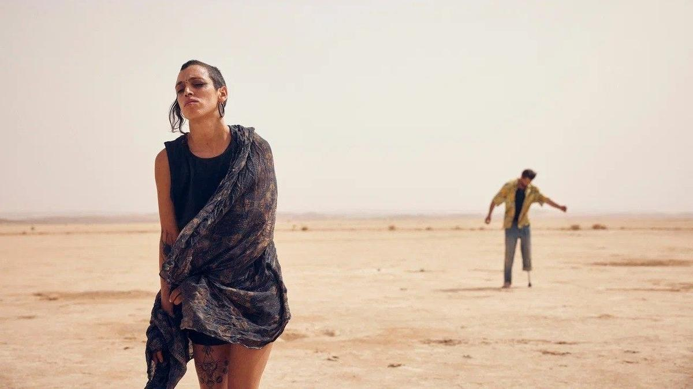

# Рейв в апокалипсисе. В прокат выходит один из фестивальных хитов — «Сират» Оливера Лаше, удостоенный Приза жюри в Каннах и выдвинутый на «Оскар»

- **URL:** https://novayagazeta.ru/articles/2025/10/29/reiv-v-apokalipsise
- **Дата:** 2025-10-29
- **Автор:** Лариса Малюкова

## Рейв в апокалипсисе

## В прокат выходит один из фестивальных хитов — «Сират» Оливера Лаше, удостоенный Приза жюри в Каннах и выдвинутый на «Оскар»

Кадр из фильма «Сират»

Пустынный массив Сагро в горах Марокко. Жаркая массовая рейв-вечеринка в самом разгаре. Реальная ли, фантастическая — вопрос. Сюда прибывает Луис (Серхи Лопес) со своим сыном Эстебаном. Он ищет старшую дочь Марину, которая бесследно пропала среди пыли и наркотиков.

Так начинается это галлюцинаторное роуд-муви.

Камера исключительно талантливого оператора в первых же псевдодокументальных кадрах выискивает в опьяневшей от рейва движущейся волнами толпе главные действующие лица — членов разношерстной команды рейверов. Джейд (Джейд Укид), Стефф (Стефания Гадда), Джош (Джошуа Лиам Хендерсон), Тонин (Тонин Жанвье) и Бигуи (Ричард Беллами) — двое из них лишены конечностей, но это никак не мешает им полностью отдаваться танцу. И любви. Впрочем, здесь это одно и то же.

Кадр из фильма «Сират»

Именно эти странные покалеченные (войной?) люди сжалятся над отчаявшимся отцом и разрешат присоединиться к их колонне из потасканных «видавших виды» машин, путешествующих в пустыне «в поисках радости» — следующей вечеринки, где может появиться «исчезнувшая».

Это — история о разношерстной группе, пытающейся перемещаться по дорогам в пустыне и горным хребтам, «вдоль обрыва, по-над пропастью, по самому по краю», между жизнью и смертью. Об их путешествии к последней станции «Конец света». Один из странников спрашивает попутчика, как может ощущаться конец света. Друг отвечает не сразу: «Так он же уже наступил давно, ты не заметил?»

Вооруженные солдаты объявляют о начале очередной войны. Надо бежать. Впрочем, здесь и сам рейв временами похож на отчаянную битву со смертью, выиграть которую невозможно.

Кадр из фильма «Сират»

Sirat — от арабского слова «путь», мост над преисподней или мост между раем и адом; в описаниях из древних книг он «тоньше волоса и острее меча». Ощущение того, что мир исчезает, бесконечные новости одна страшней другой, будто сами боги отвернулись от людей. И только посланник смерти Морс, пританцовывая, витает вместе с пылью над пустыней. Над космическими пейзажами, мимо которых мчатся наши фрики, пытаясь увернуться настигающего их реального мира. История закручивается по спирали, пока не превращается в электрошок.

Антимилитаристское и поэтическое высказывание Лаше под громкое техно — о времени скорби и печали, которое уже пришло.

Поддержите нашу работу!

1000 500 300 Нажимая кнопку «Стать соучастником», я принимаю условия и подтверждаю свое гражданство РФ

Если у вас есть вопросы, пишите [email protected] или звоните:+7 (929) 612-03-68

Кадр из фильма «Сират»

В предшественниках четвертого полнометражного фильма темпераментного испанского режиссера французского (точнее, галльского) происхождения и «Хардкор» Пола Шредера, и еще больше — лихой «Колдун» Уильяма Фридкина. Летящий ритм, тщательно прописанный, временами оглушительный саундтрек (автор Кангдинг Рэй), волны техно вас непременно настигнут. Накроют, заворожат. Или возмутят. В любом случае, не оставят равнодушным.

- В ролях: Серхи Лопес, Бруно Нуньес Архона и другие. Впрочем, здесь нет второстепенных ролей.
- 30 октября «Иноекино» выпускает картину на экраны.

Лариса Малюкова ведет телеграм-канал о кино и не только. Подписывайтесь тут.

### Этот материал входит в подписки

Смотровая площадкаКино с Ларисой Малюковой

Культурные гидыЧто читать, что смотреть в кино и на сцене, что слушать

### Добавляйте в Конструктор свои источники: сайты, телеграм- и youtube-каналы

Войдите в профиль, чтобы не терять свои подписки на разных устройствах

Поддержите нашу работу!

1000 500 300 Нажимая кнопку «Стать соучастником», я принимаю условия и подтверждаю свое гражданство РФ

Если у вас есть вопросы, пишите [email protected] или звоните:+7 (929) 612-03-68
