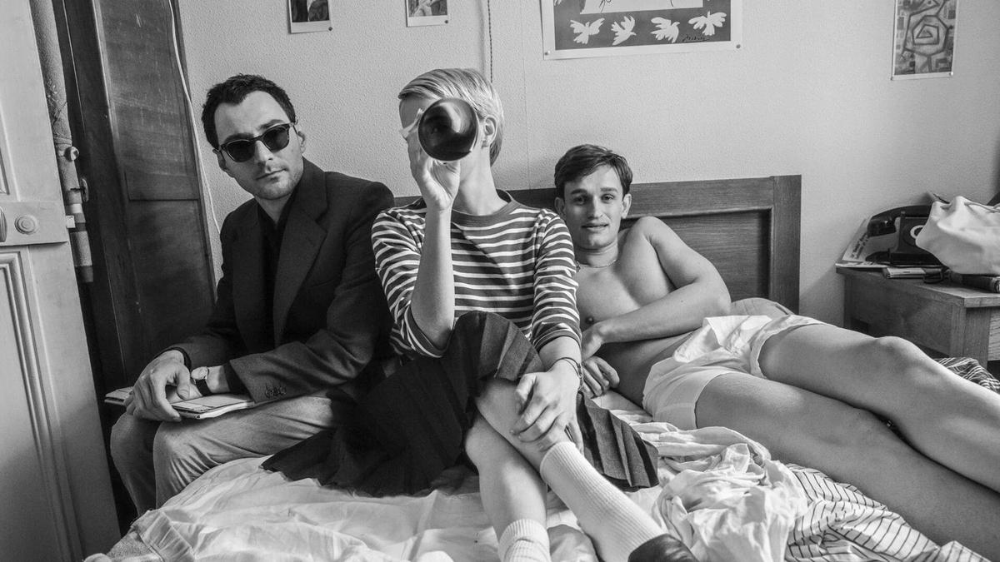

# Новая волна, Франкенштейн и «синдром холодной матери». Лариса Малюкова — о премьерах ноября

- **URL:** https://novayagazeta.ru/articles/2025/11/05/novaia-volna-frankenshtein-i-sindrom-kholodnoi-materi
- **Дата:** 2025-11-05
- **Автор:** Лариса Малюкова

## Новая волна, Франкенштейн и «синдром холодной матери»

## Лариса Малюкова — о премьерах ноября

Кадр из фильма «Новая волна»

- «Новая волна» Ричарда Линклейтера

Объяснение в любви создателям нового киноязыка, новой киножизни, разумеется, черно-белой, в квадрате 4х3.

Небожители смотрят на нас, то есть прямо в камеру: Трюффо, Жак Риветт, Аньес Варда, Эрик Ромер, Шаброль, Кокто.

Это история создания фильма — манифеста Новой волны, введшего моду на «черт-те-что», сделанное «черт-те-как», — как писали французские кинокритики.

Как выбирали двадцатишестилетнего Бельмондо — естественно, в зале для бокса. Как заманивали в фильм-авантюру голливудскую звезду Джин Сиберг, оказавшуюся в Париже.

Кино о группе киноманьяков, молодых людей, живущих и мыслящих кинематографом, дышащих кинематографом, посвятивших ему свои жизни.

Съемки фильма. 20 дней: день за днем, кадр за кадром, сигарета за сигаретой. Начинающий режиссер Годар (очки, трубка, газета) — гений и шарлатан, безумный в глазах окружающих, по-хулигански с серьезнейшим выражением преступает все правила. Все вопреки. Заново изобретает кино. Нарушает все сроки (дерется на полу кафе с многострадальным продюсером Жоржом Борегаром, которого играет Брюно Дрейфюрст). Отказывается от грима (гримерша не выплывает из обид). Постоянно меняет сценарий, сводит с ума монтажеров, предпочитая рваный прыгающий монтаж, полемизирует исключительно с помощью цитат великих. В роли Годара — Гийом Марбек, он не снимает темные очки, словно играет не столько живого человека, сколько эмблематический образ. Обри Дюйлен не слишком похож на своего Жан-Поля Бельмондо, к тому же педалирует его застывшую улыбку, компенсируя отсутствие более подробно выписанной роли. Зато Зои Дойч — Сиберг, просто находка, ее героиня постепенно лишается звездного нимба, превращаясь в актрису.

Фильм сделан с таким восхищением и почтением, что можно показывать его во всех киношколах мира.

Даже слишком почтительно и аккуратно, что никоим образом не умаляет удовольствия и напоминает годаровский завет: «Кино — важнее жизни. Реальность — ложь, правда — то, что ловит кинокамера»

«Франкенштейн. Воскрешение» Пола Дадбриджа. Не перепутайте. Это не Гильермо дель Торо из венецианской программы. Просто еще одни костюмированные ужасы. Впрочем, Дадбридж склоняется больше к драме, чем к хоррору. Да и «франкенштейнов» мировое кино поставляет к экрану исправно и немеряно начиная с 1910 года, а самым известным и лучшим до сих пор остается «Франкенштейн» 1931 года.

- «Франкенштейн. Воскрешение» — оригинальная история, основанная на классическом романе Мэри Шелли

Кадр из фильма «Франкенштейн. Воскрешение»

Действие разворачивается в 1875 году, спустя 100 лет после провалившегося эксперимента Виктора Франкенштейна. С тех пор его дневник передавался из поколения в поколение, воровался, продавался… Пока не попал в руки ученой Миллисент Браунинг. Ее муж совершил самоубийство, и Миллисент бросается с головой в трудную работу его возвращения к жизни. Она выкапывает мертвецов, убивает людей в расположенной неподалеку психиатрической лечебнице, чтобы иметь свежую плоть, дабы по инструкции дневника вернуть жизнь ее ненаглядному. Ее сын Уильям (Мэтт Барбер), врач в том же учреждении, обнаруживает исчезновение тел и начинает приближаться к страшной разгадке тайны. Скромный бюджет и шрамированный, кое-как сшитый монстр — скорее жалкий, чем страшный. Да и дух романа Мэри Шелли выветрился из фильма, как душа самоубиенного сэра Браунинга.

Историю не заладившихся отношений матерей и сыновей продолжают российские фильмы.

- «Огненный мальчик» Надежды Михалковой
- По сценарию Марины Степновой и Нади Михалковой

Кадр из фильма «Огненный мальчик»

Депутатша, возглавляющая комитет Госдумы по вопросам семьи, детей и детства (Юлия Высоцкая), ждет переизбрания. С сыном Максом (Денис Косиков) дистанция огромных размеров. Мажор Макс жжет в клубах, маму в основном наблюдая в телике. Но однажды рядом с ним оказывается надрывно «гуляющий» пацан, который по неведомой причине обливает себя бензином. Он подходит к ребятам просит зажигалку… Этот светящийся факел будет преследовать Макса, сводя его с ума.

Поддержите нашу работу!

1000 500 300 Нажимая кнопку «Стать соучастником», я принимаю условия и подтверждаю свое гражданство РФ

Если у вас есть вопросы, пишите [email protected] или звоните:+7 (929) 612-03-68

Подростка срочно отправят в глушь. Там под присмотром помощников депутатши (Анна Михалкова, Александр Устюгов) его должны спрятать-согреть. Сценарий будет ветвиться в разные стороны. Депутатшу начнут шантажировать. Макс в глухом лесу тоскует от одиночества и зверья боится…

Психологическая драма превратится в триллер про духовное развитие и выбор. Подросток зависнет на отвесной скале в минуте от гибели.

Но от смерти его спасет провидение — местная рыжая Сашка (Елизавета Ищенко). То ли девочка, то видение.

Сразу несколько фильмов в одном. Про властную мать, забывшую о собственном ребенке. Про запутанные отношения деревенской женщины Анны Михалковой и ее женатого возлюбленного (Устюгова). Михалкова играет смешную теплую тетку, которую ужасно жаль. Ближе к финалу депутатша одумается и сделает неочевидный выбор. По задумке авторов, это доброе светлое кино, в котором каждый заслуживает сочувствия.

Вопросы к режиссуре, ритму, искусственности истории, хотя есть остроумные живые эпизоды. Среди плюсов и внимательная камера Алишера Хамидходжаева.

Читайте также

Рейв в апокалипсисе

В прокат выходит один из фестивальных хитов — «Сират» Оливера Лаше, удостоенный Приза жюри в Каннах и выдвинутый на «Оскар»

- «Мой сын» Вячеслава Клевцова

Еще одна история про дисфункциональные отношения матери и сына. На уровне идеи все понятно: когда поколение родителей поступает вопреки законам морали и совести, преданные ими дети начинают вершить свой суд любым, самым жестким образом.

Кадр из фильма «Мой сын»

Адвокатша Юлии Снигирь Катя поставила профессию в служение кошельку. Сделка с совестью — привычное дело. За большие деньги (ставка — 25 лимонов) готова оправдать или посадить… в том числе невиновных. Из случайного преступления с помощью близкого друга полицейского (Алексей Филимонов) сварганить преднамеренное злостное, из одиночного — групповое. В частности, отправляет на скамью подсудимых (в перспективе на долгий срок) спортивного тренера своего сына Максима Павлова, который читает в интернете проповеди о совести и который создал из детей «звездочку мстителей».

Отцы и дети здесь троятся. Катя и ее приемный сын Леша (Леон Кемстач), которого она воспитывает, потому что его отец по непонятным причинам отчалил; молодой тренер Павлов, оказавшийся в тюрьме, и его несчастная мать, и наконец, миллионер и его сын-насильник, ведущие себя безнаказанно до поры.

Линии путаются по прихоти авторов, и кино в результате получилось инфантильное и сумбурное, оторванное от реальности

(если бы прием условности был принят как метод, была бы совсем другая картина). Проблемы не только в режиссуре (ее просто нет), но прежде всего — в сценарии (Евгений Баранов), вопросов к которому множество. Еще одно доказательство, что никаким кастингом не спасти отсутствие сценария.

Лариса Малюкова ведет телеграм-канал о кино и не только. Подписывайтесь тут.

### Этот материал входит в подписки

Смотровая площадкаКино с Ларисой Малюковой

Культурные гидыЧто читать, что смотреть в кино и на сцене, что слушать

### Добавляйте в Конструктор свои источники: сайты, телеграм- и youtube-каналы

Войдите в профиль, чтобы не терять свои подписки на разных устройствах

Поддержите нашу работу!

1000 500 300 Нажимая кнопку «Стать соучастником», я принимаю условия и подтверждаю свое гражданство РФ

Если у вас есть вопросы, пишите [email protected] или звоните:+7 (929) 612-03-68
