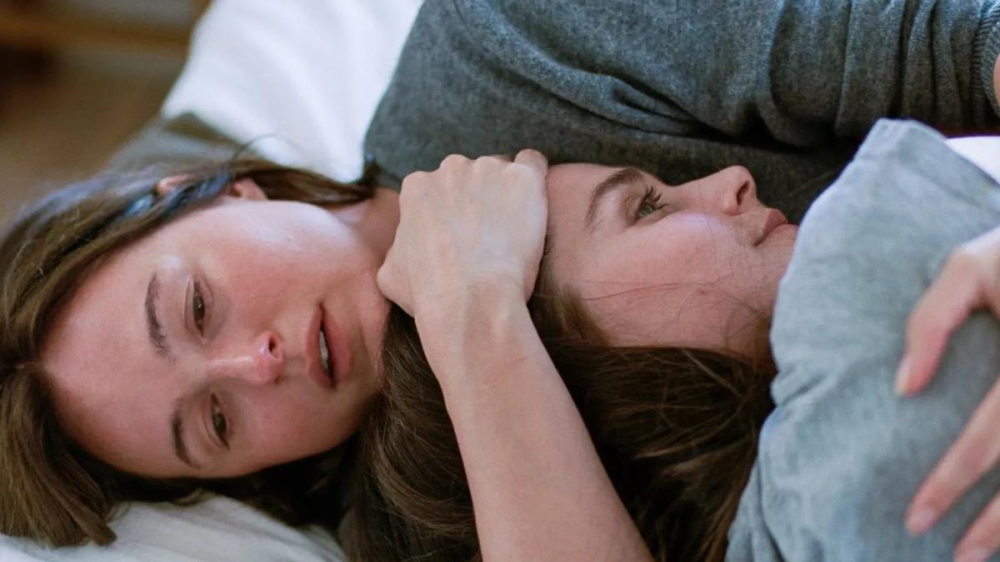

# Ценности между адом и раем. Премьеры ноября: «Сентиментальная ценность», «На выброс», «Сущность» и «Я бы тебя пнула, если бы могла». Посмотрела Лариса Малюкова

- **URL:** https://novayagazeta.ru/articles/2025/11/21/tsennosti-mezhdu-adom-i-raem
- **Дата:** 2025-11-21
- **Автор:** Лариса Малюкова

## Ценности между адом и раем

## Премьеры ноября: «Сентиментальная ценность», «На выброс», «Сущность» и «Я бы тебя пнула, если бы могла». Посмотрела Лариса Малюкова

Кадр из фильма «Сентиментальная ценность»

20 ноября сразу четыре ожидаемые и очень разные по жанру и стилю киноработы вышли в российский прокат.

«Сентиментальная ценность» Йоакима Триера. Обладатель Гран-при Каннского кинофестиваля.

Четыре года назад Триер привез в Канны романтическую прозрачную драму «Худший человек на свете» о рефлексиях, трудном взрослении благополучной студентки Юлии, за эту роль Рената Реинсве была удостоена награды за лучшую женскую роль.

Когда-то отец двух взрослых дочерей Норы (Рената Реинсве) и Агнес (Инга Ибсдоттер Лиллеос) Густав Борг — знаменитый актер и режиссер (Стеллан Скарсгард) — оставил их с мамой после череды скандалов. И вот мать умерла. Стареющий эгоцентрик Борг вернулся в опустевший дом, чтобы предложить Норе роль. Он написал очень личный сценарий, в котором и история семьи, и роль, вобравшая судьбы женщин дома, но прежде всего его матери, покончившей собой из-за ПТСР, приобретенного после пыток нацистов.

Кадр из фильма «Сентиментальная ценность»

После категоричного отказа Норы он предложит роль голливудской звезде Рэйчел Кемп (Эль Фаннинг), которая влюбится в его дарование во время ретроспективы его фильмов на Венецианском кинофестивале. Затем она влюбится уже в роль, готова даже финансировать картину…

Кружевное, тактильное, сложно устроенное, вдумчивое кино, в котором меланхолия дружит с иронией.

О зыбких и неразрывных, изменчивых и болезненных семейных узах и ценностях. С фирменным скандинавским юмором, в котором всего вдосталь: и смеха, и горечи, и сарказма.

А среди героев фильма — «кукольный», некогда семейный дом в Осло с резными наличниками. Хранилище воспоминаний и боли, исчезнувших теней, детского топота, звона разбитой посуды, признаний в любви и… нелюбви. И прочих «сентиментальных ценностей», спрятанных в подкладку отношений, изломанных внутренних связей, которые и держат их на плаву.

Название фильма Триер «пишет» поверх трещины на стене дома, в котором помимо его обитателей живут Чехов и Вуди Аллен, Бергман и Ибсен.

Из лучших фильмов Каннской программы. С выдающейся ролью Ренаты Реинсве. Впрочем, в этой трагикомедии нет второстепенных ролей.

В нынешней афише превалирует женская оптика.

Из Санденса вместе с преувеличенно восторженными отзывами прилетела новая работа писательницы и режиссера Мэри Бронштейн. «Я бы тебя пнула, если бы могла» (в оригинале веселее: «Если бы у меня были ноги, я бы тебя пнула», прокатчики поосторожничали).

Роуз Бёрн («Богиня 1967 года», «Медея», «Схватка») играет Линду, психотерапевта и мать малолетней дочери, страдающей от загадочной болезни, постоянно подключенной к зонду для искусственного питания. Есть еще «где-то там» вечно командированный муж, И ее собственный психотерапевт, с которым теряется контакт. Поэтому зияющая в потолке дыра — после аварийного провала — олицетворяет черный космос, засасывающий в темноту Линду вместе со всем скарбом ее жалкой, несчастной жизни.

Кадр из фильма «Я бы тебя пнула, если бы могла»

Лихорадочная, временами даже смешная, экзистенциальная психодрама о материнском срыве — трансформируется в сюрреалистическую Одиссею ежедневных нескончаемых мытарств. Это погружение в душевный Апокалипсис отдельно взятой матери, которой негде найти поддержку.

Второй фильм Бронштейн в качестве сценариста и режиссера, после воспетого синефилами мамблкора «Возбуждение» с еще совсем юной Гретой Гервиг.

Кино снято не просто сверхкрупно: ощущение, будто субъективная камера превратилась в микроскоп, и изучает покадрово лицо Линды во всех ежесекундных изменениях.

Впрочем, и мир вокруг мы видим глазами Линды, постепенно сходящей с ума от груза проблем, поэтому мир этот искажен, громок, некрасив, в нем превалируют тревожные краски. Насколько эта оптика отражает реальность? Так или иначе, Роуз Бёрн — одна из возможных претенденток на «Оскар» за лучшую женскую роль.

Поддержите нашу работу!

1000 500 300 Нажимая кнопку «Стать соучастником», я принимаю условия и подтверждаю свое гражданство РФ

Если у вас есть вопросы, пишите [email protected] или звоните:+7 (929) 612-03-68

Читайте также

Замороженный

На экраны выходит «Авиатор» — экранизация фантастического бестселлера Евгения Водолазкина

«На выброс» — единственный анимационный фильм из конкурса «Маяка».

Эко-драмеди, приключенческий триллер с привкусом антиутопии. Отличное семейное кино. Его авторы — дважды оскаровский номинант Константин Бронзит («Мы не можем жить без космоса», «На краю земли») и создатель популярнейшего сериала «Три кота» Дмитрий Высоцкий.

Художник — Роман Соколов («Смешарики» и совершенно восхитительные «Друзья», а еще анимация к трагифарсу «Изображая жертву»). Все последние фильмы Бронзит опирается на изображение и персонажей, придуманных Соколовым.

Кадр из анимационного фильма «На выброс»

Рабочее название — «Мусор». Про отверженных, выброшенных на свалку: некогда кутюровский брендовый галстук мажор Мак, изящная, хотя и надтреснутая фарфоровая вазочка, баллон освежителя воздуха Бриз, работяга-ботинок с приклеенной к подошве жвачкой, треснутый кнопочный телефон дедушка Лектор, цитирующий классиков, и розововолосая малышка Кати — катушка ниток. Вместе они отправляются в невероятное и опасное путешествие к невозможному, пытаясь попасть мусорный рай. У каждого своя мечта: Мак мечтает вернуть свою роскошную жизнь со своим жирным роскошным хозяином, вазочка — об Академии художеств, нитяная малышка — о швейной машинке.

А над ними парит невесомый пластиковый Эзотерий, пакет из магазина «Благая весть», обещая в короткой проповеди братьям и сестрам благодать и лучшую долю. Ветер оборвет проповедь, он улетит, но Эзотерий пообещает вернуться.

Следуйте дорогой мусора! Но как пережить свою ненужность, особенно когда те, кого ты любил, готовы выбросить тебя на свалку.

Кино про высокую цену выбора, даже если ты сам ничего не стоишь.

Но может быть, команде неудачников повезет, и они сумеют обрести главную ценность: помощь и поддержку друг друга, чтоб «не пропасть поодиночке».

Впрочем, если в этом кино и есть пафос, то он немедленно высмеивается. Плюс множество запоминающихся деталей, которые и составляют мир фильма: чайки-ангелы над гигантской мусорной дискотекой, одноглазая поломанная кукла, баюкающая некондиционного солдатика из коллекции. И разъевшаяся чайка-капитан Джонатан Ливингстон, заразившийся благородством наших героев руководитель охраны свалки.

Производство: «Студия Метрафильмс» (Артем Васильев) и Lakeside Animation Studio при поддержке Фонда кино.

Кадр из фильма «Сущность»

Хоррор скорби «Сущность» с Бенедиктом Камбербэтчем («Доктор Стрэндж», «Шерлок»), который главный мганит и главный повод смотреть фильм. Снял его британский документалист Дилан Саузерн (это игровой дебют обладателя «Грэмми» за музыкальный документальный фильм о группе Blur).

Десять лет назад вышел роман Макса Портера «Горе — это штука с перьями» — сплав прозы и поэзии. Его переводили на разные языки, награждали литературными премиями. На сцене главную роль играл Киллиан Мерфи. И вот фильм как бенефис Камбербэтча.

Имен у героев нет, потому что для авторов

это универсальная история погружения во тьму переживаемой беды и беспросветной скорби, поиск тонкого луча, способного указать путь к выходу из темницы.

Камбербэтч играет мужчину, оставшегося с двумя маленькими сыновьями после смерти жены. Он талантливый иллюстратор, работающий над графическим романом. В основном ночью. Удивительно ли, что главный персонаж его романа макабрический Ворон — обретает почти вещественную плоть, не просто символизируя боль и страдания, но питаясь страхами и поглощая их. Это поединок с запредельной (немного кукольной) «сущностью в перьях» как с самим собой.

Камбербэтч на протяжении 98 минут играет с высшей степенью сосредоточенности и самоотдачи все оттенки скорби. Жаль, что авторам не хватило энергии выписать характеры детям. Но Камбербэтчу с его актерскими амбициями было точно интересно.

Лариса Малюкова ведет телеграм-канал о кино и не только. Подписывайтесь тут.

### Этот материал входит в подписки

Смотровая площадкаКино с Ларисой Малюковой

Культурные гидыЧто читать, что смотреть в кино и на сцене, что слушать

### Добавляйте в Конструктор свои источники: сайты, телеграм- и youtube-каналы

Войдите в профиль, чтобы не терять свои подписки на разных устройствах

Поддержите нашу работу!

1000 500 300 Нажимая кнопку «Стать соучастником», я принимаю условия и подтверждаю свое гражданство РФ

Если у вас есть вопросы, пишите [email protected] или звоните:+7 (929) 612-03-68
