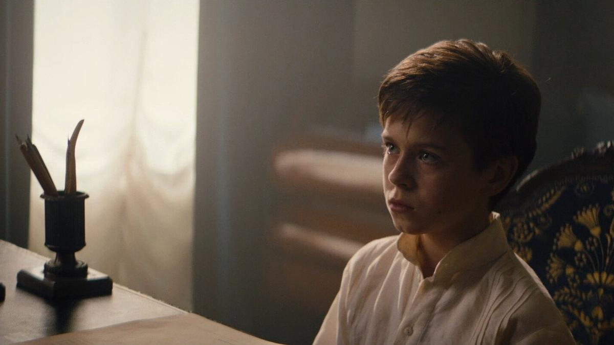

# Волчок на Золотом дне. Что смотреть в кино и на платформах в декабре. Рассказываем о зрительских проектах

- **URL:** https://novayagazeta.ru/articles/2025/12/04/volchok-na-zolotom-dne
- **Дата:** 2025-12-04
- **Автор:** Лариса Малюкова

## Волчок на Золотом дне

## Что смотреть в кино и на платформах в декабре. Рассказываем о зрительских проектах

«Волчок». Кадр из фильма. Источник: www.kinoafisha.info

## Будет сказка про Волчок

- «Волчок», режиссер Константин Смирнов («Жуки», «Девушки с Макаровым»)

Приключенческая комедия, действие которой происходит на рубеже XIX–XX веков в России, когда старую нарядную жизнь Российской империи начинают продувать вихри нового времени и набирающего обороты технического прогресса.

Тринадцатилетний дворянин и сирота Ваня Огарев (Марк-Малик Мурашкин) вынужден бежать из родного дома, спасаясь от убийц, подосланных его коварным дядей (Данила Воробьев), решившим завладеть наследством мальчика, а прежде всего — землей под виноградники. Для защиты Ваня от потенциального убийцы и его наемников нанимает(задорого) разбитного кулачного бойца Волчка (Евгений Ткачук). Волчок обещает доставить мальчика в целости и сохранности до Нижнего Новгорода, где того ждет верный друг отца (Сергей Маковецкий).

Они представляют собой довольно экзотическую пару:

простолюдин и выпивоха Волчок, которому нет равных в свирепых кулачных боях, и избалованный, начитавшийся Фенимора Купера дворянин-барчук, которого воротит от буханки черного хлеба и тошнотворных запахов в общем в вагоне.

Так начинается это роуд-муви, в котором героям постоянно угрожает опасность. За ними гонятся бандюганы, нанятые дядей, хитроумная сыщица Эльза (Юлия Хлынина). И еще кое-какие качки, нанятые… не дядей. С бандитами из разных групп явный перебор, как и с некоторыми сюжетными перипетиями, которые авторы щедрой рукой накручивают и накручивают ближе к финалу, не избегая распространенных мест и клише подобного рода приключенческого костюмного кино. Вместе с тем, несмотря на скромность бюджета, в фильме много обаятельных находок: от аттракционов знаменитой ярмарки Нижнего (забавы с электричеством, большой велотрек и прочее) до мотива с зубной щеткой, которую Волчок увидел впервые и своеобразно взял на вооружение.

«Волчок». Кадр из фильма. Источник: blog.okko.tv

Два актера играют жирно, используя жаргон боев, скажем: «сплеча». Это Евгений Ткачук в роли неотесанного, лихого, безбашенного, а в душе нежного героя-спасителя. И будто со страниц книжки выскользнувший склизкий негодяй дядюшка Даниилы Воробьева, который не то что племянника, мать родную продаст за наличные и купчую. Может, таких и не бывает, но есть в этой чрезмерности нечто гарри-поттеровское. Эдакий Вернон Дурсль на отечественный лад. Эльза Юлии Хлыниной — темная дамочка в круглых очках сильно напоминает загадочную и опасную Серафиму из анимационной «Моей любви» оскаровского лауреата Александра Петрова (правда, ей роль забыли написать). Юному исполнителю главной роли Марку-Малику Мурашкину сложно соответствовать уровню актерского существования Ткачука в их дуэте, и временами он именно что «играет».

Сегодня вообще едва ли не утрачена в режиссуре способность и умение работать с детьми. Помнится, я расспрашивала Александра Наумовича Митту, как ему удавалось снимать детей, которые не уступали на экране в органичности большим актерам. Прежде всего, это касалось Лены Прокловой — она была достойной партнершей и Быкову в «Звонят, откройте зверь», и Табакову в «Гори, гори, моя звезда». Режиссер говорил, что самое важное — правильно выбрать юного актера, который поверит в правду любых фантастических обстоятельств.

Плохо, когда дети в кино играют «кого-то», это всегда видно. А вот когда ребенок или подросток со всей своей страстью и отдачей играет «во что-то», он сам начинает верить в правду обстоятельств.

Так же работал с детьми и Ролан Быков.

Но при всех существенных недочетах, у Константина Смирнова получалась необычная приключенческая семейная картина, верная не только каверинскому девизу Сани Григорьева «Бороться, идти, найти и не сдаваться», но и размышляющая о чувстве эмпатии как способе исследования подростком взрослого мира. Способности в «чужом», непохожем на тебя, увидеть человека, а если повезет, может быть, и главного друга в твоей жизни, который всегда придет на помощь.

Съемки фильма проходили на Верхне-Волжской набережной в августе 2023 года и в Рыбинске.

Фильм выпускает на экраны 4 декабря компания «Централ Партнершип».

## На золотом дне сидели

Выходит второй сезон успешной многосерийной драмы «Золотое дно», отечественная версия легендарных «Наследников». Но кажется, во втором сезоне авторам сценария Сергею Минаеву и Дмитрию Минаеву («Золотое дно», «Первый номер») удалось наконец оторваться от «вдохновившего» их сюжета про клан богачей, которые грызутся и поедают друг друга, как пауки в банке.

Разумеется, по-прежнему за глянцевой обложкой (как тут не вспомнить «Первый номер» тех же Минаевых) — борьба за миллиарды владельцев и «примкнувших» к мегакомпании «Галактика». Ради власти и денег Градовы привычно готовы жертвовать партнерами, союзниками, друг другом и тем, что называется семьей.

Но главная оригинальная идея второго сезона — крепкая привязка полукриминальной драмы, процедуры про большие деньги и их хозяев — к российским реалиям деловой жизни образца середины двадцатых. И тут авторы не лукавят.

Поддержите нашу работу!

1000 500 300 Нажимая кнопку «Стать соучастником», я принимаю условия и подтверждаю свое гражданство РФ

Если у вас есть вопросы, пишите [email protected] или звоните:+7 (929) 612-03-68

Ради скоростей стройки флагманского проекта «Галактики» — многоэтажек нового элитного микрорайона «Северный град» — бетон безбожно бодяжат водой, и приходится проводить аудит стройки. Градовскую яхту арестовывают в Нормандии. Карточки блокируют, счета вот-вот арестуют. Значит, надо быстро открывать филиал и счет компании в Дубае — где уже «много наших, и жизнь бьет ключом». Правда, на российские паспорта дубайские чиновники «смотрят искоса, низко голову наклоня». Нужны «другие паспорта». Плюс надо срочно найти полтора ярда для перекредитования. Надо что-то решать с акционерами, которые зачем-то хотят получать свои дивиденды. Надо, надо…

«Золотое дно». Афиша. Источник: avatars.dzeninfra.ru

Контракты проводят через третьи страны. Европейских поставщиков (в частности, лифтов) в скоропомощном темпе меняют на китайских. А денег нет как нет (точнее, почти нет). Ближе к кульминации компанию Градовых вносят в санкционный список (как говорит влиятельная подруга главы клана: «самый почетный сегодня список»), плюс акционеры объявляют, что хотят выставить свои акции на продажу и этим решением доконать «сбитого летчика» «Галактику». У Градовых 10 дней, чтобы отстоять «семейное дело.

И по-прежнему нет «команды», продолжаются корпоративно-семейные конфликты. Ближайшие родственнички самозабвенно грызут, откусывают друг у друга проценты, ставки, контракты, партнеров, жен и любовниц. Здесь каждый за себя. Играет в свою игру.

Но прежде всего, глава клана Юрий Градов. Алексей Гуськов с наслаждением отдается роли большого босса, ведущего ожесточенное сражение за власть и деньги.

Сценаристы иронично разыгрывают «анти-короля Лира», который не отдаст наследства детям, сыграет с ними в свою игру. Но и дети давно выросли в молодых волков.

И первый среди них — старший сын Дмитрий Градов, давно метивший на кресло главы компании. Павел Попов во втором сезоне становится ключевым игроком во всех неожиданных интригах и схемах. И его ослепительная улыбка все больше похожа на волчий оскал. Особенно хороша сцена, где он должен реально выловить «большую рыбу» в чемпионате для толстосумов.

Парадокс: чем меньше денег у зрителей, тем с большим энтузиазмом они следят за сюжетом «богатые тоже плачут… из-за больших денег».

Производство — продюсерская компания Team Films + ИВИ и START. В режиссерском кресле по-прежнему Илья Ермолов.

В ролях: Алексей Гуськов, Юлия Снигирь, Павел Попов, Ангелина Пахомова, Валерий Карпов, Марина Ворожищева, Наталия Вдовина, Сергей Горошко, Даниил Страхов, Игорь Верник, Лидия Вележева и другие.

С 4 декабря — на ИВИ и START

Лариса Малюкова ведет телеграм-канал о кино и не только. Подписывайтесь тут.

### Этот материал входит в подписки

Смотровая площадкаКино с Ларисой Малюковой

Культурные гидыЧто читать, что смотреть в кино и на сцене, что слушать

### Добавляйте в Конструктор свои источники: сайты, телеграм- и youtube-каналы

Войдите в профиль, чтобы не терять свои подписки на разных устройствах

Поддержите нашу работу!

1000 500 300 Нажимая кнопку «Стать соучастником», я принимаю условия и подтверждаю свое гражданство РФ

Если у вас есть вопросы, пишите [email protected] или звоните:+7 (929) 612-03-68
