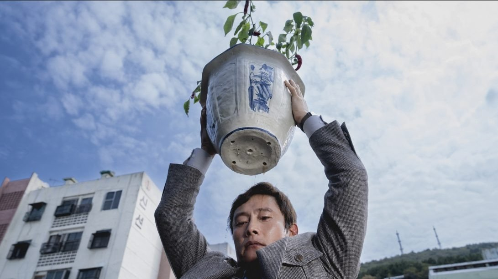

# Быть или не быть? Рассказываем о новых фильмах из номинационных списков ведущих кинопремий мира

- **URL:** https://novayagazeta.ru/articles/2025/12/09/byt-ili-ne-byt
- **Дата:** 2025-12-09
- **Автор:** Лариса Малюкова

## Быть или не быть?

## Рассказываем о новых фильмах из номинационных списков ведущих кинопремий мира

Кадр из фильма «Метод исключения»

## Человечество? Вычеркиваем

- «Метод исключения», 2025. Режиссер Пак Чхан Ук

Создатель «Олдбоя», «Служанок» и незабываемого триллера «Решение уйти» много лет точил топор на тему безжалостного циничного капитализма, выплевывающего живого человека как отходной материал. Более десяти лет он планировал экранизировать роман «Топор» Дональда Э. Уэстлейка, опубликованный в 1997 году, называя его «историей мечты».

Все начинается с угря впечатляющих размеров, его принесли в качестве презента с папиного бумажного комбината — за хорошую работу. Вообще Ман Су живет — чисто в раю. Уютный дом с оранжереей, в которой он сам ухаживает за растениями и создает бонсаи. Жена-красавица, они занимаются теннисом, танцами, и он дарит ей роскошные босоножки для танцпола. Дочь на виолончели играет, сын-подросток — в кружках. Барбекю, семейные обнимашки у костра. Но однажды осенью, в самое кризисное время года, новые владельцы компании заносят Ман Су в «расстрельный список» и сокращают. Что делать, когда на плечах жена, двое детей, большой дом, две собаки? Как удержать мир, летящий в тартарары? Когда даже твои собственные дети готовы возненавидеть тебя за отказ от подписки на Netflix. Единственная вакансия — в одной крупной бумажной компании, но есть конкуренты, которые очевидно превосходят героя…

Кадр из фильма «Метод исключения»

«Топор» Дональда Э. Уэстлейка уже был экранизирован и неплохо Коста-Гаврасом в 2005-м, между прочим, при поддержке братьев Дарденн. Пак Чхан Ук, по сути, снимает ремейк фильма Гавраса. Но мрачный, беспросветный мир буржуазных пригородов северо-восточной Франции, запечатленный в кино франко-греческого режиссера про главную фобию среднего класса — потерю работы, превращается в корейской версии в буйство красок и соцветий. Этот яркий жизнеутверждающий мир природы разительно контрастирует с радикальным криминальным сюжетом. Чхан Ук снимает кино не просто про выбор в тупике, его саркастический месседж — о растущей дегуманизации зверского капитализма, полностью подчиняющего себе человека. Это черная комедия, скорее даже трагифарс-бурлеск на тему, что делать человеку, которого «вычеркнули».

Цель оправдывает средства? У тебя есть конкуренты? «Убей их всех. Господь узнает своих». Нет, Ман Су не знал крылатого завета крестоносцев. Но свою войну он объявил.

Ли Бёнхон (главный герой в «Игре кальмаров») играет своего героя остро, гротескно, с демонстративной бравадой (настоящий мужчина даже в кризисной ситуации не имеет права на слабость). Но когда он остается один, его душит паника, и скорее от страха и отчаяния он готов на самые крайние (временами самые идиотские) поступки…

С помощью изощренных операторских решений Кима У-хёна, неожиданных ракурсов, вертикальных планов режиссер показывает зыбкий мир, в котором все персонажи, словно на батуте, их жизнь неустойчива и непредсказуема.

Кадр из фильма «Метод исключения»

И в отличие от картины Гавраса, в которой тоже немало сарказма, фильм Чхан Ука нашпигован символами. Яблоня, олицетворяющая жизнь, вырастет буквально в могиле. Больной, изъеденный кариесом зуб — символ узла нерешаемых проблем, которые «разрубить» можно лишь топором. Укус змеи… ребенок, который не говорит, но драматически играет на виолончели… И, наконец, бумага, созданная человеком, — более в человеке не нуждающаяся. Отныне ее будут делать машины, деревья рубить и обрабатывать машины. Так пойдет — и книги в будущем будут читать исключительно машины. «Метод исключения» — это не только способ решения проблем одного взятого «сокращенного», но и тактика «исключения» одного ненужного человечества, которое последовательно само себя «отсеивает».

Фильм из программы Венецианского кинофестиваля привезла в Россию компания «Вольга».

Кадр из фильма «Гамнет»

## Что в имени моем?

- «Гамнет» Хлои Чжао

Трагедия о смерти и любви как источнике подлинного искусства.

Фильм основан на одноименном романе писательницы Мэгги О’Фаррелл, вышедшем в 2020 году.

Английское графство Уорикшир. Уильям (Пол Мескал), сын перчаточника, преподает латынь, чтобы расквитаться с долгами отца. Влюбляется в странную местную девушку Агнес (Джесси Бакли), которая собирает травы и снадобья, местные шепчутся, что родилась она от лесной ведьмы. Мы и увидим Агнес впервые в лесу: приросшей к лесу — она спит, свернувшись калачиком между корнями дерева. Бледная кожа, темные волосы и глаза, ржаво-коричневые и алые цвета одежды, ястреб на руке, требующий сырого мяса. Лесная нимфа завораживает Уильяма как дивное видение свободы и первобытной красоты. Они станут жить вместе — изгои в своих семьях, несмотря на все запреты и сплетни. Лесная фея и книжный червь, который мучается с написанием пьесы. У каждого из них свое предназначение. Спустя время Агнес родит двойняшек Гамнета и Джудит. А когда чума решит забрать Джудит, ее любимый брат Гамнет сделает все возможное и невозможное, чтобы спасти сестру, пусть… ценой собственной жизни. И рана этой потери обрушится и на Агнес, и на Уильяма.

Поддержите нашу работу!

1000 500 300 Нажимая кнопку «Стать соучастником», я принимаю условия и подтверждаю свое гражданство РФ

Если у вас есть вопросы, пишите [email protected] или звоните:+7 (929) 612-03-68

Кадр из фильма «Гамнет»

Как смерть, непоправимое, пустота и тьма в сердце и «все одежды горя» — перерождаются в «огонь, живящий взор», печаль и скорбь разрушат сердце, когда не превратятся в поэзию бессмертную. А боль обретет плоть и свет сценической истории на века, в которой будет не только много смертей, но и призрачное присутствие того, кто дорог сердцу, стал духовным ядром трагедии «Гамлет».

Опустошенная Агнес окажется театре «Глобус» почти случайно и вместе с разношерстной толпой зрителей, вместе с нами будет потрясена происходящим — преображением собственного спрятанного от мира горя и вины.

Призрак из темноты выходит на дощатую сцену: лицо в муке с водой, а может, это кровь створожилась от белены, что дядя в ухо влил ему? Вот и покрылся он коростой. И ужас в его глазах — бесконечный ужас увидевшего будущие смерти, которые уж не пресечь. Что душит Уильяма, преобразившегося в Призрака. Роль? Боль, которую и Агнес разделить готова.

А Гамлет, юный принц… Он, свесив ноги, говорит, словно давний знакомый, с толпой внимающих каждому его слову, вдоху: «Достойно ль смиряться под ударами судьбы. Иль надо оказать сопротивление. Умереть. Забыться. И знать, что этим обрываешь цепь сердечных мук и тысячи лишений…»

Кадр из фильма «Гамнет»

Известно, что в Англии шестнадцатого века имена Гамлет и Гамнет были взаимозаменяемы. Оскароносный режиссер Хлоя Чжао («Жизнь кочевников») и ее соавторы осмелились на художественную интерпретацию жизни Шекспира, решились нырнуть в стершееся от времени прошлое, исследуя истоки чуда театра и гения творца.

Насколько верно, что «Гамлет» был вдохновлен ранней смертью сына, невысказанной скорбью отца (как в его «Короле Джоне»: «Мне горе заступило место сына: В его кроватке спит, со мною ходит…»

Авторы романа и фильма опираются на эту версию: философская трагедия, поднимающая вечные вопросы бытия — о смысле жизни, смерти и морали, — была «вскормлена», пропитана утратой.

Фильм снят в духе темной с живым всполохами огня и света голландской живописи — виртуозная работа оператора Лукаша Заля.

Пол Мескал («Солнце мое», «Враг») создает необычный образ человека театра. В крови которого течет театр. Это широчайшая палитра чувств и красок: от сомнений, самобичевания до сокрушительного азарта творчества. И все же сердце фильма, его живой пульс — непостижимое существование Джесси Бакли, ирландской актрисы и певицы, сыгравшей Мари Болконскую в шестисерийной экранизации «Войны и мира» BBC, а на сцене и экране — множество шекспировских ролей. Именно благодаря ей и происходит превращение боли — в чудо искусства, возможность потерянным — найти себя.

Читайте также

Вглядываясь в солнце

На экраны вышел «Звук падения» Маши Шилински, взявший Приз жюри Каннского кинофестиваля

Лариса Малюкова ведет телеграм-канал о кино и не только. Подписывайтесь тут.

### Этот материал входит в подписки

Смотровая площадкаКино с Ларисой Малюковой

Культурные гидыЧто читать, что смотреть в кино и на сцене, что слушать

### Добавляйте в Конструктор свои источники: сайты, телеграм- и youtube-каналы

Войдите в профиль, чтобы не терять свои подписки на разных устройствах

Поддержите нашу работу!

1000 500 300 Нажимая кнопку «Стать соучастником», я принимаю условия и подтверждаю свое гражданство РФ

Если у вас есть вопросы, пишите [email protected] или звоните:+7 (929) 612-03-68
