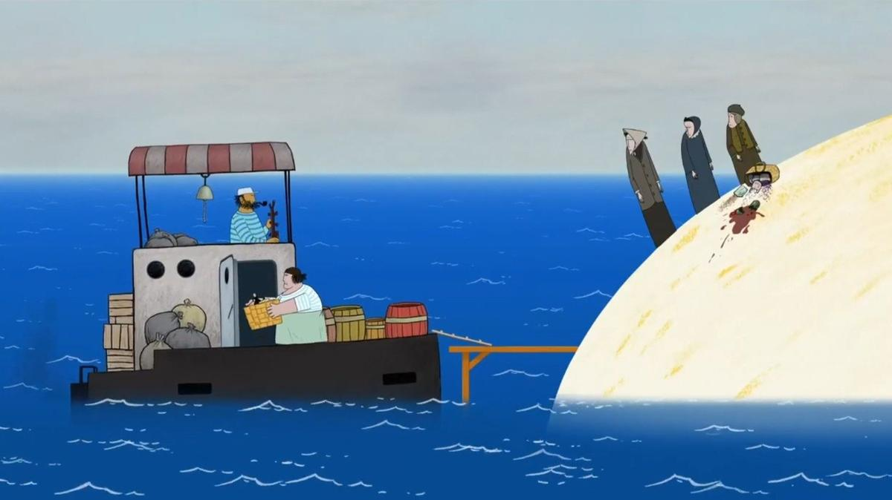

# «Три сестры» Константина Бронзита — в шорт-листе «Оскара». Это его 4-й шорт-лист подряд. Из них было две номинации

- **URL:** https://novayagazeta.ru/articles/2025/12/17/tri-sestry-konstantina-bronzita-v-short-liste-oskara
- **Дата:** 2025-12-17
- **Автор:** Лариса Малюкова

## «Три сестры» Константина Бронзита — в шорт-листе «Оскара»

## Это его 4-й шорт-лист подряд. Из них было две номинации

Кадр из фильма «Три сестры». Скриншот

Невероятный сюжет связан с продвижением фильма. История знает множество мистификаций. Многие композиторы (от Крейслера до Косадо) выдавали свои сочинения за забытые шедевры. Музыковед и композитор Ремо Джадзотто сочинил пьесу и выдал ее за восстановленную по обрывкам нот «Адажио» Томазо Альбинони (ноты вроде бы уцелели после бомбежки Дрезденской библиотеки во Вторую мировую войну). Ромен Гари дважды получил престижную Гонкуровскую премию: первый раз под своим именем, второй раз (в 1975 году) под псевдонимом Эмиль Ажар за роман «Жизнь впереди», чтобы доказать, что его второй роман был бы столь же успешен. Он создал полностью вымышленную личность Ажара с фиктивной биографией, на публике его роль исполнял родственник.

В анимации подобных мистификаций пока еще не было. Константин Бронзит решился на дерзкий эксперимент. Он послал свой новый фильм в Академию кинематографических искусств и наук (Academy of Motion Picture Arts and Sciences — AMPAS) под псевдонимом Тимур Когнов. И по сути, в этом нет обмана, так как регламент не запрещает снимать и посылать картины под другим именем.

Думаю, прежде всего это самотестирование. Бронзит — дважды оскаровский номинант, и автору с подобными регалиями открыт зеленый свет на фестивальный отбор.

Ему значительно проще пробиться сквозь заслоны и заградлинии отборщиков специального комитета Академии, формирующего лонг-листы (длинные списки), награды и реноме автора влияют и на голосование членов Академии по гильдиям. С каждой новой номинацией ты ближе к финальному состязанию (которое не обеспечивает наград, но здесь точно участие — почетно).

«Три сестры» — чистый мейнстрим, изысканная и лихая фестивальная анимация. В первых кадрах круглый светлый свод острова напомнит геометрию знаменитого бронзитовского фильма «На краю земли», в котором дом со всеми его обитателями раскачивался на острие горы-границы. Здесь и адрес есть — остров № 5. На нем трехсекционнный дом с тремя дверьми. И живут в нем душа в душу три не юных сестры монашеского вида. Возвращаются в воскресенье из храма, забирают с катера необходимые продукты. Воюют с чайками-воровками. После того как в море утонет их мешочек с монетами, вынуждены сдать одну из трех секций дома в аренду. И нагрянет к ним чудо-морячок — кругленький, с трубкой и бородой, татуировкой во все давно немытое тело с якорем. Мужчина. Сестры от одного его вида голову потеряют. Тут и начнется меж сестрами конкуренция не на жизнь… точней за жизнь с морячком. Одна ему настирывает-наглаживает, другая, сменив монашеское одеянье на бесстыдный горох, а платок — на копну волос, чайком балует. Третья и вовсе на лодке с ним уплывет. Похорошеют сестры, и будет у них праздник и веселье под граммофон с ночным купанием. Праздник жизни, о котором и не мечталось. Ссоры, ревность. И даже когда морячок исчезнет (у морячков так водится), жизнь на острове… продолжится.

Кадр из фильма «Три сестры». Скриншот

Минималистичная графика, безупречно стильная и выстроенная драматургически история, включающая в действие каждую деталь (чайки-воровки, смеющиеся над недотепами сестрами, символические подарки морячка каждой сестре, даже у мешочка с монетками — своя линия). Да и тайминг под продуманный глухой бой барабана и меланхолическую виолончельную тему выстроен идеально.

Это и есть ритм самой жизни, которую вкусили старые девы, и теперь уж от этого ритма им не отбиться…

Поддержите нашу работу!

1000 500 300 Нажимая кнопку «Стать соучастником», я принимаю условия и подтверждаю свое гражданство РФ

Если у вас есть вопросы, пишите [email protected] или звоните:+7 (929) 612-03-68

Легко, конечно, картину упрекнуть в видимой патриархальности, гендерном стереотипе, когда женщина определяется через присутствие мужчины. Но для Константина Бронзита — это история о бесконечном чувстве одиночества. В недавнем интервью мне он говорил о своих героинях, что каждая из них ищет родственную душу: «Мне кажется, одиночество — главная проблема сегодняшнего расклеенного мира. Но каждому нужна другая душа, другой человек, чтобы опереться и не упасть».

«Профессия режиссера, — говорит Бронзит, — амбициозна. Странно соревноваться в искусстве, но так все устроено. Я понял, что имя начинает работать на тебя, включаются преференции. В селекционные комитеты крупных фестивалей присылают до 4000 заявок, а порой и больше. Мне было интересно проверить собственные силы. Я посылал фильм на фестивали под вымышленным именем Тимур Когнов из Кипра (у меня есть родственник Тимур Когновицкий). Я создал биографию, фильмографию. Решил посмотреть, как отборщики определяют качество фильма вне регалий автора, выбирают его только за счет качества. Риски большие — остаться с носом. Когда я рассказывал об этой идее близким — они крутили пальцем у виска. И выяснилось, что действительно все непросто. Почти два года фильм гулял по фестивалям, отборщики его не всегда досматривали. Из сотни смотров он попал на 10 — это мало. Но зато примерно из половины фестивалей, его пригласивших, фильм получил награды.

Свой «каминг-аут я решил совершить, только попав в шорт-лист. Теперь могу сказать, что «Три сестры» сделаны режиссером Константином Бронзитом».

Кадр из фильма «Три сестры». Скриншот

Как говорят в таких случаях, следим за продолжением захватывающего сюжета и желаем картине «Три сестры» завоевать «Оскар».

Номинанты на премию «Оскар» будут объявлены 22 января.

Из списка из 113 фильмов в шорт-лист было выбрано 15 участников:

- Autokar (Belgium/France) by Sylwia Szkiłądź
- Butterfly (France) by Florence Miailhe
- Cardboard (U.K.) by J.P. Vine
- Éiru (Ireland) by Giovanna Ferrari
- Forevergreen (U.S.) by Nathan Engelhardt & Jeremy Spears
- The Girl Who Cried Pearls (Canada) by Chris Lavis & Maciek Szczerbowski
- Hurikán (Czechia, France, Slovakia, Bosnia) by Jan Saska
- I Died in Irpin (Czechia, Slovakia, Ukraine) by Anastasiia Falileieva
- The Night Boots (France) by Pierre-Luc Granjon
- Playing God (Italy, France) by Matteo Burani
- The Quinta’s Ghost (Spain) by James A. Castillo
- Retirement Plan (Ireland) by John Kelly
- The Shyness of Trees (France) by Sofiia Chuikovska, Loïck du Plessis D’Argentré, Lina Han, Simin He, Jiaxin Huang, Maud Le Bras & Bingqing Shu; Gobelins
- Snow Bear (U.S.) by Aaron Blaise
- The Three Sisters (Cyprus) by Kognov Timur\

### Этот материал входит в подписки

Смотровая площадкаКино с Ларисой Малюковой

Культурные гидыЧто читать, что смотреть в кино и на сцене, что слушать

### Добавляйте в Конструктор свои источники: сайты, телеграм- и youtube-каналы

Войдите в профиль, чтобы не терять свои подписки на разных устройствах

Поддержите нашу работу!

1000 500 300 Нажимая кнопку «Стать соучастником», я принимаю условия и подтверждаю свое гражданство РФ

Если у вас есть вопросы, пишите [email protected] или звоните:+7 (929) 612-03-68
