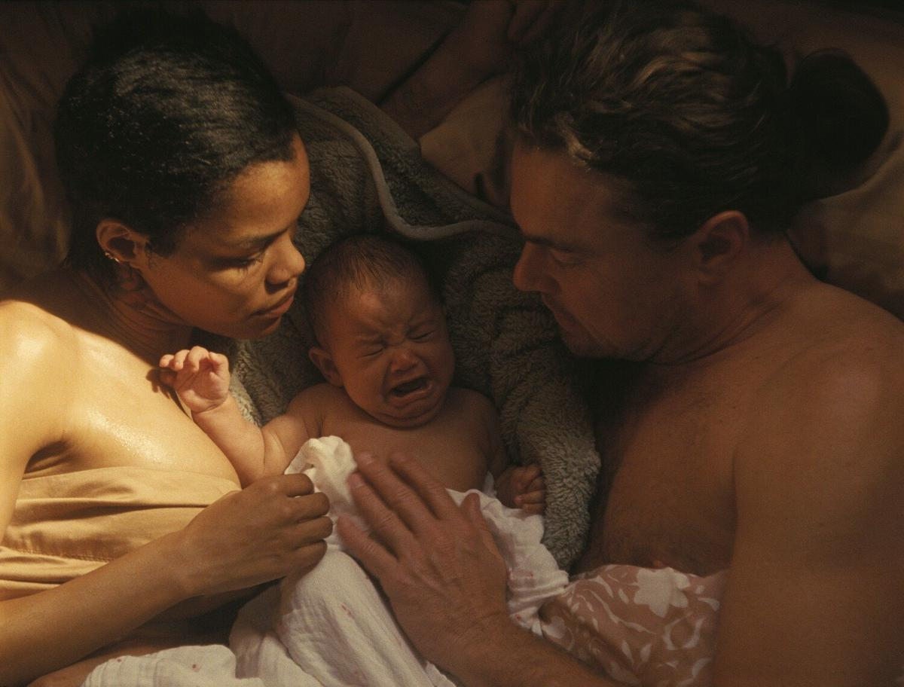

# Простые случайности и сентиментальная ценность. Лучшие фильмы 2025-го. Выбор обозревателя Ларисы Малюковой

- **URL:** https://novayagazeta.ru/articles/2025/12/23/prostye-sluchainosti-i-sentimentalnaia-tsennost
- **Дата:** 2025-12-23
- **Автор:** Лариса Малюкова

## Простые случайности и сентиментальная ценность

## Лучшие фильмы 2025-го. Выбор обозревателя Ларисы Малюковой

- «Битва за битвой», реж. Пол Томас Андерсон
- «Сентиментальная ценность», реж. Йоаким Триер
- «Простая случайность», реж. Джафар Панахи
- «Метод исключения», реж. Пак Чхан Ук
- «Грешники», реж. Райан Куглер
- «Сны поездов», Клинта Бентли
- «Сират», реж. Оливер Лаше
- «Гамнет», реж. Хлоя Чжао
- «Эддингтон», реж. Ари Астер
- «Исчезновение Йозефа Менгеле», реж. Кирилл Серебренников

## «Битва за битвой», реж. Пол Томас Андерсон

«Битва за битвой». Кадр из фильма

Картина-диагноз, в которой все возможные кризисы доведены до белого каления. Но кризисы в наше время лишь усугубляются. Разрешится лишь семейный — как последнее пристанище погрязшего в хаосе человека. Здесь каждый из персонажей — портрет. И бывший революционный активист, ныне спивающийся, скуривающийся одинокий отец взрослой дочери — Пэт (грандиозная роль Ди Каприо), он смешон, жалок и чертовски храбр. И Перфидия (яростная и сексуальная Тейана Тейлор), которая, увы, в середине фильма исчезает. И главная звезда картины Шон Пенн — беспощадный полковник Лоджо — швами зла наружу, микс омерзения и почти сочувствия в финале. «Битва за битвой» — не просто штормовой триллер и драма. Здесь поиски культурного кода миксуются с политикой и поп-культурой, но внутри всех этих наворотов и сюжетных нагромождений — чистейшая и нежнейшая тема бескорыстной и беспредельной любви отца и дочери.

## «Сентиментальная ценность», реж. Йоаким Триер

«Сентиментальная ценность». Кадр из фильма

Кружевное, тактильное, сложно устроенное вдумчивое кино, в котором меланхолия дружит с иронией. О зыбких и неразрывных, изменчивых и болезненных семейных и творческих узах и ценностях. С фирменным скандинавским юмором, в котором вдосталь и иронии, и горечи. А среди героев — некогда семейный «кукольный» дом в Осло — старинный, деревянный. С резными наличниками. Хранилище воспоминаний и боли, исчезнувших теней прошлого, детского топота, звона разбитой посуды, признаний в любви и… нелюбви. И прочих «сентиментальных ценностей», спрятанных в подкладку отношений, изломанных внутренних связей, которые хоть как-то держат на плаву. Как, например, треснувшая бабушкина ваза. Из лучших картин Каннской программы. С выдающейся ролью Ренаты Реинсве. Впрочем, в этой трагикомедии нет второстепенных ролей.

## «Простая случайность», реж. Джафар Панахи

«Простая случайность». Кадр из фильма

Притча о праве на месть. Но это было бы слишком просто. Панахи знает, о чем рассказывает: об уязвимости мстящих.

Действие происходит в современном Иране. Компания фриков: тренер по каратэ — ныне свадебный фотограф, невеста с женихом, продавец книг и автомастер планируют привести в исполнение свой приговор насильнику и мучителю.

История о жертвах и палачах, чувстве вины, неизживаемых травмах, которые порождают ненависть. О циклической природе насилия, которое превращено в рутину государственными институциями. О моральном болоте существования в стране, где травмированные жертвы режима вынуждены жить и соседствовать с людьми, которые поддерживают режим, и «силу имеют». Панахи раскачивает качели жанров, превращая политический триллер в притчу, притчу — в комедию абсурда.

## «Метод исключения», реж. Пак Чхан Ук

«Метод исключения». Кадр из фильма

Создатель «Олдбоя», «Служанок» и незабываемого триллера «Решение уйти» много лет точил топор на тему безжалостного циничного капитализма, выплевывающего живого человека как отходный материал.

В новой экранизации романа «Топор» Дональда Э. Уэстлейка нестерпимо яркий жизнеутверждающий мир природы контрастирует с мрачной сутью криминальной сюжета. Чхан-ук снимает кино не просто про выбор в тупике, его саркастический месседж о растущей дегуманизации зверского капитализма, подчиняющего себе человека. Это черная комедия, скорее даже трагифарс-бурлеск на тему «что делать, когда тебя «вычеркнули».

Цель оправдывает средства? У тебя есть конкуренты? «Убей их всех. Господь узнает своих». Ман Су (Ли Бёнхон) не знал завета крестоносцев. Но свою войну вынужденно объявил. С помощью изощренных операторских решений, неожиданных ракурсов, вертикальных планов авторы разворачивают на экране зыбкий мир, в котором все герои — словно на батуте, их жизнь неустойчива и непредсказуема.

«Метод исключения» — не только способ решения проблем отдельно взятого «сокращенного», но и тактика «исключения» одного ненужного человечества, которое последовательно само себя «отсеивает».

## «Грешники», реж. Райан Куглер

Поддержите нашу работу!

1000 500 300 Нажимая кнопку «Стать соучастником», я принимаю условия и подтверждаю свое гражданство РФ

Если у вас есть вопросы, пишите [email protected] или звоните:+7 (929) 612-03-68

«Грешники». Кадр из фильма

Вампирская историческая и вместе с тем актуальная сага, оригинальный блокбастер писателя-режиссера Райана Куглера с Майклом Б. Джорданом, играющим близнецов — бывших гангстеров, ветеранов Первой мировой, вознамерившихся открыть джук-джойнт.

Фильм-блюз с атмосферой, насыщенной музыкой, сексом, весельем, эйфорией и страхом, подпитанным встречей со сверхъестественным. Здесь зловещие моменты смыкаются с мгновениями безоглядной — до головокружения — свободы. Собственно, свободе и посвящена картина. И музыке, которая связывает в один нерасторжимый узел добро и зло, черное и белое, в какие-то моменты даже примиряя их. Как жизнь со смертью.

Куглер («Рид», «Черная пантера») снова создает свой авторский мир, переосмысливает классический жанр, ввинчивая в него и социальную сатиру, и темы расовой сегрегации, и музыку как способ диалога. Нарушает временные завесы, приглашая в клуб тридцатых брейкдансеров, рэперов и древних шаманов.

## «Сират», реж. Оливер Лаше

«Сират». Кадр из фильма

Ядреный веселый и страшный рейв в марокканской пустыне, снятый как пыльный взрывной Апокалипсис. Отец и сын присоединяются к группе бродячих рейверов в поисках пропавшей дочери/сестры. И начинается экзистенциальное испытание, галлюциногенное роуд-муви по самому по краю обломившейся и заминировавшей себя цивилизации. Одиссея как путешествие по внутреннему миру обреченных. Один из героев спрашивает попутчика, что он думает о конце света, когда он настанет, и получает ответ: «Он идет уже давно. Наш конец света». Армагеддон как прощальная вечеринка. Танцпол заминирован. Картина вдохновлена суфийской метафорой Сирата — тонкого моста над геенной огненной, отделяющего жизнь от смерти, иллюзию от прозрения. Приз жюри Каннского кинофестиваля картине испано-французского режиссера Оливера Лаше был ожидаем.

## «Гамнет», реж. Хлоя Чжао

«Гамнет». Кадр из фильма

Хлоя Чжао («Жизнь кочевников») и ее соавторы решились нырнуть в стершееся от времени прошлое, исследуя истоки чуда театра и гения творца.

Трагедия о смерти и любви как источнике подлинного искусства. Когда непоправимое: пустота и тьма в сердце, «все одежды горя», — перерождается в «огонь, живящий взор». Печаль и скорбь разрушат сердце, когда не превратятся в поэзию бессмертную. Боль обретет плоть и свет сценической истории на века — «Гамлет». И будет в ней не только много смертей, но и призрачное присутствие того, кто станет духовным ядром трагедии «Гамлет».

А главной зрительницей новоявленного спектакля окажется потерявшая сына Агнес — потерявшаяся в разношерстной толпе зрителей, вместе с ними будет потрясена происходящим — преображением спрятанного от мира горя и вины — в искусство. И Гамлет, юный принц, по-свойски свесив со сцены ноги, делится с ними сокровенным: «Достойно ль смиряться под ударами судьбы. Иль надо оказать сопротивление. Умереть. Забыться. И знать, что этим обрываешь цепь сердечных мук и тысячи лишений». Фильм снят в духе почерневшей от времени с живым всполохами огня и света голландской живописи — виртуозная работа оператора Лукаша Заля.

## «Эддингтон», реж. Ари Астер

«Эддингтон». Кадр из фильма

В своем четвертом фильме режиссер «Реинкарнации» и «Солнцестояния» портретирует ковидный мир за порогом нервного срыва. Спрятавшийся по домам и квартирам, натянувший маску на лицо. Мир молчаливой паники. Странно ли, что на вершину этой горы из подполья взлетели прежде невзрачные закомплексованные одиозные фрики. В режиме полной изоляции люди сходят с ума.

Фильм — бенефис Хоакина Феникса (остальные актеры скорее играют свиту «короля»). Из маленького недолюбленного антиваксера разрастается демон возмездия (впрочем, тоже нелепый), на пике реванша забывшего кого и зачем наказывает. Он сам, как заряженное ружье.

COVID для Астера — черное зеркало, засмотревшись в это зеркало, реальность теряет ориентацию и баланс. Город Эддингтон для Астера и есть концентрированный символ нации, в висок которой сейчас целится возмущенный и растрепанный маленький человек, шериф Хоакина Феникса.

## «Исчезновение Йозефа Менгеле», реж. Кирилл Серебренников

«Исчезновение Йозефа Менгеле». Кадр из фильма

Сложно устроенный кинороман, главы которого носят разные имена «ангела смерти», избежавшего наказания. Йозеф, Грегор, Петер.

Да, злодей Менгеле вроде бы сбежал от наказания и бежит на протяжении всей жизни. От местных властей, нагоняющих его агентов Моссада, вычисливших Эйхмана — его собрата по убийствам. Но его война не закончена, потому что Третий рейх и паранойя самооправдания внутри него. Потому что зло неискоренимо. И заразительно.

Продуманная цветовая и световая партитура (оператор Владислав Опельянц). Черно-белое, нуаровое, в стиле шпионского триллера кино с изощренной контрастной графикой. И неожиданно ослепительно цветные, солнечные сцены в Аушвице. И от этого контраста — беспечного и бесконечного залитого солнцем утра и измученных лиц прибывших на перрон полуживых узников — из них Менгеле смычком и выбирает подопытных для своих мясных «экспериментов» — холод по коже.

### Этот материал входит в подписки

Смотровая площадкаКино с Ларисой Малюковой

Культурные гидыЧто читать, что смотреть в кино и на сцене, что слушать

### Добавляйте в Конструктор свои источники: сайты, телеграм- и youtube-каналы

Войдите в профиль, чтобы не терять свои подписки на разных устройствах

Поддержите нашу работу!

1000 500 300 Нажимая кнопку «Стать соучастником», я принимаю условия и подтверждаю свое гражданство РФ

Если у вас есть вопросы, пишите [email protected] или звоните:+7 (929) 612-03-68
