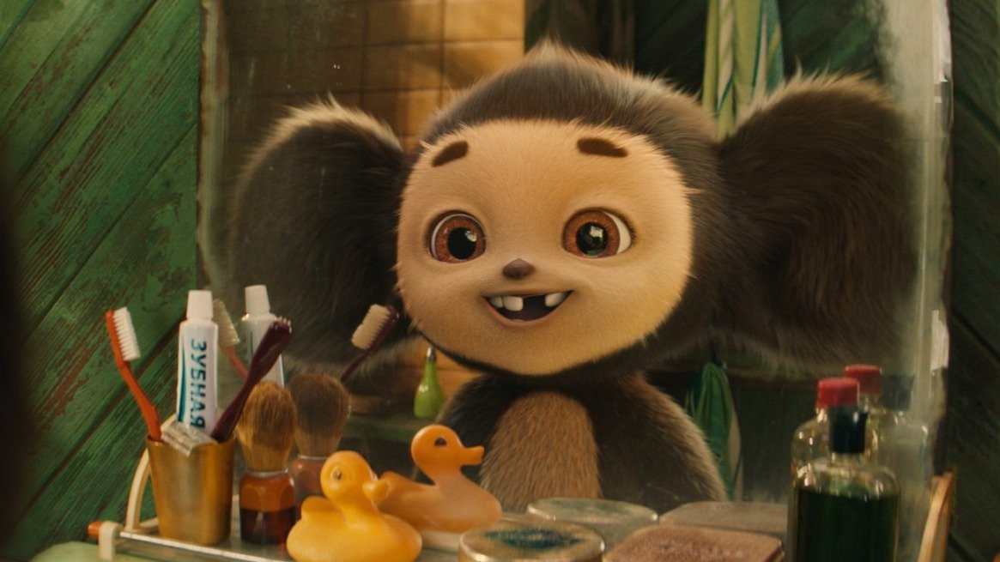

# «Чебурашка-2» — денежное дерево. Просчитанный маркетологами сиквел про ушастого зверька, его друга Гену и похорошевшую Шапокляк и в этом году соберет рекордную кассу

- **URL:** https://novayagazeta.ru/articles/2025/12/30/cheburashka-2-denezhnoe-derevo
- **Дата:** 2025-12-30
- **Автор:** Лариса Малюкова

## «Чебурашка-2» — денежное дерево

## Просчитанный маркетологами сиквел про ушастого зверька, его друга Гену и похорошевшую Шапокляк и в этом году соберет рекордную кассу

Кадр из фильма «Чебурашка 2»

Первого января на экранах стартует «Чебурашка 2» Дмитрия Дьяченко — продолжение кассового рекордсмена, собравшего в 2023 году почти 7 млрд рублей. Очевидно, что и сиквел ждет успех.

Главные конкуренты «Буратино» и «Простоквашино» — уступают новой киноистории о неизвестном науке звере. «Буратино» визуально слишком изыскан, вне привычных «детских» стереотипов, «Простоквашино» — аляповат и дурно-театрален. Эти проекты, конечно, здорово «откусят» от так называемого «новогоднего пирога» — периода наибольшей посещаемости кинотеатров, но и «Чебурашке» останется чем поживиться. «Чебурашка» — хорошо продуманный и просчитанный маркетинговый проект с опорой на узнаваемые тропы.

Итак, спустя год после событий первого — фильм второй. Чебурашка живет в доме сочинского садовника Гены (Сергей Гармаш). Прижился и даже настолько повзрослел, что из милого малыша превратился в невыносимого проказника, который только и делает, что бесконечно все роняет, рассыпает, разбивает — расчебурахивает. Гена неистово сердится, превращаясь в зубастого злого крокодила, — микс персонажей Чуковского с Dr. Curt Connors или Аллигатором Локки. А тут и беда нечаянно нагрянет. Милый-милый дом с башенкой, в котором Гена живет в дендрарии с Чебурашкой, вот-вот снесут, на его месте собираются строить парк развлечений. Однако Шапокляк, превратившаяся из нехорошей в милейшую бизнесменшу Римму Анатольевну (Елена Яковлева), по просьбе Гены готова отказаться от стройки. Главным злодеем оказывается ее помощник Ларион (Дмитрий Лысенков). Тут возникает серия неутомимых флешбэков, и мы узнаем историю строительства дома молодым Геной (Артем Быстров), его любви и старого конфликта с Ларионом.

Кадр из фильма «Чебурашка 2»

Итак, алгоритмы нового «Чебурашки» созданы с вектором на традиционные семейные ценности и семейные отношения (помнится, депутат Дмитрий Певцов критиковал фильм за «трансгуманистическую идеологию», потому что Чебурашка называет Дядю Гену мамой»).

Создатели исправились. Едва ли не все узловые виды и подвиды подобных проблем и отношений здесь проиллюстрированы, как в учебнике по семейной психологии.

Ларион — злой, потому что в детстве был недолюблен злобным папашей-Охотником. Гена потерял главную любовь своей жизни и потому ему не хватает терпения в воспитании трудного чебурашьего сына. Чебурашка начитался умных книг, и потому на любое замечание парирует цитатой, намекая на «оральную агрессию» названого папаши. Внучка Риммы Анатольевны Соня — жертва вседозволенности, антивоспитательной избалованности и отсутствия социальных контактов. Беременная дочь Гены Таня (Полина Максимова) замучена опекой и вниманием мужа-невротика Толи (Сергей Лавыгин). Их старший сын Гриша испытывает дефицит родительского внимания и ревность к будущему ребенку, который заберет любовь папы и мамы.

Кадр из фильма «Чебурашка 2»

Поддержите нашу работу!

1000 500 300 Нажимая кнопку «Стать соучастником», я принимаю условия и подтверждаю свое гражданство РФ

Если у вас есть вопросы, пишите [email protected] или звоните:+7 (929) 612-03-68

После внятной экспозиции средняя часть, в которой Чебурашка подбивает детей на «побег из дома» (как в «Буратино») и путешествие в лес подальше от непонимающих их взрослых, — довольно затянутая, суетливая, не держит внимания. Зато финальная третья, с зашкаливающей на пределе всех мыслимых вкусовых красных линий, когда зрители волей-неволей начнут переживать за жизнь Чеба, — на пике эмоций и сентиментальности.

Среди главных секретов успеха франшизы — узнаваемость. Сам Чебурашка — главный символ детства, взрослые ностальгируют по беспечной поре, ощущению безопасности.

Второй фильм в сравнении с первым набрал зрелищности, масштаба. Чего стоит гигантский шоколадно- мармеладовый день рождения Сони.

Фильм перенасыщен отсылками к знаменитым хитам. Их здесь шоколодный «пруд пруди».

Читайте также

Что смотреть на Новый год?

Лучшие фильмы, сериалы и другие итоги года от Ларисы Малюковой. Спрашивает Ирина Петровская

Домашние шалости Чебурашки словно списаны с сериала «Маша и Медведь». Роскошный день рождения юной миллионерши Сони напоминает праздник в картине «Чарли и шоколадная фабрика», конечно, без фирменных бертоновских гротеска и готики. Но здесь тоже есть шоколадное озеро, своя Эйфелева башня и мармеладные карусели. Во время детского побега-похода от взрослых в лес и горы вспомнится «Приключения Тома Сойера и Гекльберри Финна» Говорухина. Мотивы самых разных шлягеров от «Один дома 2» до «Книги джунглей» передают друг другу эстафету.

А в самом финале будет… приглашение в кино на премьеру «Чебурашки» — 1 января 2027-го. Авторы обещают главный флешбэк — историю происхождения Чебурашки из племени мохнатых чебурахоподобных. Прародители неведомой зверушки Эдуард Успенский, Роман Качанов и Леонид Шварцман сильно бы удивились.

Лариса Малюкова ведет телеграм-канал о кино и не только. Подписывайтесь тут.

### Этот материал входит в подписки

Смотровая площадкаКино с Ларисой Малюковой

Культурные гидыЧто читать, что смотреть в кино и на сцене, что слушать

### Добавляйте в Конструктор свои источники: сайты, телеграм- и youtube-каналы

Войдите в профиль, чтобы не терять свои подписки на разных устройствах

Поддержите нашу работу!

1000 500 300 Нажимая кнопку «Стать соучастником», я принимаю условия и подтверждаю свое гражданство РФ

Если у вас есть вопросы, пишите [email protected] или звоните:+7 (929) 612-03-68
