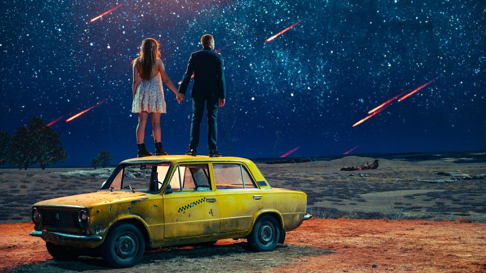

# Ландыши в мире танков. 1 января в онлайн-кинотеатре Wink стартовал новый сезон драмеди «Ландыши»

- **URL:** https://novayagazeta.ru/articles/2026/01/07/landyshi-v-mire-tankov
- **Дата:** 2026-01-07
- **Автор:** Лариса Малюкова

## Ландыши в мире танков

## 1 января в онлайн-кинотеатре Wink стартовал новый сезон драмеди «Ландыши»

«Ландыши». Кадр из фильма

«Ландыши. Вторая весна» — продолжение истории, которая собрала 100 млн просмотров к концу года. Патриотическую тему авторы упаковали в розовые обертки глянцевой лавстори, в которой мажорка из Лондона влюбляется в простого русского танкиста. На Кинопоиске у «Ландышей» рейтинг 8.2. Ника Здорик и Сергей Городничий, сыгравшие главные роли, после показа прославились.

И вот продолжение.

В телевизоре загса — хроника СВО, машины со знаком Z на проселочных дорогах. Катя Орлова (Ника Здорик) пришла сюда не разводиться с пропавшим без вести Лехой Данилиным, а напротив, взять его фамилию, потому что «и в горе, и в радости…». Почти сразу начинаются музыкальные номера. Много. В первых сериях сиквела — песни в основном те же, что и в первом сезоне. «Встречная полоса» NANSI & SIDOROV, «Ландыши» Twins Kovl и другие. Самоотверженная офицерская жена Катя решает отправиться на поиски пропавшего мужа вместе с гарнизонным девичьим ансамблем «Ландыши». Раз их мужья на СВО, они должны «поддержать всех наших парней». Героини проезжают на разрисованном цветами микроавтобусе города, пострадавшие от обстрелов, где потерявшим дома горожанам раздают гуманитарную помощь. Девушки поют и играют для обездоленных, для бойцов, а по дороге решают взять «гуманитарку» для «людей Донбасса», у которых ни света, ни воды, ни связи. Катя со слезами на глазах соглашается, хотя это совсем не по дороге, но людей жалко. Особенно жаль малышку, чью мать убило вчера, — ее надо довезти и найти слова, чтобы объяснить, что мамы больше нет. Катя найдет, ведь у нее тоже мама умерла. И папа. Да и у ее Лехи родители погибли. Все они — сироты.

Одна из участниц ансамбля, героиня Валерии Ланской, решает покинуть группу и отправиться в Донецк, чтобы стать волонтером в госпитале.

Леху Данилина, лейтенанта танковых войск, тяжело раненого, Катя отыщет в опасной серой зоне. Не без божьей помощи и божьего огня в полуразрушенной церкви. И ему, израненному, с перебитыми ногами, в слезах объяснится в любви. И снова песня — звучит композиция Жени Трофимова, давшая название сиквелу: «Я скучаю, и кажется, что не придет. / Как бы мы ни просили. / Покрытая памятью. Наша вторая весна».

«Ландыши». Кадр из фильма

Катя спасет искалеченного Леху не только от смерти, но и от нагрянувшего ПТСР. И они станцуют свой вальс, оторвутся от желтых «Жигулей» к звездам и падающим с помощью ИИ кометам. И споют вместе на фестивале «Таврида.Арт». Есть у Лехи еще один добрый ангел — скромный водитель микроавтобуса в тельняшке, который прошел все возможные войны: и Афганистан, и Чечню, и Приднестровье, и Абхазию, и Балканы.

Вот и геройский танкист Леха, который товарища в бою собой прикрыл, непременно найдет себя, и родине послужит… в новом качестве, освоит новую военную профессию (не будем спройлерить). Вот такая нежная любовь.

В отличие от первого сезона, который снимал режиссер Александр Карпиловский, второй не притворяется ромкомом, это героическая мелодрама, кино про подвиг и травму: мужья на СВО, жены — в тылу и в серой зоне, где земля заминирована, а церкви разрушены. Про подвиг любви, когда «судьба и родина едины». И даже вражеский дрон, изумившись силе этой любви, отступает.

Кино как агитпроп в эстетике развлекательных массовых жанров было популярно в тридцатые годы прошлого века, когда государство осознало, что чистый лозунг и агитация оставляют зрителя равнодушным. Нужна высокоградусная эмоция. И вторые «Ландыши» словно сделаны в состоянии аффекта, жгут на зашкаливающих чувствах и реакциях, тонут в море слез неутомимо рыдающей героини (в кинотеатрах на премьерных показах зрительницам выдавали носовые платки).

Автор идеи, продюсер и сценарист Юрий Сапронов, говорит: «Мы знаем, что продолжения ждет огромное количество людей. Для многих «Ландыши» — это не просто сериал для развлечения, который посмотрел и забыл. Это история, в которой очень многие зрители почувствовали поддержку, тепло и надежду. Именно поэтому мы не могли не сделать им такой подарок к Новому году. Мы работали в очень плотном режиме: снимали сразу двумя съемочными группами, монтируем практически круглые сутки, проект все еще в процессе работы». Этот авральный темп сказался на качестве проекта — видно, что спешили. Режиссером второго сезона официально заявлен клипмейкер Илья Шпота, для которого этот проект стал дебютом в кино (музыкальные клипы — главный козырь проекта «Ландыши»). Однако в титрах есть и Карпиловский, и Михаил Пипия, работавший до этого вторым режиссером.

Поддержите нашу работу!

1000 500 300 Нажимая кнопку «Стать соучастником», я принимаю условия и подтверждаю свое гражданство РФ

Если у вас есть вопросы, пишите [email protected] или звоните:+7 (929) 612-03-68

«Ландыши». Кадр из фильма

Помимо проблем со сценарием, в котором по воле авторов происходят «неожиданные случайности», неряшливая режиссура, работа с актерами, массовка — картонная. Зато реклама — массированная, вездесущая, продуманная. Съемка самой массовой сцены в российском кино на фестивале «Таврида.Арт» (более 30 тысяч участников), разлетевшаяся на тысячи рилсов и роликов в соцсетях (рилсы стали движком популярности и первых «Ландышей»). Проект нацелен охватить гигантскую территорию провинции и не потерять стомиллионную народную любовь.

Производством вторых «Ландышей» занимается компания «Всемирные русские студии» совместно с «НМГ Студией» при поддержке Института развития интернета (АНО «ИРИ»), АНО «Таврида.Арт» и контент-студии «Юг. Кино». Хедлайнер промо в Сети — Кино-Театр.Ру.

Лариса Малюкова ведет телеграм-канал о кино и не только. Подписывайтесь тут.

### Этот материал входит в подписки

Смотровая площадкаКино с Ларисой Малюковой

Культурные гидыЧто читать, что смотреть в кино и на сцене, что слушать

### Добавляйте в Конструктор свои источники: сайты, телеграм- и youtube-каналы

Войдите в профиль, чтобы не терять свои подписки на разных устройствах

Поддержите нашу работу!

1000 500 300 Нажимая кнопку «Стать соучастником», я принимаю условия и подтверждаю свое гражданство РФ

Если у вас есть вопросы, пишите [email protected] или звоните:+7 (929) 612-03-68
