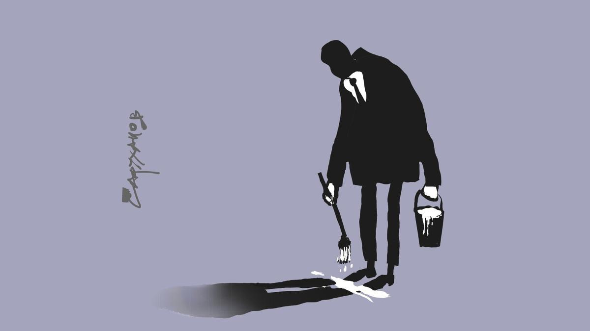

# Замажь меня нежно. Как в России стирают: части тела, сигареты, наркотики, лица актеров и… память

- **URL:** https://novayagazeta.ru/articles/2026/01/10/zamazh-menia-nezhno
- **Дата:** 2026-01-10
- **Автор:** Лариса Малюкова

## Замажь меня нежно

## Как в России стирают: части тела, сигареты, наркотики, лица актеров и… память

Иллюстрация: Петр Саруханов / «Новая газета»

## Ликвидация

В советские времена мы не ведали про блюринг. Тогда главным помощником цензоров были ножницы. Кромсали со всей решительностью не соответствующие идеологическим нормам «моменты». Цензура и советское кино — ровесники. Первый советский документ о введении цензуры в кино датируется 15 февраля 1918-го. Сталин развил и усовершенствовал ленинский завет «киноленты контрреволюционные и безнравственные не должны иметь места». Главное же усовершенствование касалось «неблагонадежных граждан». В политике, науке, культуре. Их тоже следовало вычеркивать, изымать — из профессии, титров, жизни.

Все началось еще с Эйзенштейна, когда буквально накануне премьеры «Октября» из готового монтажа срочно пришлось вырезать Льва Троцкого, обильно представленного в фильме.

Резали сценарии и фильмы на протяжении всей истории советского кино, в том числе культовые — Гайдая, Мотыля, Меньшова. Не разрешали Этушу в «Кавказской пленнице» быть похожим на Сталина. Запрещали умирать во сне герою Жженова в «Экипаже», чтобы не расстраивать Брежнева. Фильмы, которые сегодня называют классикой, не только отправляли на «полку» на десятилетия (от «Комиссара» Аскольдова до «Долгих проводов» Муратовой, фильмов Параджанова и Германа), но уничтожали — как в результате монтажа и переделок полностью разрушили «Бежин луг» Эйзенштейна, как рубили во дворе студии, словно кочан капусты, экранную копию «Стеклянной гармоники» Хржановского.

Да и списки запрещенных актеров — не сегодняшнего дня изобретение. Вырезали из титров и из самих фильмов имена репрессированных актеров Дмитрия Консовского, Татьяну Окуневскую, Леонида Оболенского и многих других. Нельзя было показывать поуехавших Олега Видова, Елену Кореневу, Савелия Крамарова (из «Неуловимых мстителей» пришлось срочно ликвидировать любимую зрителем сцену с охраной у костра, где Крамаров в очередной раз рассказывает историю про мертвых с косами).

По разным, порой загадочным причинам не рекомендовалось снимать в главных ролях Ролана Быкова (за негеройскую внешность), Владимира Высоцкого (чиновники не утверждали его на роли Рыбака в картине «Восхождение», генерала Черноты в «Беге», Д’Артаньяна в «Трех мушкетерах»), Сергея Юрского, Инну Чурикову, Екатерину Савинову, Людмилу Гурченко, Олега Стриженова, Ларису Лужину. За что можно было попасть в черный список? За «осуждение операции «Дунай» во время Пражской весны», за «отсутствие социального здоровья в лице или несоветскую внешность», за «прозападные взгляды», из-за личной неприязни начальства (Фурцевой или директора «Мосфильма» Ивана Пырьева). Имена из секретных списков складываются в коллективный портрет уникальных дарований, будто и выбирали лучших, без которых и история нашего кино была бы иной.

Из гигантского числа фильмов (в том числе классики) «изымали» сцены с алкоголем (в пору антиалкогольной кампании). Пострадали любимейшие народные «Ирония судьбы», «Кин-дза-дза», «Бриллиантовая рука», «Кавказская пленница», «Покровские ворота».

## С глаз долой

После немногих лет относительной свободы все вернулось на круги своя. Сегодня в помощь цензуре пришли новые технологии: блюринг, компьютерная графика, искусственный интеллект. Что же требуется спрятать, скрыть, убрать «с глаз долой»?

### Политика и история

Искать логику в блюринге того или иного элемента довольно трудно. Кого-то, например, испугала новость о смерти Владимира Путина в вымышленной вселенной антиутопии «Крушение мира». Компания «Экспонента» выпустила отцензурированную версию картины, где новостной сюжет и портрет президента России вместе с надписью «Putin Dead» заблюрен. Из гротескной черной комедии «Дворец» Романа Поланского вырезали сцену с новогодним обращением российского лидера (а заодно и других русских, показанных с иронией).

Память о прошлом тоже попадает под блюр по неясным причинам. В блокбастере Фрэнсиса Форда Копполы «Мегалополис» закрасили надпись «СССР» на космическом спутнике, который пару раз мелькает на экране. Никакой принадлежности космического объекта к Советскому Союзу в российской прокатной версии не допускается. И когда один из героев читает газету, в которой упоминается «soviet satellite» (советский спутник), в переводе звучит «старый, отслуживший срок спутник».

В блокбастере Фрэнсиса Форда Копполы «Мегалополис» закрасили надпись «СССР» на космическом спутнике, который пару раз мелькает на экране. Скриншот из видео

Кадр после цензуры. Скриншот из видео

### Интим не предлагать

В последние годы заблюривание стало одним из главных механизмов компромисса между законотворцами и российскими прокатчиками, которые вынуждены соблюдать ряд ограничений, чтобы выпускать кино в прокат и продавать его стримингам.

В категории сомнительного оказалось и… человеческое тело. Мужская нагота (пятые точки «сильной половины человечества» и половые органы) — именно то, что ни в коем случае никто не должен увидеть на экране. Опять-таки, блюр происходит безотносительно возрастного рейтинга, который присваивается фильмам при оформлении прокатного удостоверения.

Кадры интимного характера вычеркиваются из картин в первую очередь. Порой доходит до абсурда. Многочисленные круги с размытым фокусом со временем закрывают все. Не только гениталии, но и природу, архитектуру, книги на полке…

В ужастике «Верни ее из мертвых» замазаны гениталии мужчины, показанные на несколько секунд. Не повезло и Хоакину Фениксу в картине «Все страхи Бо» Ари Астера: обнаженный актер появляется в паре эпизодов с мыльном пятном между ног. Еще одно мыльное пятно — у Себастьяна Стэна в фильме «Другой человек». Голые задницы мужчин в триллере «Гадкая сестра» исправно замазаны, в то время как на женские позволено смотреть беспрепятственно. Скрыли половые органы в хорроре «Крик. Сезон призраков».

Чуть более изысканная цензура у военной драмы «Под огнем». На долю секунды у раненого солдата показывают поврежденные взрывом гениталии. В кинотеатральной версии их закрыли блюром, однако после цифрового релиза короткий эпизод вернулся к истокам. В редких случаях то, что нельзя в кинотеатрах, все еще допустимо онлайн.

Алексей Федорченко не мог «сдать» фильм «Колбаса Митрофана Аксенова» из-за короткого эпизода в музее эротического искусства, где работал один из героев: Федорченко велели убрать все экспонаты. Режиссер «сжал» их в нарезку по секунде, они пролетали незаметно. Этого оказалось мало. Почему? Потому что на стоп-кадре все вполне можно рассмотреть! В итоге все экспонаты закрыли «кустиками», а герой оказался в странном «садике».

Телесный блюр посягнул и на бессмертную классику. Пострадал, например, перевыпуск мелодрамы «Мечтатели» Бернардо Бертолуччи. Компания «Иллюзион Кино», выпускавшая кино в России, замазала гениталии Майкла Питта. Изменение коснулось исключительно кинотеатральной копии. В цифровом варианте, доступном в российских онлайн-кинотеатрах, все осталось как прежде.

### Наркотикам нет

Есть понятные причины блюра. Впрочем, эта прозрачная логика никак не оправдывает факт вмешательства в художественные произведения. Драма о немецком гангста-рэпере Xatar «Золото Рейна», чья жизнь плотно была связана с запрещенными веществами, пострадала от блюра наркотических средств, а один из эпизодов с их употреблением вовсе исчез.

Проблема наркозависимости — важная часть повествования картины «Последнее завтра» с канадским певцом The Weeknd в главной роли, однако фильм также пострадал от цензуры.

В триллере «Серфер» члены культа склоняют героя Николаса Кейджа к употреблению наркотиков. В одном эпизоде оказался заблюрен шприц с иглой, хотя контекст его применения более чем понятен. От чего пытаются оградить нас цензоры в кейсах подобного рода? Ни одна из этих картин не призывает к употреблению наркотиков, а замалчивание проблемы никогда не способствовало ее решению.

В драме «Птица» Барри Кеогана (из конкурса Канн!) в квартире героя мелькает на столе белый порошок, который тоже в российском прокате заблюрили.

Из версии «Аноры» для российских онлайн-кинотеатров убрали моменты употребления наркотиков, не говоря уже о нецензурной лексике. Эти сцены просто кадрировали, оставив звуковую дорожку, так что можно было догадаться о происходящем на экране.

В «Джентльменах» Гая Ричи заблюрили изображения кустов марихуаны, а слова «анаша», «конопля», «шишки», «ганджубасик» вырезали от греха подальше.

Не пощадили и Балабанова. В «Жмурках» отредактировали сцены с Алексеем Серебряковым: заблюрили не только нарколабораторию, но и плакаты с девушками топлес на заднем плане, а также момент смерти персонажа.

### Чтоб не пил, не курил…

Курение, о вреде которого обычно сообщается титром в начале фильмов и сериалов, также все строже табуируется — несмотря на возрастной рейтинг 18+ у большинства картин, герои которых курят. Под блюр попадает и новое кино — боевик «Западня» с Биллом Скарсгардом и Энтони Хопкинсом; драма «Конклав» Эдварда Бергера; хоррор «Кровавый урожай» — и культовая классика.

На цифровых каналах замазана квадратиками сигарета в руках у Штирлица. И начинаешь думать, что он там курил? Может, мы раньше не замечали? Скриншот из видео

Поддержите нашу работу!

1000 500 300 Нажимая кнопку «Стать соучастником», я принимаю условия и подтверждаю свое гражданство РФ

Если у вас есть вопросы, пишите [email protected] или звоните:+7 (929) 612-03-68

Кадр после цензуры. Скриншот из видео

В мультфильме Хаяо Миядзаки «Ветер крепчает», который перевыпустила компания RWV Film, заблюрен не только процесс курения, но и пачки сигарет. На цифровых каналах замазана квадратиками сигарета в руках у Штирлица. И начинаешь думать, что он там курил? Может, мы раньше не замечали?

В фильмах начали замазывать бутылки со спиртным. В совсем новой семейной комедии «На деревню дедушке» заблюрили фляжку, из которой попивает дедушка задиристого внука Юрий Стоянов.

Возможно, скоро будем смотреть кино и сериалы из одних только квадратиков.

### Угроза традиционным ценностям

Жестко скрывают в российском кино любые признаки и намеки на ЛГБТ*. Вообще даже нынешний закон допускает упоминание и демонстрацию ЛГБТ-персон на экране, но запрещает пропаганду явления. Отделить одно от другого порой чрезвычайно сложно, так что прокатчики предпочитают не рисковать и блюрят все без разбора.

В драмеди «Джулс» инопланетянин ходит в футболке с надписью на английском языке «Не я лесбиянка, а моя подруга». «Это из далеких времен, когда она не могла промолчать об этом», — поясняет шутливую надпись главная героиня. В российской версии фильма надпись заблюрена — видимо, во избежание разночтений.

В байопике «Сент-Экзюпери» с Луи Гаррелем и Дайан Крюгер в коротком эпизоде закрашено лицо мужчины. Все дело в том, что он около пяти секунд танцует с другим мужчиной, но зритель не должен догадаться, что этот танец — однополый. В музыкальном байопике «Последнее завтра» под блюр попал персонаж Барри Кеогана: в одном из эпизодов он целуется сначала с одной девушкой, а следом с другой. Вероятно (можем только предполагать), цензоры считали это как намек на любовь втроем, что нетрадиционно, нескрепно.

Любопытно, что блюринг распространился и на пиратские показы. В российских кинотеатрах на так называемом предсеансовом обслуживании блюрили «Барби» — эпизод, где Гослинга целуют мужчины в щеки во время танца под песню «I’m Just Ken».

В российских кинотеатрах блюрили «Барби» — эпизод, где Гослинга целуют мужчины в щеки во время танца под песню I’m Just Ken. Скриншот из видео

Кадр после цензуры. Скриншот из видео

Блюр коснулся и религиозных моментов. Один из последних примеров замазывания такого рода — мультфильм «Мемуары улитки». Вероятно, чтобы исключить любые параллели между христианством и несуществующей, но весьма похожей на него религией, в мультфильме заблюрили всю религиозную атрибутику — названия книг, надписи в храме, даже кресты.

## Нет таких людей… и зверей

Заблюривают и вырезают артистов, попавших в черные списки: их сцены и имена в титрах. Сатирическая комедия «День радио» на телеканале «Дом кино Премиум» подверглась масштабной «чистке». Из фильма полностью вырезали эпизоды с участием лидера группы «Ногу свело» Максима Покровского**, а также групп «Мумий Тролль» и «Вопли Видоплясова». Имена солистов этих групп оказались заблюрены в титрах, как и имена Михаила Козырева** и Алексея Кортнева. Персонажи, которых играют Козырев и Виторган, вроде остались, но их роли в фильме сильно сокращены.

«Мне кажется, что на канале «Дом кино» работают очень пугливые люди. Это все душевная организация работников. <…> Они очень трепетные какие-то, душевные люди», — сказал Максим Виторган. Знал бы он, что с ним сделают в сериале «Бар «Один звонок»», выход которого был отложен на два года из-за запрещенного Данилы Козловского. Данилу вернули, а вот Виторгана лица лишили. С помощью компьютерных технологий пририсовали ему новое.

ИИ-двойник Максима Виторгана в сериале «Бар «Один звонок». Скриншот из видео

Роль мамы героя в фильме «Остров Юрьев» Александра Баршака сыграла Юлия Ауг, но сцены с ней не вошли в финальный монтаж. В титрах музыкальной сказки «Огниво против Волшебной скважины» есть Король и имя сыгравшего его Сергея Барковского. А вот Королева, сыгранная Юлией Ауг, из титров исчезла. В самой картине она есть, но лицо ее изменено практически до неузнаваемости.

Целый ряд фильмов лишился режиссерских имен в титрах из-за того, что эти режиссеры тоже «значатся в списках».

Порой объяснить тот или иной акт цензуры бывает крайне затруднительно. В документальном фильме «Комната 999» замазали в титрах имя Кирилла Серебренникова, эпизод с его участием вырезали. В картине 16 режиссеров рассказывают о видении будущего в кино. Узнать о будущем по версии режиссера «Ученика», «Лета» и «Чайковского» российскому зрителю запрещено. При этом Серебренников — не «иностранный агент», не террорист, не экстремист. Каким законом руководствовалась компания «Артхаус», удаляя этот отрывок, остается гадать.

Самый любимый наш «блюр» — Заяц из «Ну, погоди!» в образе Аллы Пугачевой, поющий про айсберг и превращенный каналом «Карусель» в облачное пятно. Скриншот из видео

После цензуры. Скриншот из видео

Но самый любимый наш «блюр» — Заяц из «Ну, погоди!» в образе Аллы Пугачевой, поющий про айсберг и превращенный каналом «Карусель» в облачное пятно. Изображение Пугачевой «затуманили» и на афише в фильме «Ледокол».

Набирающему обороты процессу посвятил философское киноэссе «Цензурократия» Никита Миклушов (диплом фестиваля «Короче»). Блюр в кадре поглощает сигареты и обнаженных героев фильма. Скованные одним скотчем, они рассматривают едва различимые книжные полки… Что-то останется? Увы, постепенно весь мир в кадре размывается в мареве тотального блюринга.

Лариса Малюкова, Тимур Алиев

Этот материал вышел в пятнадцатом номере «Новая газета. Журнал». Купить его можно в онлайн-магазине наших партнеров.

### * «Международное движение ЛГБТ» признано в России экстремистским и запрещено.

### ** Признан Минюстом «иноагентом».

Поддержите нашу работу!

1000 500 300 Нажимая кнопку «Стать соучастником», я принимаю условия и подтверждаю свое гражданство РФ

Если у вас есть вопросы, пишите [email protected] или звоните:+7 (929) 612-03-68
