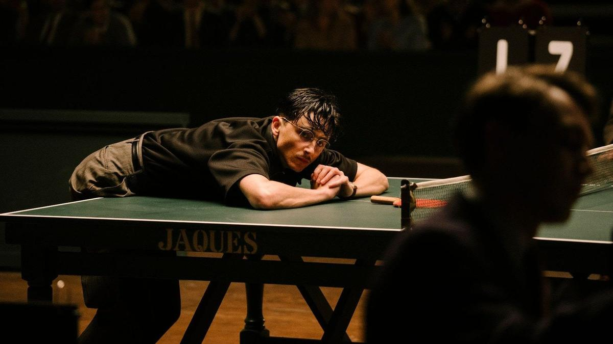

# Тимоти великолепный. 15 января выходит в прокат фильм Джуша Сафди, уже отмеченный «Золотым глобусом» за лучшую мужскую комедийную роль

- **URL:** https://novayagazeta.ru/articles/2026/01/12/timoti-velikolepnyi
- **Дата:** 2026-01-12
- **Автор:** Лариса Малюкова

## Тимоти великолепный

## 15 января выходит в прокат фильм Джуша Сафди, уже отмеченный «Золотым глобусом» за лучшую мужскую комедийную роль

Кадр из фильма «Марти великолепный»

Когда говорят об увлекательном разговоре с собеседником, сравнивают его с игрой в теннис. Фильм — непредсказуемая, взрывная игра, чувственная одиссея. Режиссер Джуш Сафди летит-торопится в слаломе между избитыми клише спортивных драм: «проигрывал, проигрывал и к финалу — выиграл!» Кажется, что «Марти великолепный» вообще про другое.

Нью-Йорк, 1952-й. Круглосуточный мошенник, ловкий 23-летний Марти Маузер (Тимоти Шаламе) намерен вырваться из семейного бизнеса — обувного магазина. Из плена жизни, которую он не выбирал. Хотя лишь он умеет продать что угодно, обмануть покупательницу, всучив ей дорогую пару, обвести вокруг пальца своего дядю (Ларри Ратсо Сломан), хозяина магазина. Протащить в подсобку влюбленную в него, как кошка, замужнюю Рэйчел (Одесса А'зион) — для рискованного секса между коробками с обувью. Однако амбициозный еврейский пройдоха из Нижнего Ист-Сайда талантлив как черт — виртуозно играет в настольный теннис. Он одержим идеей фикс: стать чемпионом, первой ракеткой США в только еще набирающем популярность виде спорта, продемонстрировать, что он, Марти, лучший. Настольный теннис его религия, сила, пружина, которая может вынести его на Олимп. Просто надо раздобыть деньги, чтобы участвовать в международных турнирах. Очень много денег. Каким образом?

Любым. Лгать, воровать, соблазнять, играть в азартные игры, участвовать в криминальных авантюрах, манипулировать другими, проглатывать публичные унижения, мошенничать, манипулировать. Участвовать в развлекательных шоу — цирке с тюленями, десятками шариков… У него миссия — готовность идти до конца.

Кадр из фильма «Марти великолепный»

Он готов платить любую цену. Наконец, убедить скептиков, что жалкий пинг-понг — настоящий спорт. Марти патентует собственную марку оранжевых мячей — под названием Marty Supreme. Достает правдами и — нет… скорее, неправдами деньги, чтобы поехать в Великобританию на чемпионат по настольному теннису на стадионе «Уэмбли». А потом замахнуться на матч-реванш в далекой Японии. И воспользоваться помощью соперника, самодовольного, циничного мужа звезды миллионера Милтона Роквелла (в этой роли изумительный Кевин О'Лири, бизнесмен, телеведущий, участник шоу Shark Tank). Такие, как он, и станут лицами победившей «реальной политики» в Америке.

«Марти великолепный» — лучший фильм Сафди. Узнаваемый режиссерский почерк Джоша Сафди (с братом Бенджамином Сафди они снимали громкоголосые криминальные триллеры «Хорошее время» и «Неограненные драгоценности») — зашкаливающая эмоция, драйвовый ритм. Он переносит действие из бедных кварталов Нью-Йорка в шикарный номер «Ритца» в Лондоне, на открытую сцену в послевоенном, травмированном поражением Токио.

История погружена в сумрачное кофейно-изумрудное с всплесками теплого света ретро пятидесятых, окутано музыкой Дэниела Лопатина, создающего сложные звуковые ландшафты.

В сумраке зала теннисный стол освещен как сцена. И каждый матч разыгрывается как спектакль. В середине фильма действие явно провисает, но финал искупает все «временные трудности».

Любопытно, что кино про настольный теннис, игру для экрана не самую выигрышную, кажется энергичней, изобретательней картин о динамичных видах спорта вроде футбола или фигурного катания. Потому что Сафди снимает не про спорт, это та же история неудачника — как в «Неограненных алмазах», — который ломает, рвет начертанную ему линию судьбы. Все фильмы братьев Сафди — про людей, которые вольно или невольно становятся и мячиками на «теннисном столе», вознамерившимися стать игроками. А за историей талантливого пройдохи-вундеркинда очевидно «маячит» сложный процесс послевоенного превращения разрозненной страны в мировую сверхдержаву, и мотором развития становятся национальная гордость отдельных персонажей, ценности капитализма (не только конкуренция, но индивидуальная инициатива) и безумство храбрых, не скованное ни малейшими сомнениями в себе.

Харизматик Шаламе играет самовлюбленного, амбициозного неудачника, зацикленного на сверхидее. Героя с отрицательным обаянием.

Кадр из фильма «Марти великолепный»

Поддержите нашу работу!

1000 500 300 Нажимая кнопку «Стать соучастником», я принимаю условия и подтверждаю свое гражданство РФ

Если у вас есть вопросы, пишите [email protected] или звоните:+7 (929) 612-03-68

Характер — как кипящая смесь: смекалка с неопытностью, гордыня, юношеский нарциссизм и готовность к любым жертвам, даже публичному унижению. Под темной монобровью горят глаза, веснушки и оспинки не умаляют харизмы, взрывная энергия, быстрая речь, мгновенные непредсказуемые реакции, которые выносят его на поверхность со дна неудач.

Ему жизненно необходим матч-реванш с японским чемпионом Кото Эндо (Кото Кавагути) — его полной противоположностью: хладнокровная дисциплина и сосредоточенность, горизонтальные молниеносные движения ракетки-призрака, неотбиваемые подачи. Шаламе, как и его герой, был готов на многое ради роли: носил контактные линзы от +10 до –10. Месяцы тренировался с экспертом по настольному теннису Диего Шаафом, и к началу съемок стал практически профессионалом.

Читайте также

Я такое дерево

Едва ли не во всех номинационных списках киносезона — «Сны поездов»

У Марти в кино много предшественников. Прежде всего, Говард Ратнер, одержимый «Большим кушем» и азартными играми гений рискованных схем («Неограненные алмазы»); юный Феррис Бьюллер — манипулятор, гедонист и бунтарь; Джерри Магуайер, втянутый в мир больших денег и интриг; обаятельный мошенник Фрэнк Абигнейл из «Поймай меня, если сможешь». Но мы наблюдаем и за внутренним ростом Марти. По сути, фильм — посвящение амбициозным, его слоганом мог бы стать завет Сенеки «Дорогу осилит идущий» («Viam supervadet vadens»).

Лариса Малюкова ведет телеграм-канал о кино и не только. Подписывайтесь тут.

### Этот материал входит в подписки

Смотровая площадкаКино с Ларисой Малюковой

Культурные гидыЧто читать, что смотреть в кино и на сцене, что слушать

### Добавляйте в Конструктор свои источники: сайты, телеграм- и youtube-каналы

Войдите в профиль, чтобы не терять свои подписки на разных устройствах

Поддержите нашу работу!

1000 500 300 Нажимая кнопку «Стать соучастником», я принимаю условия и подтверждаю свое гражданство РФ

Если у вас есть вопросы, пишите [email protected] или звоните:+7 (929) 612-03-68
