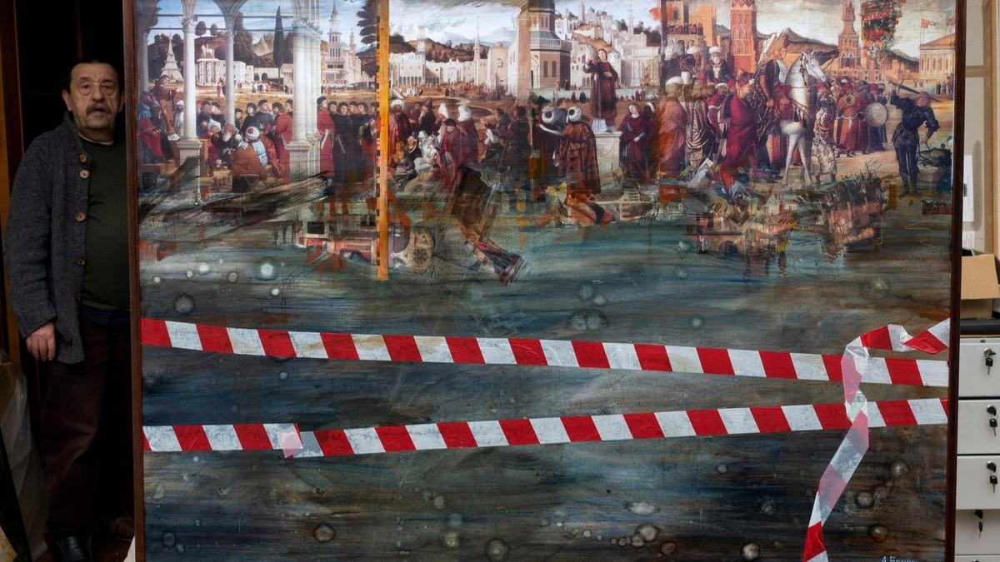

# «Я возглавляю северо-западное отделение по безопасности в искусстве». 24 января в московском кинотеатре «Художественный» — премьера фильма «Анатолий Белкин. Высокая вода»

- **URL:** https://novayagazeta.ru/articles/2026/01/23/ia-vozglavliaiu-severo-zapadnoe-otdelenie-po-bezopasnosti-v-iskusstve
- **Дата:** 2026-01-23
- **Автор:** Лариса Малюкова

## «Я возглавляю северо-западное отделение по безопасности в искусстве»

## 24 января в московском кинотеатре «Художественный» — премьера фильма «Анатолий Белкин. Высокая вода»

Кадр из фильма «Анатолий Белкин. Высокая вода»

«Я давно понял, что ничего нельзя откладывать, все надо начинать немедленно… Ну, задавай свои глупые вопросы».

Так начинается это кино.

24 января в «Художественном» — кино Юлии Бобковой о легенде советского андеграунда, классике неофициального искусства Анатолии Белкине, мастере визуальных высказываний, инсталляций и манифестов, участнике знаменитых выставок авангардного искусства в Ленинграде, создателе журналов, в том числе «Собака.ru», преподавателе, сочинителе масштабных культурных провокаций, мыслителе.

С конца 80-х в галереях Нью-Йорка, Сан-Франциско, Парижа, Лондона, Берлина, Питера проходили и проходят персональные выставки ярчайшего представителя нонконформистской культуры и мистификатора. В 2004-м прогремела его выставка-мистификация «Золото болот» в Эрмитаже, посвященная вымышленной «болотной цивилизации», грандиозный лжеобраз этой «цивилизации» подпитывался археологическими артефактами, якобы обнаруженными «энтомологической» экспедицией, членами которой были сам Белкин и его друзья.

Кадр из фильма «Анатолий Белкин. Высокая вода»

Его работы и его выставки всегда изрядно встряхивали и проветривали российское современное искусство. Сегодня работы художника хранятся в Русском музее, европейских и американских коллекциях.

Юлия Бобкова (люблю ее фильм о композиторе и «небесном тапёре» Олеге Каравайчуке) снимала не байопик, скорее ее живое кино — с байками, анекдотами и воспоминаниями друзей Белкина, редкой хроникой —

попытка максимального приближения к «божеству» авангарда — как человеку, максимально впитавшему и ёмко отразившему свое время.

Вне патетики и социальных масок. Язвительно и трепетно.

И вот само «божество» начинает режиссировать кино «про себя», так уж устроен художник, который едва ли не всю собственную жизнь превратил в инсталляцию. К примеру, почему бы не начать эту историю на кладбище? Тем более что на «Комаровском» такие прекрасные лисички! И столько близких друзей, начиная с Сергея Курехина, близкого по духу гения, существовавшего, как и Белкин, вне любых границ и уложений. В том числе законов времени. И неуправляемый импровизатор Каравайчук. И Ахматова, похороны которой собрали цвет новой поэзии — ее «мальчиков»: Бродский, Рейн, Бобышев.

В документальной драме, которая словно шьется на наших глазах, Белкин иронизирует над собой как героем фильма, перебирает старые фото, на которых приятели, в том числе культ-иконы Илья Кабаков, Сергей Курехин, Юрий Темирканов, Александр Сокуров и другие. Живые и мертвые.

Он показывает нам книжку-альбом «последний ковчег» с фотографиями друзей, в ней закладки тех, кого уже нет. Очень много закладок.

Бродим и плывем с ним по его Петербургу: улицы, каналы — вид на город с воды, дворцы и бесконечные коридоры коммуналок. Он размышляет о том, что с нами происходит: было и будет. Это его город, запечатленный в коллажах, графике, картинах, инсталляциях. Город, который стал в фильме равноценным собеседником «градообразующего Белкина». Город, вобравший в себя личную и коллективную память, смысловую среду, питающую среду художественную. А потом вдруг перемещаемся из его города в Нью-Йорк, на Манхеттен, где у Белкина была своя мастерская — на зависть коллегам.

Кадр из фильма «Анатолий Белкин. Высокая вода»

Поддержите нашу работу!

1000 500 300 Нажимая кнопку «Стать соучастником», я принимаю условия и подтверждаю свое гражданство РФ

Если у вас есть вопросы, пишите [email protected] или звоните:+7 (929) 612-03-68

Вспоминаем эпохальные первые легальные выставки ленинградского художественного подполья в застойные семидесятые — в ДК Газа и «Невский». Тогда случилось невозможное: работы почти сотни неофициальных художников показали при рекордном скоплении зрителей, выстаивавших в очереди по несколько часов. Видим эту великолепную очередь, в которых славный Ленинград: от Товстоногова с молодым Басилашвили до Гладилина. Бродим по заброшенному, полуразрушенному уродливому советскому дворцу — ДК вместе с Белкиным, по камням, разбитым стеклам, которые скрипят под подошвами, как по руинам древнего Рима. Слушаем рассказы участника жарких битв. И прежде всего нашего Белкина, описавшего в своих работах советскую цивилизацию: коммуналки, рюмочные, подъезды с запахом, чердаки, подвалы. Дворы-колодцы и комнаты чемоданного размера. Бесчисленные приметы и предметы. Как, например, старинные заклепки на именитых мостах. Он терся кожей обо все эти дворы, узкие и безразмерные пространства. До сих пор живет рядом с Михайловским замком в прекраснейшем из городов, знакомом до слез.

Сквозной образ фильма — «высокая вода», которая поднимается все выше, грозя поглотить, смыть всё. Воды в этом кино много, она плещется и бьется о зашитые в гранит набережные, спасающие город от наводнений.

И на его картине — густая, темная, опасная, безразличная и жестокая, как алчная слепая чернь, вода вот-вот захлестнет, сожрет прекрасные фрагменты шедевров Витторио Карпаччо и его современников — символическое наводнение в Венеции. Белкин бесстрашно исследует хрупкость искусства перед временем и стихией (в том числе социальными катаклизмами). На его коллаже «Осторожно, Египет» — древняя пирамида перевязана красно-белой леерной лентой. Работа посвящена разрушенным новыми варварами братьями-мусульманами египетских музеев, бесценных скульптур и статуэток, которым по четыре тысячи лет. Та же красно-белая лента, как знак SOS, и на «Высокой воде. Карпаччо».

Осторожно, искусство.

Уцелеет ли дух? Тонкий слой краски, туши, души — на бумаге, слова и рифмы? Вот в чем вопрос.

Он готовит свою выставку в Эрмитаже, которая «буквально связывает» прошлое с настоящим, возводит дамбу от натиска разрушительной стихии, «высоких вод», называет искусство «последним ковчегом». Но вода поднимается все выше…

Продюсеры фильма, снятого по заказу Музея AZ, — Наталия Опалева и Станислав Ершов.

Лариса Малюкова ведет телеграм-канал о кино и не только. Подписывайтесь тут.

### Этот материал входит в подписки

Смотровая площадкаКино с Ларисой Малюковой

Культурные гидыЧто читать, что смотреть в кино и на сцене, что слушать

### Добавляйте в Конструктор свои источники: сайты, телеграм- и youtube-каналы

Войдите в профиль, чтобы не терять свои подписки на разных устройствах

Поддержите нашу работу!

1000 500 300 Нажимая кнопку «Стать соучастником», я принимаю условия и подтверждаю свое гражданство РФ

Если у вас есть вопросы, пишите [email protected] или звоните:+7 (929) 612-03-68
