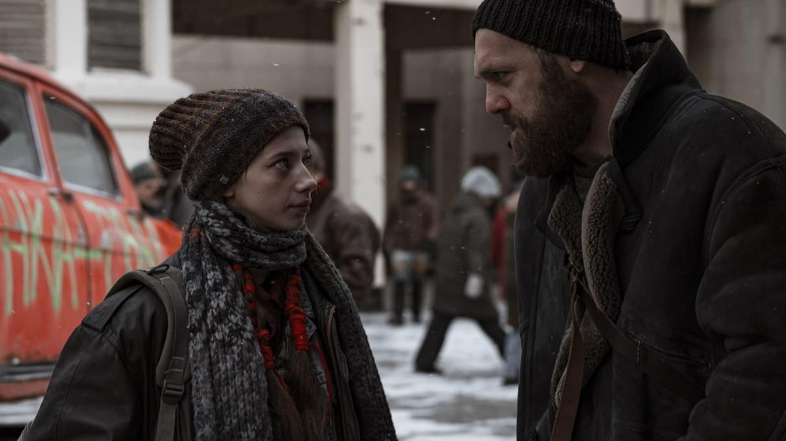

# Никогда не возвращайся. С 1 февраля на платформе KION детективный триллер «Резервация» режиссера Алексея Андрианова

- **URL:** https://novayagazeta.ru/articles/2026/01/26/nikogda-ne-vozvrashchaisia
- **Дата:** 2026-01-26
- **Автор:** Лариса Малюкова

## Никогда не возвращайся

## С 1 февраля на платформе KION детективный триллер «Резервация» режиссера Алексея Андрианова

Кадр из сериала «Резервация»

Экранизация фантастического романа Станислава Гимадеева «Принцип чётности». История о бывшем полицейском Сергее (Денис Шведов с бородой), который возвращается домой — но дома больше нет. Его город, отрезанный от внешнего мира загадочной аномалией, теперь называют резервацией. «Никогда не возвращайся в прежние места»: шероховатая история словно иллюстрирует шпаликовскую строчку, закрученную в воронку дистопии. В резервации — бедность, нищета, уличные рынки со старьем, нет ни телефона, ни телевизора, ни связи. Здесь люди живут без будущего, в полной неясности, что с ними происходит.

Сергей решается проникнуть на закрытую территорию за бетонным забором — хочет вытащить из «зоны», отрезанной от мира, жену (Екатерина Волкова) и дочь (Полина Гухман). Но если пробраться внутрь еще как-то можно, то выйти с территории аномалии, тщательно охраняемой, практически невозможно. Любая попытка заканчивается смертью беглеца.

Кто установил барьер? Каковы «правила резервации» и что такое «право на выход»? Почему дети, рожденные здесь, бесследно исчезают? Почему еду можно есть исключительно из вакуумной оболочки? Почему всем следует пить таблетки неведомого состава?

Но главное, почему люди ко всему так быстро привыкают и не задаются вопросами, что с ними происходит?

Ради спасения своей семьи Сергею придется раскрыть многослойную тайну резервации. Стать частным сыщиком, хранителем семьи, которая от него отвернулась, и, возможно, стать мстителем. А среди первых дел, которые ему поручают: разыскать по просьбе мутного мэра особой зоны (Филипп Янковский) его пропавшую дочь.

Кадр из сериала «Резервация»

Поддержите нашу работу!

1000 500 300 Нажимая кнопку «Стать соучастником», я принимаю условия и подтверждаю свое гражданство РФ

Если у вас есть вопросы, пишите [email protected] или звоните:+7 (929) 612-03-68

Режиссер Алексей Андрианов снимает многосерийную антиутопию в темных красках про мир со сдвигом. Как и в романах Стругацких, сюжет про физическую аномалию — ловушку для людей, оказывается поводом для разговора про «моральный сдвиг», в противостоянии темной неизвестной силе человек стоит перед сложнейшими выборами: определить, кто здесь враги, а кто — свои, простить слабости слабым, дать отпор беспощадным.

Микс криминальной интриги с философским подтекстом — привычен для кинофантастики — с помощью фантастического допущения, в конструировании альтернативного мира сай-фай исследует социальные страхи, философские дилеммы, по сути, отвечая на один главный вопрос: «Что у вас тут вообще происходит?»

Читайте также

«Я возглавляю северо-западное отделение по безопасности в искусстве»

24 января в московском кинотеатре «Художественный» — премьера фильма «Анатолий Белкин. Высокая вода»

«Резервация», как «Эпидемия» или «Территория», — сериал про попытку свободы в несвободе. «Это история про возвращение и исправление старых ошибок», — говорит режиссер. Возможно, ему удастся преодолеть несовершенство романа, его слабую проработку сеттинга.

Лариса Малюкова ведет телеграм-канал о кино и не только. Подписывайтесь тут.

### Этот материал входит в подписку

Смотровая площадкаКино с Ларисой Малюковой

### Добавляйте в Конструктор свои источники: сайты, телеграм- и youtube-каналы

Войдите в профиль, чтобы не терять свои подписки на разных устройствах

Поддержите нашу работу!

1000 500 300 Нажимая кнопку «Стать соучастником», я принимаю условия и подтверждаю свое гражданство РФ

Если у вас есть вопросы, пишите [email protected] или звоните:+7 (929) 612-03-68
