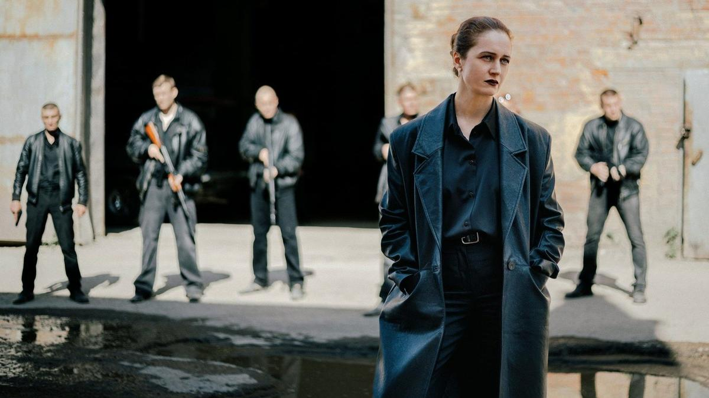

# Как выйти из сумрака. С 29 января на платформах START и WINK — второй сезон сериала «Дети перемен» — большого семейно-криминального киноромана

- **URL:** https://novayagazeta.ru/articles/2026/01/28/kak-vyiti-iz-sumraka
- **Дата:** 2026-01-28
- **Автор:** Лариса Малюкова

## Как выйти из сумрака

## С 29 января на платформах START и WINK — второй сезон сериала «Дети перемен» — большого семейно-криминального киноромана

Кадр из сериала «Дети перемен»

Работы Любови Львовой и Сергея Тарамаева («Черная весна», «Фишер») «Дети перемен» существуют отдельно от общего сериального конвейера. Они не боятся откровенной театральности, неожиданных визуальных решений, цитат и отсылок, монтажа несочетаемых стилей и жанров. Юный бандит выводит арию Чайковского, подростки вызывают лживых взрослых на дуэль, пахан слушает монолог из «Дяди Вани». Первый сезон завершается трагической сценой гибели Офелии — невесты главного героя.

И никто здесь не знает, что день грядущий им готовит. Потому что «Дети перемен» — семейная сага про эпоху «открытого перелома», воронку 90-х, втянувшую и закрутившую в смертельном водовороте одну особенную семью. Время и в первом сезоне было одним из главных действующих лиц — соскочившее с резьбы, с рельсов эволюции.

Время как концентрат неисполнимых космических желаний и утлых возможностей, сжатое в кровавых разборках, ярких вспышках-романах, подлых подставах, рыночных перепродажах, отраженное в глазах десятков персонажей: ужасом, вседозволенностью, восторгом, страхом.

Оно повелевало, дирижировало судьбами героев и их взаимоотношениями.

И вот вновь встречаемся с Флорой (Виктория Исакова) и ее тремя взрослыми сыновьями. Старший сын, криминальный авторитет Петр (Слава Копейкин), осужденный за убийство, в тюрьме, и если выйдет, то уж точно не по воле мамаши, королевы троллейбусов Флоры, которая его ни разу не навестила. Средний — Юра (Макар Хлебников) все еще художник, правда, в его рукодельных киноплакатах больше не нуждаются. Видимо, будет учить детей рисованию. Младший — Руслан (Хетаг Хинчагов) живет с матерью Флорой и своим отцом Лашей, ставшим по вине брата Петра инвалидом (безупречно тонкая, хрупкая актерская работа режиссера Руслана Братова).

Кадр из сериала «Дети перемен»

Но главные метаморфозы произошли с самой Флорой. Как и намекали в финале первого сезона, она больше не водит троллейбусы, а сама возглавляет ОПГ, стала ферзем в городе… Это превращение с первых кадров не выглядит убедительным. Флора Виктории Исаковой вся в коже — бандерша с гладкой прической, темным маникюром и резиновых сапогах вроде бы яростно быкует, наказывает провинившихся, ботает по фене… Но кажется, вот-вот скинет свой прикид и скажет, что ее атаманша — шуточная, понарошку, вот-вот любительница караоке запоет: «Говорят, мы бяки-буки…» Актрисе неуютно, неорганично в этом внезапном радикальном преображении, не поддержанном внутренней логикой развития истории или характера. Правда, постепенно ее героиня на экране обретает достоверность, опору в драматургии. Тарамаев и Львова — режиссеры-харизматики, за счет киноязыка, визуальных решений, работы с актером способны минимизировать сценарные прорехи. Но даже такой актрисе, как Виктория Исакова, необходимы «вещественные доказательства» в перемене участи, психофизики ее героини.

Как женщина прозорливая, Флора мечтает о легальном бизнесе: бандитская эпоха вот-вот закончится. Увы, завоевывать этот самый легальный бизнес — троллейбусный парк, например, приходится уже отлаженным бандитским образом. Вначале кажется, что в истории слишком много допусков: и администрация Флоре настолько попустительствует и боится киднеппинга: будто за ней и впрямь какая-то мощная сила (ее мы не видим). Примерно то же можно сказать о прикованном к инвалидному креслу Эйнштейну Артема Кошмана, научившемуся манипулировать людьми, независимо от их статусов и рангов.

Постепенно вырисовывается главный конфликт сезона:

это битва антагонистов — Флоры и ее сына Петра (к которому того и гляди присоединятся его братья). Битва «не на жизнь» — такой жаркой огненной остроты противостояние «отцов и детей».

Поддержите нашу работу!

1000 500 300 Нажимая кнопку «Стать соучастником», я принимаю условия и подтверждаю свое гражданство РФ

Если у вас есть вопросы, пишите [email protected] или звоните:+7 (929) 612-03-68

Надеюсь, в следующих сериях история обретет присущую авторам убедительность всех сюжетных хитросплетений.

Кадр из сериала «Дети перемен»

Ведь в мрачном карнавале «Детей перемен», сочиненном Сергеем Тарамаевым и Любовью Львовой, реальность рассыпается, разбивается на мелкие, порой не склеиваемые осколки — жизни людей, которые могли бы повторить вслед за гонимым Артистом Александра Яценко, цитирующим Чехова: «И там за гробом мы скажем, что мы страдали, что мы плакали, что нам было горько, и бог сжалится над нами».

Эта интонация сочувствия к людям-осколкам внутри катастрофы рассыпающегося мира — и отличает их порой неровные работы от штампованных сериалов про «лихие 90-е с лихими бандами».

А пасхалок, весьма причудливых рифм и решений, как всегда у режиссеров в новом сериале немало. Телевизионная стилистика сшивается с балабановскими ритмами и долгими проходами. Кажется, весь сезон — оммаж Алексею Октябриновичу. Юра (Макар Хлебников) — «сиреневый мальчик», светлое пятно мрачного криминального сказания старины неглубокой — «наш брат» в невнятном рубежном мире, закономерно встречает режиссера Балабанова (Сергей Карабань), который снимает фильм про последнего отчаявшегося героя Данилу. Юра видит съемку, как когда-то Данила Багров следил за съемкой настоящих киношников. Натурально Балабанов с бутылкой белого в руках интересуется главным-сакраментальным: «В чем сила, брат?»

Отвечать на этот вопрос будет весь сериал и его герои: заблудившаяся в сумрачном лесу жизни Флора с сыновьями, экс-мужьями, да и все их соотечественники. Но во времена «большого перелома» еще кажется, что выход из сумрачного леса есть.

Лариса Малюкова ведет телеграм-канал о кино и не только. Подписывайтесь тут.

### Этот материал входит в подписку

Смотровая площадкаКино с Ларисой Малюковой

### Добавляйте в Конструктор свои источники: сайты, телеграм- и youtube-каналы

Войдите в профиль, чтобы не терять свои подписки на разных устройствах

Поддержите нашу работу!

1000 500 300 Нажимая кнопку «Стать соучастником», я принимаю условия и подтверждаю свое гражданство РФ

Если у вас есть вопросы, пишите [email protected] или звоните:+7 (929) 612-03-68
