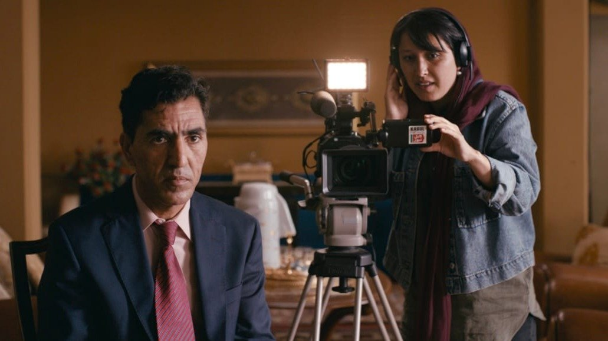

# Приз Мишель Йео и афганский ромком. Международный кинофестиваль в Берлине открыл фильм «Нет хороших мужчин»

- **URL:** https://novayagazeta.ru/articles/2026/02/13/priz-mishel-ieo-i-afganskii-romkom
- **Дата:** 2026-02-13
- **Автор:** Лариса Малюкова

## Приз Мишель Йео и афганский ромком

## Международный кинофестиваль в Берлине открыл фильм «Нет хороших мужчин»

Кадр из фильма «Нет хороших мужчин»

Берлинале-2026 открывался под проливным дождем. Звезды выныривали из авто, чтобы скорей спрятаться под прозрачной крышей над красной дорожкой. Зонтики и плащи в этом году — лучшие из аксессуаров. Хотя многие актрисы предпочли декольте, голые спины, шифоновые и шелковые наряды. Здесь видели и не такую погоду, случалось, февральский ветер нес на звездную дорожку и снег. Среди почетных гостей — Шон Бейкер, Даниэль Брюль, Белла Рамзи, Аугуст Диль, Нил Патрик Харрис, Мишель Йео, которой Бейкер вручил почетного «Золотого медведя».

На редкость точный выбор фильма Открытия. Формально кино в русле важных для Европы тем: гендерный баланс и репрезентация различных меньшинств. Но всё это политика, и не случайно члены главного жюри говорили на своей пресс-конференции о том, что кино и политика — вещи противоположные. «Если мы снимаем фильмы, которые целенаправленно носят политический характер, мы вступаем в политическую плоскость», — заявил председатель жюри Вим Вендерс.

Фильм «Нет хороших мужчин» Шарбану Садат («Волк и овца») избегает публицистического пафоса. Это, прежде всего, универсальная человеческая, более того, романтическая история, которая разворачивается в Кабуле, у порога крушения цивилизованной жизни.

Это храброе, временами сентиментальное, временами смешное нежное кино. Комедийный ромком неожиданно — как это и бывает в реальности — превращается в битву на выживание.

35-летняя Садат сама написала сценарий, сняла и исполнила главную роль. Садат родилась в Тегеране, изучала документальное кино в Atelier Varan, начала карьеру в жанре cinéma vérité. Ее фильм «Волк и овца» получил главный приз каннского «Двухнедельника режиссеров».

С самого начала автор фильма играет со штампами: на вступительных титрах сладко-разноцветно расцветают кактусы, как в мыльных операх или в индийском кино.

Нару — единственная женщина-оператор на главном телеканале Кабула. Она дама прогрессивных взглядов, но вынуждена снимать популярное женское шоу, в котором психолог отвечает на вопросы зрительниц. Вопросы в основном посвящены тому, как вести себя с мужем-абьюзером. Ответы психолога же выдержаны в русле пещерной патриархальности: подумаешь, родила много детей, вот и потускнела — надо больше уделять внимание макияжу, чтобы нравиться мужу, может, он и бить тебя перестанет. Примером «внимания макияжу» служит разрисованная, как фреска, ведущая программы. Но однажды Нару удается поехать снимать интервью с главным политическим обозревателем «Новостей». Интервью сорвется как раз потому, что у камеры — женщина. Но Нару добудет репортаж ко «Дню влюбленных» (да, до 2021-го такой праздник существовал в Афганистане, и женщины в этом репортаже будут искренне рассказывать, насколько обделены этой любовью дома, как к ним относятся их мужья. А известный обозреватель Кодрат обратит на Нару внимание.

Кадр из фильма «Нет хороших мужчин»

Отношения будут медленно завязываться, хотя Нару всячески этому препятствует: она формально замужем, хотя с мужем давно не живет, воспитывает четырехлетнего сынишку. Да и вообще она точно знает — хороших мужчин в стране нет. Вот только Кодрат почему-то ведет себя иначе. Их репортажи — последние зарисовки мирной нормальной жизни. И сама Нару — вопиющий и шокирующий пример нормальности: джинсовая куртка, брюки, кроссовки, прозрачный платок, который все время сползает, приводя фанатиков в неистовство.

Шарбану Садат ломает стереотипы представлений об Афганистане и иранских женщинах, прочерчивая на экране возможность нормальной жизни страны — без гнета фундаменталистов.

Поддержите нашу работу!

1000 500 300 Нажимая кнопку «Стать соучастником», я принимаю условия и подтверждаю свое гражданство РФ

Если у вас есть вопросы, пишите [email protected] или звоните:+7 (929) 612-03-68

Смешной эпизод, когда подружка Нару, ныне гражданка США, привозит подарок в коробке — «символ счастливого развода», огромных размеров фаллоимитатор. И три подруги в студии пытаются подключить его к батарейке. Упоительная сцена большой свадьбы, на которой отплясывает в сверкающем пиджаке продюсер телевидения, а невеста восседает горой за обильным праздничным столом.

Читайте также

Берлинале-2026: Неопознанные летающие объекты

12 февраля открывается Международный Берлинский кинофестиваль. Рассказываем о самых любопытных картинах киносмотра

Центр и главный магнит фильма — Шарбану Садат, Нару, проживает на наших глазах целую жизнь, от разочарования к надежде. Это история романтики, бунтарства, внутренней свободы, женской самостоятельности и самостояния. И при всем трагизме — оптимистическая в своей вере в человека. Но это и история и бунтарства самой Шарбану Садат, первой в афганском кино показавшей на экране поцелуй

Садат успела эвакуироваться в Европу, где и наблюдала окончательное крушение демократии и пришествие талибов. В своих интервью она говорит, что бурное время, что ей пришлось пережить, и определило тип кино, которое она хотела бы снимать: о поиске взаимопонимания, взаимопомощи, радости, несмотря на потрясения, насилие и репрессии: «Афганистан похож на остальной мир, поэтому я решила: я сниму романтическую комедию».

Лариса Малюкова ведет телеграм-канал о кино и не только. Подписывайтесь тут.

### Этот материал входит в подписки

Смотровая площадкаКино с Ларисой Малюковой

Культурные гидыЧто читать, что смотреть в кино и на сцене, что слушать

### Добавляйте в Конструктор свои источники: сайты, телеграм- и youtube-каналы

Войдите в профиль, чтобы не терять свои подписки на разных устройствах

Поддержите нашу работу!

1000 500 300 Нажимая кнопку «Стать соучастником», я принимаю условия и подтверждаю свое гражданство РФ

Если у вас есть вопросы, пишите [email protected] или звоните:+7 (929) 612-03-68
