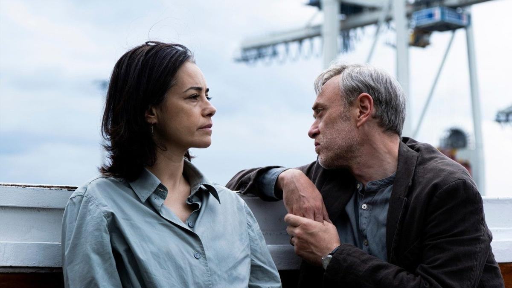

# Шепотом о наболевшем. Берлинале смотрит на Восток с открытым женским лицом. Рецензии на кинопремьеры «Шепотом», «Желтые листья», «Всем нравится Билл Эванс»

- **URL:** https://novayagazeta.ru/articles/2026/02/14/shepotom-o-nabolevshem
- **Дата:** 2026-02-14
- **Автор:** Лариса Малюкова

## Шепотом о наболевшем

## Берлинале смотрит на Восток с открытым женским лицом. Рецензии на кинопремьеры «Шепотом», «Желтые листья», «Всем нравится Билл Эванс»

Кадр из фильма «Желтые листья»

Первые картины конкурса свидетельствуют о серьезном намерении одного из главных кинофестивалей раскрыть миру скрытые доселе свободные лица несвободного востока.

Фильм открытия «Нет хороших мужчин» (о нем мы уже рассказывали) — история любви самостоятельной и независимой женщины, оператора Кабульского телевидения, которая выбирает свою судьбу вопреки законам патриархального общества.

В фильме «Шепотом» (À Voix basse / In A Whisper) тунисской француженки Лэйлы Бузид все еще неожиданнее.

Из Франции на похороны дяди приезжает 32-летняя Лилия. В большой семье безвременно почившего оплакивают женщины трех поколений плюс родственницы и соседки.

Здесь правит домострой — даже на телевизор властная домоправительница бабушка накладывает запрет. И нетрадиционная личная жизнь Лилии явно тут никого не устроит.

Теперь ей самой придется решать вопросы собственной идентичности, а заодно понять, что случилось с ее дядей, которого на протяжении многих лет гнобила его большая семья, не давая права выбора. Две судьбы срифмуются, и дядя с того света поможет любимой племяннице с выбором.

Кадр из фильма «Шепотом»

Если в картине «Нет хороших мужчин» — шероховатости наивной драматургии и некоторые прямолинейные ходы с лихвой компенсирует режиссерская энергия, то тунисская лента сделана более изощренно — слишком старается соответствовать всем новым европейским канонам, чем, видимо, и приглянулась отборщикам.

В любом случае, российским зрителям можно не беспокоиться: ее у нас не покажут.

Политическая драма «Желтые листья» Илкера Чатака, родившегося в Берлине в турецкой семье, — весьма актуальное (в том числе для России), но не оригинальное кино. В отличие от предыдущей картины режиссера «Учительская», вошедшей в оскаровскую номинацию, действие разворачивается не в Германии, а в Турции (снимали в Германии).

Успешная супружеская пара: Дерия — известная актриса, готовая играть в авангардных экспериментальных спектаклях (Озгю Намаль), и Азиз (Тансу Бичер) — продвинутый профессор литературы. Внезапно появляется свидетельство их неблаговидных с точки зрения государства политических взглядов. Оба они теряют работу. Получают письма с угрозами, вынуждены переехать в Стамбул.

Илкер Чатак снимает психологическую драму о том, чем приходится жертвовать, когда ты становишься мишенью репрессий.

Не станут ли платой за твои взгляды твои отношения с близкими, твоя семья? На какие компромиссы ты готов идти ради детей, ради своего благополучия?

Кадр из фильма «Желтые листья»

Поддержите нашу работу!

1000 500 300 Нажимая кнопку «Стать соучастником», я принимаю условия и подтверждаю свое гражданство РФ

Если у вас есть вопросы, пишите [email protected] или звоните:+7 (929) 612-03-68

Режиссер не понаслышке знает о массовых увольнениях в Турции — многие из его друзей лишились работы после формальных придирок администрации. Но прежде всего это кино — о свободе творчества, без которой и творчества никакого нет (в качестве альтернативы актриса, вынужденная покинуть театр, соглашается сняться в мыльной опере). Примечателен эпизод, в котором Дерии на сцене по ходу пьесы надо раздеться, она готова, но как на это решиться театру? К сожалению, телевизионный формат и многочисленные диалоги «по существу поднятой темы» сделали изображение необязательным. Хотя актерские работы отменные.

«Всем нравится Билл Эванс». Режиссер — Грант Джи. Меланхолический байопик о джазовом гении устроен как негромкий завораживающий джаз, сочиненный самим Эвансом. Как придуманные им сложные ритмические построения, мягкое тусклое туше, перекличка инструментов, импрессионистическая лирика.

Кадр из фильма «Всем нравится Билл Эванс»

Практически на титрах — тот самый знаменитый и последний клубный концерт трио великого Билла Эванса со Скоттом Лафаро (контрабас) и ударником Полом Мотианом (Paul Motian) — легендарный звездный состав (1959–1961).

Всего несколько дней назад в нью-йоркском клубе Village Vanguard завершилась запись двух величайших джазовых пластинок всех времен. Сегодня вечером они играют как боги. Здесь нет привычных для джаза соло — инструменты, звуки, взгляды музыкантов говорят друг с другом.

Возвращаясь дождливой ночью после этого счастливого концерта для ценителей, Лафаро погибнет в автокатастрофе. А Эванс (Андерс Даниэльсон Ли), оглушенный, ошеломленный горем, перестанет играть. Алкоголь, попытка полюбить, наркотики, попытки слезть с иглы. У него останутся звуки: плеск льющейся в стакан воды, шипение мяса на сковородке, уродливая какофония ломки. Он будет стараться вернуться к жизни, но стоит ли, если в ней нет музыки…

Это дебют в игровом кино британского документалиста Гранта Джи, известного своей трилогией документальных фильмов «Золотая машина». Джи снимал музыкальные неигровые картины Joy Division и Meeting People is Easy о группе Radiohead. Он постоянно сотрудничает с великолепным театральным режиссером Кэти Митчелл, вплетающей кино и видеоарт в свои спектакли.

И кажется, сам Грант Джи открыт поиску своего киноязыка. Он играет с изображением, с временами, с ритмом, словно импровизирует. Сверхкрупно — черно-белые струны контрабаса, клавиши, пальцы едва дотрагиваются до клавиш, кажется, они сами опускаются и поднимаются, отражение Эванса на крышке рояля, кружатся бобины, музыканты играют, пересматриваясь друг с другом. Это удивительный, тихий и непредсказуемый разговор. Особая тайная связь внутри рождаемой сейчас, в этот момент, музыки.

Понятно, что без этой связи Эвансу будет невыносимо. Черно-белые 60-е — кажется, что само время впечаталось в кадр: белые рубашки мужчин, дым сигарет, легкие тюлевые занавески. Много воздуха. Смутные, душные цвета 80-х. Прошлое смешивается, наскакивает на будущее, меняется с ним местами. Надежда — с разочарованием. Джаз — с режущими диссонансами. Родители (Билл Пуллман и Лори Меткалф) попытаются вернуть своего взрослого сына к жизни. И именно мать произнесет ключевые, почти спасительные слова: «Иногда важно понять, что означает пауза в музыке».

Читайте также

КомментарийПриз Мишель Йео и афганский ромком Международный кинофестиваль в Берлине открыл фильм «Нет хороших мужчин»Лариса МалюковаКомментарийБерлинале-2026: Неопознанные летающие объекты 12 февраля открывается Международный Берлинский кинофестиваль. Рассказываем о самых любопытных картинах киносмотраЛариса МалюковаКомментарийПриз Мишель Йео и афганский ромком Международный кинофестиваль в Берлине открыл фильм «Нет хороших мужчин»Лариса МалюковаКомментарийБерлинале-2026: Неопознанные летающие объекты 12 февраля открывается Международный Берлинский кинофестиваль. Рассказываем о самых любопытных картинах киносмотраЛариса МалюковаБерлин

### Этот материал входит в подписки

Смотровая площадкаКино с Ларисой Малюковой

Культурные гидыЧто читать, что смотреть в кино и на сцене, что слушать

### Добавляйте в Конструктор свои источники: сайты, телеграм- и youtube-каналы

Войдите в профиль, чтобы не терять свои подписки на разных устройствах

Поддержите нашу работу!

1000 500 300 Нажимая кнопку «Стать соучастником», я принимаю условия и подтверждаю свое гражданство РФ

Если у вас есть вопросы, пишите [email protected] или звоните:+7 (929) 612-03-68
