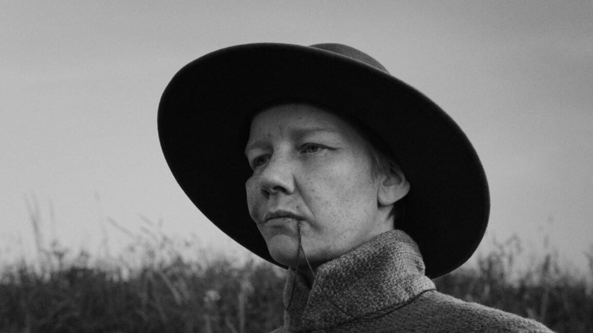

# Солдат по имени Роза и другие незнакомцы. Лариса Малюкова с хроникой «Берлинале»

- **URL:** https://novayagazeta.ru/articles/2026/02/17/soldat-po-imeni-roza-i-drugie-neznakomtsy
- **Дата:** 2026-02-17
- **Автор:** Лариса Малюкова

## Солдат по имени Роза и другие незнакомцы

## Лариса Малюкова с хроникой «Берлинале»

Кадр из фильма «Роза»

Довольно слабую программу показывает нам Берлинале в первой половине киносмотра. Кажется, директор Триша Таттл решительно разворачивает конкурс в сторону «повестки». Фильмы о свободных женщинах несвободного Востока, пробующих себя в экспериментальном кино. Европа представлена в основном в копродукциях со странами третьего мира. Или в причудливых сюжетах-метафорах. Как финский (копродукция с Литвой, Францией, Великобританией) «Рожденный ночью» («Yön Lapsi») режиссера Ханны Бергхольма. В нем родила Сага в ночь не то сына… одним словом, монструозного, покрытого то ли шерстью, то ли волосами монстра. Который вместо молока хочет крови, в крайнем случае сырого мяса. И как-то надо матери с этим сжиться… Тема материнства как кошмара, начатая в прошлом году главными фестивалями мира, получает еще более брутальное (и довольно противное) воплощение.

С точки зрения европейской политики все актуально, но смотреть это не обязательно.

«ДАО» (не путать со скандальным «Дау» — но тоже игра в реальность в режиме длительного проживания типажами предложенных ролей) разворачивается во Франции и Гвинее-Бисау, откуда родом родственники режиссера. Начинается все с кинопроб, режиссер Ален Гомис выбирает из многих претендентов актеров, которые разыграют/проживают это действо. Они должны стать родственниками, представителями большого клана. И они ими становятся. Гомис еще больше размывает границы между фактом и вымыслом (в кастинге и члены его собственной семьи). Отсутствие нарратива (сценария у фильма не было) создает ощущение спонтанности и некоторого хаоса, в то же время это не документальное кино, хотя чувство подлинности возникает с момента прибытия героев фильма к своей неисчислимой «родне». Большая шумная свадьба во французской провинции, ритуал поминовения в крошечной африканской деревне.

Режиссер собирает-монтирует события как мозаику, соединяя, сталкивая эмоции, погружая нас в красочный карнавал, палитру обрядов, метафор, образов, живых портретов.

Начало и конец жизни как единый ритуальный круг. С музыкой, объятиями, разговорами по душам. Нет главных и второстепенных героев, но в центре свободного повествования огненные мать и дочь-невеста (Кэти Корреа и Д'Жоэ Куадио). Кино как погружение в диковинный, незнакомый мир, через эмоцию, молитвы, танцы, еду, ритуалы. Очень затянутый эксперимент с некоторыми чудными сценами. После показа познакомилась с некоторыми из участников.

Кадр из фильма «Дао»

«Мы все незнакомцы», режиссер Энтони Чэнь

Первый сингапурский фильм в конкурсе Берлинале. Драма из жизни бедняков, развивающаяся на протяжении нескольких лет в современном Сингапуре. История неблагополучной сложноустроенной семьи на фоне социально-экономического пейзажа страны.

Трудяга Бун Киат (Анди Лим) жарит и подает лапшу в крошечной забегаловке. Один воспитывает 21-летнего сына Джуньяна (Ко Цзя Лер) — лоботряса, инфантила и бездельника. Но лоботряс влюбляется, и женится на своей беременной подружке Лидии (Реджин Лим), ученице старших классов, начинающей фортепианную карьеру. Отец в это же время делает предложение официантке средних лет Би Хуа (Ё) — жаркий темперамент, микс романтики и цинизма. В пересказе звучит как мыльная опера. Во многом эта история и напоминает сериал, но прекрасные актеры и «американские горки» сюжета о выживании бедняков в современном мегаполисе несколько микшируют многочисленные сюжетные натяжки. В одной квартире собрались совершенно разные во всех отношениях люди, и за их сближением, за их попытками выплыть из неурядиц и бед наблюдать любопытно.

Энтони Чен играет с разными форматами: от неспешного телевизионного хода действия и вялых диалогов до скачкообразного монтажного ритма инстаграма, будут рилсы, TikTok LIVE Gifts.

Кадр из фильма «Мы все незнакомцы»

Будут разнообразные почти криминальные авантюры, зарисовки разительного социального неравенства и попыток эмигрантов стать своими в чужой стране. Сочувствие к персонажам почти перевесит вязкое ощущение многосерийного телевизионного мувика, втиснутого в 157 минут экранного действия.

Поддержите нашу работу!

1000 500 300 Нажимая кнопку «Стать соучастником», я принимаю условия и подтверждаю свое гражданство РФ

Если у вас есть вопросы, пишите [email protected] или звоните:+7 (929) 612-03-68

Фильм является заключительной частью неофициальной трилогии Энтони Чена «Взросление» (Growing Up), в которую также входят фильмы «Илоило» (2013) и «Сезон дождей» (2019).

Читайте также

Охотники за пращурами

Мировая премьера в короткометражном конкурсе «Берлинале» — фильм Евгении Арбугаевой «Чуураа»

«Обрезка розовых кустов» — вопиющая провокациями неудачная черная комедия Карима Аинуза. Ремейк подзабытого стильного черно-белого фильма Марко Беллоккьо «Кулаки в кармане». Вот взять хорошее, по меркам шестидесятых революционное кино, осмысленное художественное высказывание, радикальный бунт против косных буржуазных ценностей и превратившейся в клетку семьи, — и снять вроде бы дерзкое, на самом деле, старательно вычурное, бессмысленно шокирующее кино.

История еще одной безумной семейки, упакованная в картинку, напоминающую глянец модной обложки. На роскошной вилле слепой тиран (Трейси Леттс) тихо тиранит взрослых детей: прежде всего младшего сына — милейшего вида эпилептика с навязчивыми идеями (Лукас Гейдж), дочь — необузданную в капризах нимфоманку Анну (Райли Кио). Любимца всей семьи Джека (Джейми Белл), который приводит в этот дурдом свою невесту (Эль Фанинг), обычную девушку в платье от Zara. Мать вроде бы погибла (Памела Андерсон) и ее сгрызли волки. А может, и не погибла. Но волки периодически грызут человеческую плоть. Джек сладострастно занимается самоповреждением острыми предметами. У каждого из членов семьи свои неугомонные скелеты в шкафах. История про аморальных циников-беспредельщиков неожиданно увенчана прозорливым романтическим девизом: «Люди — это розы. Семьи — это кусты роз. Кусты роз нуждаются в обрезке». И фильмы тоже.

А зрителям рекомендуется перечесть женитьбу Фигаро — то есть пересмотреть дебютную картину Беллоккьо, которая возвестила о начале направления в европейском кинематографе — «кино контестации». По мнению ряда критиков, фильм стал предтечей бурных проявлений протеста европейской молодежи 1968-го. Между прочим, начинающий режиссер снял фильм, взяв взаймы деньги у брата — всего 80 тысяч долларов. А снимали кино в доме матери режиссера, где прошло его детство. Вот были люди в наше время.

Кадр из фильма «Обрезка розовых кустов»

Из приличного «Роза» Маркуса Шляйнцера («Михаэль», «Анджело») — история из XVII века о женщине, вынужденно переодевшейся в мужскую одежду, чтобы ее приняли в коммуну и дали землю с заброшенной фермой. Она выдает себя за погибшего на фронте товарища, наследника владельцев фермы. Замечательная Сандра Хюллер («Анатомия падения», «Зона интересов») делает все возможное, чтобы убедить односельчан, что она — грубоватый раненый в лицо солдат (на щеке шрам, пуля на веревочке вокруг шеи). Теперь она (он) — фермер, готовый хозяйство с работниками поднять и даже… жениться.

Фильм с явными отсылками к «Жанне Д’Арк» — последнего шедевра Дрейера (есть даже сцена с инквизиторами) — исследует гендерные привилегии и социальные роли в Германии. В своем огненном монологе Роза обвиняет общество, в котором женщина лишена свободы выбора. Из достоинств — завораживающее черно-белое изображение, светопись на темном экране с высвеченными реальными источниками света (керосиновые лампы, фонари, свечи, солнце) — лицами в духе старой голландской живописи. Один из первых претендентов на «Золотого медведя».

Лариса Малюкова ведет телеграм-канал о кино и не только. Подписывайтесь тут.

### Этот материал входит в подписки

Смотровая площадкаКино с Ларисой Малюковой

Культурные гидыЧто читать, что смотреть в кино и на сцене, что слушать

### Добавляйте в Конструктор свои источники: сайты, телеграм- и youtube-каналы

Войдите в профиль, чтобы не терять свои подписки на разных устройствах

Поддержите нашу работу!

1000 500 300 Нажимая кнопку «Стать соучастником», я принимаю условия и подтверждаю свое гражданство РФ

Если у вас есть вопросы, пишите [email protected] или звоните:+7 (929) 612-03-68
