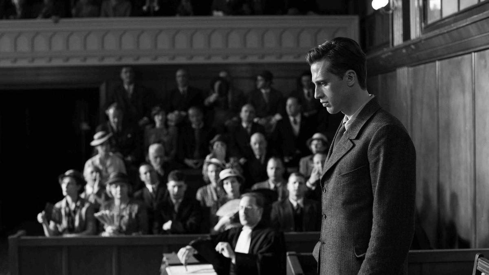

# Я — незнакомец, я жив, я мертв. На экраны выходит фильм Франсуа Озона «Посторонний» по знаменитому роману Альбера Камю

- **URL:** https://novayagazeta.ru/articles/2026/03/04/ia-neznakomets-ia-zhiv-ia-mertv
- **Дата:** 2026-03-04
- **Автор:** Лариса Малюкова

## Я — незнакомец, я жив, я мертв

## На экраны выходит фильм Франсуа Озона «Посторонний» по знаменитому роману Альбера Камю

Кадр из фильма «Посторонний»

В прологе — черно-белая хроника из Алжира конца тридцатых. За кадром преувеличенно бодрый голос поет дифирамбы расстраивающемуся и хорошеющему на глазах Алжиру. «Город уже не похож на трущобы! — радуется комментатор. — Франция открыла город и страну миру! Новый Алжир строится, расширяется, европеизируется, и уже так похож на Париж! А вместе с тем сохраняет многоголосие и переплетение культур, он устремлен в будущее!»

В это время в грязную переполненную жаркую камеру вводят нового арестованного. Это белый европеец Мерсо, французский поселенец в Алжире. На вопрос арабских сокамерников он честно отвечает: «Я убил араба».

Так Озон с первых минут обозначает подводные смыслы, которые он рассмотрел и укрупнил в нетленном ключевом произведении экзистенциализма и философии абсурда, повествующем о человеке, отчужденном от социальных норм, привычной лжи и условностей. Новая экранизация, вызвавшая споры спустя 80 лет после публикации романа, сосредоточена на переосмыслении его колониального контекста.

Мерсо Бенжамена Вуазена («Лето '85») — невероятно привлекательный сдержанный, немногословный, даже замкнутый в себе человек, который живет и действует сообразно обстоятельствам, плывет по течению, не выражая никаких эмоций. Получив телеграмму о смерти матери в богадельне (денег на ее содержание не хватает), он едет на похороны, но не изображает горя, не плачет, не раскаивается, молча участвует в ритуалах, пьет кофе и отбывает… в кинематограф с очаровательной Мари смотреть комедию с Фернанделем. Чем вызывает оторопь окружающих. На следующий день после смерти матери он чудно проводит время с Мари, занимается с ней любовью. Но в ответ на ее признание не отвечает ей взаимным признанием… впрочем, если она хочет, он может и жениться. На предложение шефа отправиться в Париж и сосредоточиться на собственной карьере отвечает, что ему и здесь неплохо. И, наконец, не выражает раскаяния после совершения случайного убийства.

Кадр из фильма «Посторонний»

Он неприкрыто честен с собой и другими, и поэтому не совпадает с принятыми нормами поведения — что воспринимается обществом как вызов черствого хладнокровного, на любые низости готового убийцы. Ему не могут простить его индифферентности, неспособности (нежелания?) проявить эмоции. Его искренности, которая пугает то ли внутренней свободой, то ли бездушием.

Озон снимает кино в духе строгого минимализма Брессона. Черно-белое графичное изображение (оператор Ману Дакосс). Монохром подчеркивает контраст между холодной «эмоциональной глухотой» Мерсо и жаркой знойной, потной атмосферой муравейника-Алжира.

Маленькая комната Мерсо исполосована светом, пробивающимся сквозь жалюзи. Свет переливается искрами солнца на морской глади алжирского пляжа. Ослепительные блики полуденного солнца и капли пота ослепят юношу в момент случайного рокового выстрела. Но Озон выстраивает этот кульминационный кадр изобретательно: не просто солнце ослепило Мерсо, но солнце, отраженное лезвием ножа, который достанет араб.

Мерсо Вуазена в своих белых брюках, белом льняном пиджаке привлекателен и молод. Существует на экране максимально сдержанно, без выразительных пластических или мимических движений, в духе персонажей Брессона, который предпочитал модели артистам. Мерсо здесь притягательный, морально неоднозначный.

Кадр из фильма «Посторонний»

Поддержите нашу работу!

1000 500 300 Нажимая кнопку «Стать соучастником», я принимаю условия и подтверждаю свое гражданство РФ

Если у вас есть вопросы, пишите [email protected] или звоните:+7 (929) 612-03-68

Кстати, когда в 1967 году Лукино Висконти в своей экранизации хотел видеть в роли Мерсо только Алена Делона, ему навязали Марчелло Мастроянни — слишком теплого и эмпатичного для роли Чужого, «вещи в себе». Вуазен напоминает Делона в роли безжалостного красавчика Тома Рипли. С балкона Мерсо отрешенно наблюдает за жизнью города: за мамой с гурьбой детишек, за продавщицей цветов…

Да и на свое отражение в зеркале он смотрит словно со стороны. Чужой себе и всем. Посторонний. Непонятный. Поэтому раздражен и возмущен не только прокурор, но и публика в зале, присяжные. Мерсо приговаривают к смертной казни не за убийство араба.

Для колониального правосудия это не такое уж страшное преступление. Его судят за безразличие. За то, что не плакал на похоронах матери, за внебрачную связь, за то, что хотя бы перед смертью не готов открыться священнику, который за показным участием едва скрывает ласковое равнодушие. Да и сам суд, сосредоточенный исключительно на неконвенциональном поведении француза, совершенно игнорирует трагедию убитого местного жителя, проявляя имперское отчуждение.

Кадр из фильма «Посторонний»

Переосмысливая классический текст романа-загадки через призму современной колониальной критики, Озон показательно преувеличивает роль сестры убитого араба Джемилы. В романе ее имя не упоминается. В фильме она обрастает судьбой. Это ее регулярно побивает сутенер, дружок Мерсо. Она немым укором сидит на всех судебных заседаниях. В финале она замирает у могилы брата, имя которого написано на арабском языке: Мусса Хамдани. Некоторые исследователи заметили, что трактовка Озона отчасти продиктована романом «Мерсо, или Расследование» Камеля Дауда, который пересказывает сюжет Камю с точки зрения брата убитого араба.

«Было важно через образ Джемилы показать, как араб оказывается невидимым, продемонстрировать, что два мира живут бок о бок, не видя друг друга, — говорит режиссер. — Они не смешивались на улицах или на пляже. И конечно же, не имели одинакового статуса. Камю осознавал это неловкое взаимодействие между двумя общинами». На титрах звучит знаменитая песня The Cure «Killing an Arab». «Я жив, / Я мертв. / Я — незнакомец, / Убивающий араба».

### Этот материал входит в подписки

Смотровая площадкаКино с Ларисой Малюковой

Культурные гидыЧто читать, что смотреть в кино и на сцене, что слушать

### Добавляйте в Конструктор свои источники: сайты, телеграм- и youtube-каналы

Войдите в профиль, чтобы не терять свои подписки на разных устройствах

Поддержите нашу работу!

1000 500 300 Нажимая кнопку «Стать соучастником», я принимаю условия и подтверждаю свое гражданство РФ

Если у вас есть вопросы, пишите [email protected] или звоните:+7 (929) 612-03-68
