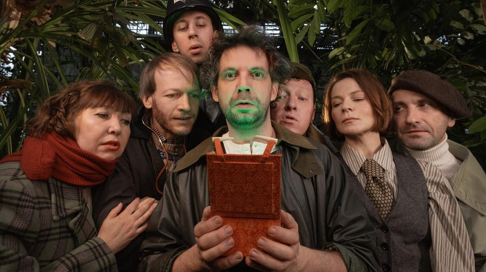

# Убийца — убийца. Антон Федоров поставил спектакль «Шерлок и все-все-все» в Пространстве «Внутри»

- **URL:** https://novayagazeta.ru/articles/2026/03/10/ubiitsa-ubiitsa
- **Дата:** 2026-03-10
- **Автор:** Лариса Малюкова

## Убийца — убийца

## Антон Федоров поставил спектакль «Шерлок и все-все-все» в Пространстве «Внутри»

Сцена из спектакля «Шерлок». Фото: teatrmesto.ru

…Тра-ля-ля-ля-ля-ля-ля-ля: с мотива-заставки из сериала Игоря Масленникова начинается этот спектакль.

Спектакль про чудаков, которые то на пролетке (диван на колесиках, которые они сами ногами двигают), то на лодке (которая спускается с неба), то на двухместном велосипеде, быстрее Чипа с Дейлом мчатся на помощь.

Доктор Ватсон в бейсболке (Сергей Шайдаков) вернулся с афганской войны контуженным, может, поэтому все время напевает дурным голосом мотивы Дашкевича из народного сериала. Миссис Хадсон Натальи Рычковой — застегнутая на все пуговицы домоправительница, леди совершенство Мэри Поппинс с железобетонными яйцами на завтрак, бренди — перед вояжем для храбрости, зонтиком — чтоб улететь. Закидывает в камин поленья, сбивая со стены и так поломанную скрипку. Отбивает узнаваемый — по сериалу — маршевый ритм колотушками по напольному барабану, снова отсылая нас к «Приключениям Шерлока Холмса и доктора Ватсона».

Холмс (Семен Штейнберг), буквально как Винни-Пух, знает про все на свете и догадывается мгновенно буквально обо всем подозрительном: собачья плеть, кольцо, Rachel… пестрая лента, яд, пилюля, кровавая лампочка, портмоне, канарейки и гепард…

«Хотите узнать, как я распутал этот клубок?» «Гениально!» — как заведенный повторяет Ватсон, влюбленный в Шерлока, как Пятачок — в Винни-Пуха. Дьявольски коварный, по-наполеоновски самоуверенный Мориарти танцует с Холмсом смертельный танец над ледяной пропастью в полиэтиленовых горах, пародируя сцены смертельных драк из миллионов боевиков.

А за длинным окном — то дождь, то снег, то аквариум, то лондонский пейзаж, то пронесется с воем, сверкая красными глазами, собака Баскервилей, то Никита Михалков в белом шарфе, похожий на Вилли Токарева, раскроет нам свои безмерные объятия. Анимация Нади Гольдман — расширяет пространство, в котором оживают и гепард и бабуин, привезенные из Индии доктором Ройлоттом, и прочие страсти-мордасти.

Сцена из спектакля «Шерлок». Фото: Софья Полунина

Хиппующий Шерлок Штейнберга — комик и спасатель, нарциссичный невротик, готовый жертвовать собой и своей трехногой собакой Тэтчер ради малознакомых тетенек — на одно лицо (всех их играет Ольга Бешуля), которых нужно немедленно выволакивать из беды. Какая разница — кого? Главное — немедленно! Кудрявый нервный фат, неврастеник, рьяно пиликающий на скрипке, и неустрашимый супергерой.

Холмс — заложник своего дара, перед раскрытием очередного убийства ворожит-танцует шаманский танец, утробным голосом описывает очередного преступника в ботинках с квадратными мысами и красным лицом. Его охватывает раж ищейки, он часто дышит, как гончая, взявшая след. Впрочем, здесь они все немного заведенные куклы. И само подвижное пространство сцены с переворачивающимися стенами — неустойчивый условный «мир в табакерке».

Мозаика из цитат превращается в пастиш.

Холмс несется над пропастью во ржи к ярмарке тщеславия, меняя регистры, превращаясь из Карлсона в Робин Гуда. Временами жонглирование цитатами кажется чрезмерным. Впрочем, здесь все умножено, все в квадрате и кубе: повторы, цитаты, гэги, пластика.

Поддержите нашу работу!

1000 500 300 Нажимая кнопку «Стать соучастником», я принимаю условия и подтверждаю свое гражданство РФ

Если у вас есть вопросы, пишите [email protected] или звоните:+7 (929) 612-03-68

Спектакль избыточен, нарочито шаржированный. Где-то ближе к финалу (упоительно танцевально-умиротворительному) — зависает на повторах.

Но, похоже, авторы спектакля и не стремились к кафедральным высказываниям. «Шерлок Холмс и все-все-все» —- спектакль-«багатель», безделица, не претендующая на масштабность, призванная во времена истерики, хаоса и страха — утешать видимым миру непошлым смехом. Это «заметки на полях» в данном случае не только произведений Конан Дойля, но и наших «объединительных», узнаваемых с «трех нот» впечатлений: мелодий, сериалов, книг, персонажей, цитат. Интеллектуальная игра включает разгадку скрытых в «пустяке» смыслов, подтекстах, превращаясь в занятное упражнение для ума. Впрочем, багатели писали Бетховен, Лист и Барток. Композиторы и писатели использовали этот жанр для экспериментов, неожиданных политональных наложений.

Сцена из спектакля «Шерлок». Фото: Софья Полунина

И в каждой шутке здесь лишь доля шутки: «Кто убийца? Убийца — убийца (Кто режиссер? Режиссер)». А общий посыл спектакля вдруг леденит кровь.

После очередного преступления Холмс говорит, что убийств больше не будет, но трупы приносят и приносят, приносят и приносят. Убийств становится все больше, больше. Они превращаются в неостановимый круговорот. Холмс не успевает раздеваться/одеваться. Мчаться на помощь. Но ему не остановить этот конвейер зла и крови… хотя в финале авторы сильно подсластят горькую пилюлю.

Пока в театре Пространство «Внутри» не открылся новый зал, спектакль играется на «Арт-платформе» «Новый манеж».

### Этот материал входит в подписку

Культурные гидыЧто читать, что смотреть в кино и на сцене, что слушать

### Добавляйте в Конструктор свои источники: сайты, телеграм- и youtube-каналы

Войдите в профиль, чтобы не терять свои подписки на разных устройствах

Поддержите нашу работу!

1000 500 300 Нажимая кнопку «Стать соучастником», я принимаю условия и подтверждаю свое гражданство РФ

Если у вас есть вопросы, пишите [email protected] или звоните:+7 (929) 612-03-68
