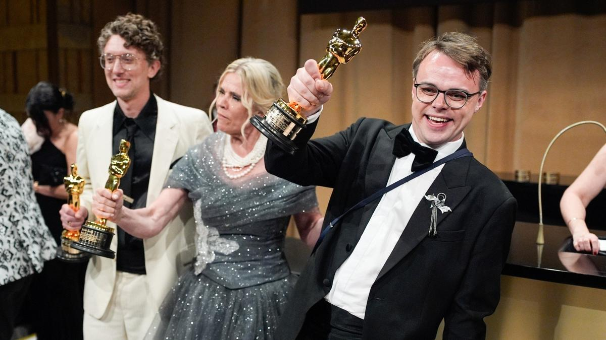

# С неба должны падать звезды. Cамый предсказуемый за последние годы «Оскар» оправдал ожидания

- **URL:** https://novayagazeta.ru/articles/2026/03/16/s-neba-dolzhny-padat-zvezdy
- **Дата:** 2026-03-16
- **Автор:** Лариса Малюкова

## С неба должны падать звезды

## Cамый предсказуемый за последние годы «Оскар» оправдал ожидания

Режиссеры фильма «Господин Никто против Путина» Павел Таланкин и Дэвид Боренстайн. Фото: AP / TASS

Главным триумфатором вечера стала «Битва за битвой» Пола Томаса Андерсона — фильм получил шесть статуэток, включая «Лучший фильм» и «Лучшего режиссера», окончательно закрепив за Полом Томасом Андерсоном статус одного из ключевых американских авторов своего поколения.

Почему-то не «Бриллиантовая бабочка», а заокеанская американская премия притягивает интерес всего мира, в том числе наших соотечественников. И что бы ни говорили вечные скептики, на мой взгляд, список номинантов предъявляет яркую картину мирового кино, подключенного к современности. Уже битва слонов — почти равноценных по оценкам экспертов, букмекеров и по итогам предварительных голосований гильдий мегахитов «Битва за битвой» и «Грешники» — вызывала острый интерес. Будь любая из этих картин на прошлогоднем «Оскаре», она бы мокрого места не оставила от скромной «Аноры».

Эта ночь принадлежала Андерсону. Конечно, академикам хотелось еще и отметить вклад современного классика, создателя «Прозрачной нити» и «Нефти» в мировой кинематограф. Но это тот случай, когда предсказуемость — сестра таланта.

Пол Томас Андерсон. Фото: Zuma \ TASS

Не соглашусь с критиками, утверждающими, что его фильм разбирается исключительно с американскими проблемами. Этот кинороман — вольная интерпретация романа Томаса Пинчона «Винляндия». Переосмыслив протагонистов и антагонистов, Андерсон разворачивает на экране эпопею, в которой бурлит и пенится картина современной Америки и — шире — разорванного современного мира. Фильм — диагноз, в котором все возможные кризисы доведены до высшей точки кипения. Левые боевики бьются с властью, освобождая задержанных иммигрантов, а заодно нападая на правительственные офисы. А главный злодей Шона Пенна — узколобый расист, оказывается сторонником жесткого иммиграционного контроля и противостоит беспощадным либералам. «Битва за битвой», по сути, антропологический кинороман, исследующий истоки современного фашизма, превращения страны в полицейское государство. Кроме того, это волнующая драма взаимоотношений поколений.

Пенн получил за свою выдающуюся роль третью статуэтку (до этого были «Таинственная река» и «Милк»). На церемонию актер не пришел (вот что значит не первый «Оскар»). Среди проигравших — великолепный Стеллан Скарсгард, в «Сентиментальной ценности» перевоплотившийся в стареющего эгоцентрика, разменявшего «семейные ценности» на карьеру. За бортом и остроумный и харизматичный проводник-спаситель, тренер по боевым искусствам Бенисио дель Торо из «Битвы за битвой».

Кадр из фильма «Битва за битвой»

Четыре статуэтки (из рекордных 16 номинаций) — у хоррора-мюзикла «Грешники» Райана Куглера, главного конкурента Андерсона. Из исторических моментов — победа оператора Отем Дюральд Аркапоу. Она стала первой женщиной в истории «Оскара», победившей в этой исторически мужской номинации, — символический рубеж для одной из самых закрытых профессий индустрии. На мой субъективный взгляд, гендер сыграл решающую роль в выборе академиков. Ужасно жаль, что проигнорирована выдающаяся работа бразильского оператора Адольфо Велозо «Сны поездов» — удивительная киноживопись, которая раскрывает глубину картины Клинта Бентли. И какая вопиющая несправедливость, что этот фильм так и не вышел на большие экраны, а сразу отправился в библиотеки стримингов.

В отличие от Андерсона, Райан Куглер придумал «Грешников» с чистого листа, но с огромным количеством исторических и кинематографических отсылок, фильм вдохновлен и пропитан историей юга США. Поэтому Куглер справедливо получил награду за оригинальный сценарий. Он строит историю по лекалам триллера «От заката до рассвета»: первая часть — светлая, почти бытовая экспозиция, знакомство с героями. Тьма спустится во второй части, когда включаются законы хоррора, и бутлегерам, организовавшим джук-джой (дешевый бар с танцполом) придется противостоять вампирам. Само же действие неспешно закручивается в спираль по законам блюза в жгучей атмосфере американского юга с голливудским размахом.

Кадр из фильма «Грешники»

Совершенно справедливо «Грешники» удостоены награды за лучший саундтрек. Шведский композитор фильма Людвиг Йоранссон создал уникальное звуковое полотно, сочетающее элементы блюза и атмосферного хоррора. Он вообще превосходный автор и соавтор режиссеров, блестяще владеющий новыми технологиями. В его фильмографии «Оппенгеймер», «Красные браслеты», «Одиссея». Это его третий «Оскар» после «Оппенгеймера» и «Черной пантеры»

А вот «Оскар» за лучшую мужскую роль Майклу Б. Джордану — все-таки из сюрпризов. Хотя в «Грешниках» он сыграл не одну, а сразу две роли: разных по характеру братьев-близнецов. Только ленивый не прогнозировал победу Тимоти Шаламе за блистательную работу в фильме «Марти великолепный». Он сыграл героя с отрицательным обаянием: круглосуточного мошенника, харизматика, самозабвенно преданного теннису. Несмотря на скандалы вокруг Шаламе, бурлящие перед «Оскаром», казалось, награда у него в руках. Увы. В какой-то степени он повторил судьбу Ди Каприо, своего конкурента в номинации, которому не впервые пролетать мимо. Его работа в «Битве за битвой» выше всех похвал. Невероятной сложности характер: Ди Каприо играет сломленного, запущенного, во вредных привычках экс-революционера, который и смешон, и жалок, и потерян… но с какого-то момента обретает себя, ради дочери проявляя чертовскую храбрость. Впрочем, в этой номинации жаль всех проигравших, в том числе, совершенно роскошного Итана Хоука в камерной драме «Голубая луна».

Джесси Бакли. Фото: AP / TASS

Поддержите нашу работу!

1000 500 300 Нажимая кнопку «Стать соучастником», я принимаю условия и подтверждаю свое гражданство РФ

Если у вас есть вопросы, пишите [email protected] или звоните:+7 (929) 612-03-68

А вот победа в номинации за главную женскую роль Джесси Бакли была предопределена. В фильме «Хамнет: история вдохновившая «Гамлета» она сыграла жену Шекспира.

Финальный эпизод, в котором ее героиня, прилипнув в сцене, будет смотреть спектакль, рожденный из ее горя, — войдет в учебники по актерскому мастерству.

«Сентиментальная ценность» — лучший международный фильм. Жаль, конечно, что без «Оскара» осталась «Простая случайность» Джафара Панахи. Режиссер заявил, что после окончания оскаровской гонки он намерен вернуться домой, к своей семье. Хотя месяц назад был арестован сценарист его фильма Мехди Махмудиан. «Сентиментальная ценность» Йоакима Триера претендовала на девять статуэток «Оскар». Это свидетельство заметного роста интереса академиков к работе неамериканских авторов. Кстати, четыре номинации было у политического триллера бразильца Клебера Мендонсы Фильо «Секретный агент».

Жаль, что «Оскар» не достался нашему Константину Бронзиту: победила сентиментальная «Девушка с жемчужными слезами», основанная на библейской легенде. Это третья номинация Бронзита. Утешает то, что его соотечественник Александр Петров был удостоен «Оскара» только с четвертой попытки — это был «Старик и море».

Еще один «капитан очевидность»: лучший документальный фильм — «Господин Никто против Путина» (режиссеры Павел Таланкин и Дэвид Боренстайн). О проникновении государственной военной пропаганды в российские школы. «Идеальная соседка» — реальная история убийства во Флориде как хроника соседской вражды — кино мощнее, технологичнее, современнее, эмоциональнее. Но здесь политика рулит. Павел Таланкин со сцены призывал к миру:

с неба на людей должны падать звезды, а не ракеты. Так триумфально завершилось его путешествие из родной школы в Карабаше в Голливуд.

Читайте также

Главные события в кино: прокат, премии, Оскар и новые фильмы

Ирина Петровская и Лариса Малюкова помогают сориентироваться в потоке премьер, премий и громких новостей

## Все лауреаты «Оскара»-2026

Лучший фильм

- «Битва за битвой»

Лучшая режиссура

- Пол Томас Андерсон («Битва за битвой»)

Лучшая женская роль

- Джесси Бакли («Хамнет: история, вдохновившая «Гамлета»)

Лучшая мужская роль

- Майкл Б. Джордан («Грешники»)

Лучшая песня

- Golden — «Кей-поп-охотницы на демонов»

Лучший международный фильм

- «Сентиментальная ценность» (Норвегия)

Лучшая операторская работа

- «Грешники»

Лучший монтаж

- «Битва за битвой»

Лучший звук

- F1

Лучший оригинальный саундтрек

- «Грешники»

Лучший документальный фильм

- «Господин Hиктo пpoтив Пyтинa»

Лучший короткометражный документальный фильм

- «Все пустые комнаты»

Лучшие визуальные эффекты

- «Аватар: пламя и пепел»

Лучшее художественное оформление

- «Франкенштейн»

Лучший оригинальный сценарий

- «Грешники»

Лучший адаптированный сценарий

- «Битва за битвой»

Лучшая мужская роль второго плана

- Шон Пенн — «Битва за битвой»

Лучший короткометражный игровой фильм

- «Певцы»
- «Два человека обмениваются слюной»

Лучший кастинг

- «Битва за битвой»

Лучший грим и прически

- «Франкенштейн»

Лучший дизайн костюмов

- «Франкенштейн»

Лучший короткометражный анимационный фильм

- «Девушка, которая плакала жемчугом»

Лучший анимационный фильм

- «Кей-поп-охотницы на демонов»

Лучшая женская роль второго плана

- Эми Мэдиган — «Орудия

Лариса Малюкова ведет телеграм-канал о кино и не только. Подписывайтесь тут.

### Этот материал входит в подписки

Смотровая площадкаКино с Ларисой Малюковой

Культурные гидыЧто читать, что смотреть в кино и на сцене, что слушать

### Добавляйте в Конструктор свои источники: сайты, телеграм- и youtube-каналы

Войдите в профиль, чтобы не терять свои подписки на разных устройствах

Поддержите нашу работу!

1000 500 300 Нажимая кнопку «Стать соучастником», я принимаю условия и подтверждаю свое гражданство РФ

Если у вас есть вопросы, пишите [email protected] или звоните:+7 (929) 612-03-68
