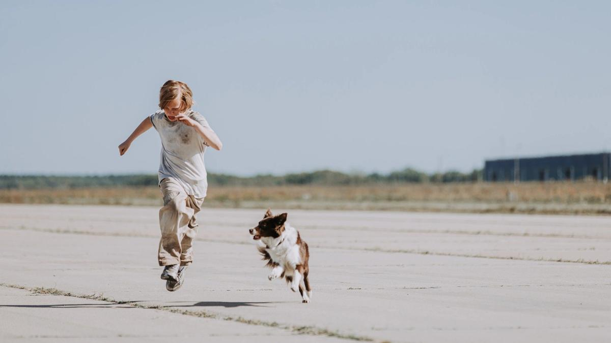

# Космос как сочувствие. На экранах — музыкальное фантастическое драмеди «Космическая собака Лида» Евгения Сангаджиева

- **URL:** https://novayagazeta.ru/articles/2026/03/25/kosmos-kak-sochuvstvie
- **Дата:** 2026-03-25
- **Автор:** Лариса Малюкова

## Космос как сочувствие

## На экранах — музыкальное фантастическое драмеди «Космическая собака Лида» Евгения Сангаджиева

Кадр из фильма «Космическая собака Лида»

Нет, это не про пафос космических достижений. Неожиданно ироничное, неглупое, безбашенное зрительское кино с повышенной проникающей целительной энергией.

Начало нулевых. 13-летний Игорь живет с мамой (Юлия Пересильд) и отчимом (Евгений Стычкин). Но однажды случилось событие из ряда вон. Отец-космонавт подарил сыну вернувшуюся из космоса собаку Лиду. И как только отчим Степан вместе с беременной мамашей решают отдать подростка в «кадетку», Игорь с Лидой бегут из дома. Ну раз они никому здесь не нужны: мама вот-вот родит ребенка от чужого дяди Степы.

Лида будет отважно защищать мальчика. И не только его. Мифическая подхватившая волшебный дар в космосе псина бьет электрическим разрядами, закручивая воронку времени, вынимая из людей их будущее. То есть представьте: встретить самого себя лет через 30. И не факт, что в этом многоликом будущем ты себе понравишься. Во всяком случае, взрослый Игорь — неохватно толстый, плешивый (почище Брендана Фрейзера в «Ките» или «чокнутого профессора Клампа) — себя юного не радует. Одутловатый, с потным затылком, в электричках «музыкально» побирается. Кому захочется увидеть такую неказистую, с одышкой, перспективу: со слезами из «Короля и Шута» («Знаю я, что жизни не вернуть») и колотящимся в голове Децлом («Кто ты? А? Кто ты? Кто ты?). И вот ради этого надо сдавать ЕГЭ?

Именно Игорь-взрослый и сообщает себе-подростку, что через три дня «их» отец взорвется в ракете на старте… Значит, срочно нужно остановить запуск на Байконуре. Значит, нужно пересечь страну, границу, все красные линии… Спасти отца. Изменить будущее можно, лишь исправив настоящее. Этим и займутся Игорь-ребенок и примерно пять его разнообразных взрослых инкарнаций.

Когда Игорь с помощью Лиды «выходит из себя», окружающее пространство отчасти остается прежним — «нулевым». С рынками-люстрами и всяким хламом на вокзале, с цыганами-киднепперами, с раздолбанными электричками, провинциальным ТВ, доморощенным цирком, полицейским участком, экстрасенсами и гуру-коучами.

Кадр из фильма «Космическая собака Лида»

Среди альтернативных грядущих версий Игоря — бизнесмен-мошенник с улыбкой в 32 карата. Ведет семинар, как построить личный бизнес, у него завидная тачка, обожающие и ненавидящие его «жертвы внушений». Этот Игорь — «твоя идеальная жизнь» с журнальной обложки — белозубый циник. Продает Лиду налево и направо за бешеные деньги, понимая, что она вернется.

Есть Игорь — «пропащая душа», уголовник в татуировках, с их общей мамой Пересильд на груди в виде тату. Юному Игорю придется пройти недетские испытания, оказаться у порога отчаяния в казахской степи среди беспощадных добытчиков ценных металлов из падающих космических аппаратов. У порога смерти — когда себе же взрослому придется делать искусственное дыхание.

Каждый из взрослых Игорей вроде бы помогает двигаться мальчишке к заветной ракете в альтернативной реальности, но каждый раз — облом и трудный выбор для подростка.

Отличные диалоги. Одни указания гипотетической сестры героя (Александра Бортич) чего стоят: «В садик меня не отдавай. И не надо меня здесь рожать!»

Развлекательное, но не эскапистское кино (которое заполняет афишу). Не про ностальгию по 2000-м.

Про взросление, эмоциональную и ценностную сепарацию, формирование собственной идентичности во взаимоотношениях с самим собой и с самыми близкими. Про вызовы и ответственность не только за себя. Про альтернативную историю собственной жизни и усилие рассмотреть в случайностях закономерность. Про свободу как осознание неизбежности смерти, которое меняет тебя сейчас.

Да и что там в будущем? Поможет ли оно увидеть себя со стороны?

У Евгения Сангаджиева («Happy End», «Балет») реликтовая в отечественном кино способность — снимать летнее, легкое, разогретое эмоционально кино с подкладкой сущностных вопросов. Лихо отыгрывать абсурдные сюжетные повороты — с дотошной честностью, будто они происходят здесь и сейчас. Разворачивать гротеск и эксцентриаду скачкообразного сюжета в историю про нас, с сегодняшними страхами и неоправданными надеждами.

Нескучный дуэт юного Данилы Харенко и многоликого Евгения Ткачука держит линию безумного роуд-муви. Ткачук дождался личного бенефиса, он с видимым удовольствием трансформируется в пять разных образов, характеров, судеб одного и того же человека.

Кадр из фильма «Космическая собака Лида»

Поддержите нашу работу!

1000 500 300 Нажимая кнопку «Стать соучастником», я принимаю условия и подтверждаю свое гражданство РФ

Если у вас есть вопросы, пишите [email protected] или звоните:+7 (929) 612-03-68

Из недостатков — да, они есть — чрезмерное увлечение клипами, которые, подобно Лиде, утягивают авторов во временную воронку (хронометраж почти 2 часа).

Саундтрек связывает ретро в плейлист со своей драматургией, не иллюстрирующей действие, но вступающей с ней смысловой ироничный диалог: от музыкальных пристрастий маленького Игорька (Децл) до Михаила Круга с рыдательным «Письмом»: «Мамуля-мама, прости меня прости» — визитная карточка Игоря-уркагана. Качели характеров летают от «Весны» Дельфина до Bad Balance, от нарисованной мелом Белой двери в неведомый мир Пугачевой до кульминации — обезоруживающей романтикой таривердиевской любовной баллады «У тебя такие глаза».

Конечно, в генах этой киноигры со временем — «Назад в будущее». А на тему, как в настоящем исправить ошибки прошлого и грядущего — большая фильмография. Вспомнится Купер («Интерстеллар»), видящий себя в прошлом. Марти Макфлай («Назад в будущее»), взаимодействующий с молодыми родителями. Герой Брюса Уиллиса, встречающий себя маленьким в «Малыше». Киллер в «Петле времени», получающий заказ на убийство самого себя из будущего. Путешественник к себе самому молодому («Очарованный»). Но при всей универсальности «Космическая собака Лида» — онтологически российское кино во всей своей предметной судьбоносной узнаваемости. Поэтому и истоки его угадываются скорее в разного рода хороших приключенческих сказках: от «Достояния республики» до «Сказки странствий» и недавнего «Волчка» (с тем же Ткачуком в роли кулачного борца, ведущего сквозь опасные приключения юного джентльмена).

Авторы описывают свою историю как путешествие в «мир несбывшегося». Ну отчего же? Финал фильма — не буду спойлерить — свидетельствует о том, что любые наши усилия, даже не достигшие задуманной цели, меняют реальность.

Но в параллельных сюжету смыслах просачивается и тайная мысль: а что мы сами сделали в нулевые с нашим будущим.

В зеркале себя и вот это «настоящее» видели?

P.S. Лида во время одинокого полета в космос тоже свои разные-разные жизни вспоминает. Так что продолжение… возможно. Главное, чтобы зрители, привыкшие к сладким пилюлям Андреасянов, пришли. Говорят, у фильма небольшой рекламный бюджет.

P.P.S. В роли Лиды — собака Шаня. Хорошая работа. Недавно оскаровская академия опубликовала письмо собаки Инди, исполнившей главную роль в хорроре «Глазами пса». Она призывает включить животных в число номинантов на «Оскар». Думаю, Шаня ее бы поддержала: у нее большой шанс на победу.

Читайте также

Разнообразие волн

Что показали на 31-м фестивале анимационных фильмов в Суздале

Лариса Малюкова ведет телеграм-канал о кино и не только. Подписывайтесь тут.

### Этот материал входит в подписки

Смотровая площадкаКино с Ларисой Малюковой

Культурные гидыЧто читать, что смотреть в кино и на сцене, что слушать

### Добавляйте в Конструктор свои источники: сайты, телеграм- и youtube-каналы

Войдите в профиль, чтобы не терять свои подписки на разных устройствах

Поддержите нашу работу!

1000 500 300 Нажимая кнопку «Стать соучастником», я принимаю условия и подтверждаю свое гражданство РФ

Если у вас есть вопросы, пишите [email protected] или звоните:+7 (929) 612-03-68
