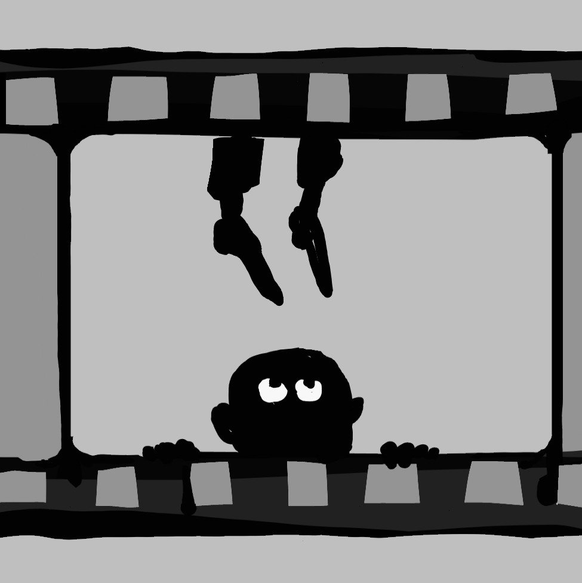

# Что смотреть после Оскара? Кинопанорама с Ириной Петровской и Ларисой Малюковой

- **URL:** https://novayagazeta.ru/articles/2026/03/25/chto-smotret-posle-oskara
- **Дата:** 2026-03-25
- **Автор:** Лариса Малюкова

## Что смотреть после Оскара?

## Кинопанорама с Ириной Петровской и Ларисой Малюковой

В новом выпуске «Кинопанорамы» на канале НО.Медиа из России обсуждаем главные события в мире кино: итоги премии «Оскар», неожиданные победы и разочарования, громкие скандалы вокруг фильма «Господин никто против Путина», а также судьбу картин без прокатного удостоверения, включая работы Александра Сокурова.

Разбираем феномен коммерческого успеха фильмов Сарика Андреасяна и влияние брендов на зрителя, вспоминаем юбилей фильма «Остров» Павла Лунгина и обсуждаем, как меняется современное кино. Также делимся рекомендациями: что посмотреть в кино и дома — от авторского кино до сериалов. С вами — Лариса Малюкова и Ирина Петровская.

### Этот материал входит в подписки

Смотровая площадкаКино с Ларисой Малюковой

Культурные гидыЧто читать, что смотреть в кино и на сцене, что слушать

### Добавляйте в Конструктор свои источники: сайты, телеграм- и youtube-каналы

Войдите в профиль, чтобы не терять свои подписки на разных устройствах

Поддержите нашу работу!

1000 500 300 Нажимая кнопку «Стать соучастником», я принимаю условия и подтверждаю свое гражданство РФ

Если у вас есть вопросы, пишите [email protected] или звоните:+7 (929) 612-03-68
