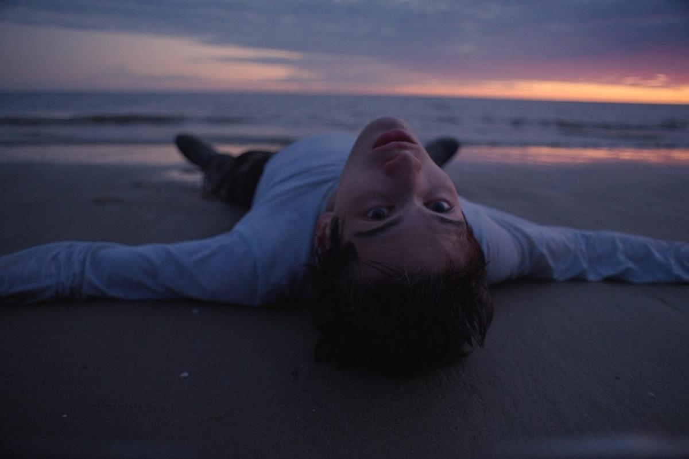

# В космических песках Шойны. 2 апреля в прокат выходит фильм «Космос засыпает» Антона Мамыкина, получивший главный приз на кинофестивале «Дух огня»

- **URL:** https://novayagazeta.ru/articles/2026/03/31/v-kosmicheskikh-peskakh-shoiny
- **Дата:** 2026-03-31
- **Автор:** Лариса Малюкова

## В космических песках Шойны

## 2 апреля в прокат выходит фильм «Космос засыпает» Антона Мамыкина, получивший главный приз на кинофестивале «Дух огня»

Продолжение космической темы — следом за «Космической собакой Лидой» и перед премьерой картины «Моя собака — космонавт». «Космос засыпает» — это драма взросления, в которой смешались времена и жанры, форма спорит с содержанием, а Марк Эйдельштейн водит трактор и летает по пескам на мотоцикле.

Кадр из фильма «Космос засыпает»

Его герой Паша Ветров вынужден прервать занятия в престижном петербургском вузе, где учится на ракетостроителя, чтобы срочно вернуться в родной поселок Шойна в Заполярном районе Ненецкого автономного округа. Только что умер папа, мама (Дарья Екамасова) лежит в депрессии лицом к стене, брат-подросток (Никита Конкин) предоставлен сам себе. Какие тут заоблачные планы и мечты, конференции и гранты. Надо становиться старшим в семье.

Шойна находится на краю самой северной в мире пустыни.

Дюны Белого моря разрослись, и ветхие дома понемногу засыпает песком. Где-то рядом запускают ракеты, их обломки вылавливает местная ребятня. Не случайно же Паша возмечтал стать ракетостроителем, строить аппараты без ступеней, чтобы при взлете ничего не отваливалось и не падало на дома. Чтобы в космос можно было отправлять сразу большие группы туристов, например, весь их класс. Или весь поселок.

Ему снится, как он мчится по пескам, уворачиваясь от летящих с неба мини-ракет. Ему придется выбирать между завидным грантом, заветным международным симпозиумом и неблагополучной малой родиной с ворохом нерешаемых проблем.

В картине головокружительные пейзажи (сама Шойна и стала почти семь лет назад источником вдохновения для создания фильма): бескрайняя пустыня, белые цветы на фоне синего моря, россыпи янтарной морошки. Удивительная, временами даже слишком изысканная работа явно насмотренного оператора Владимира Борисова, некоторые сцены напоминают то ли «Дюну», то ли «Запределье» или «Безумного Макса». Экзотичный и трудный быт деревни, ее жители и дома, которые тонут в песке, сняты слишком поэтично и красиво, что выдает скорее туристический взгляд.

Кадр из фильма «Космос засыпает»

Марк Эйдельштейн — тот еще деревенский житель, временами кажется, что сейчас из-за кадра выйдет режиссер очередной рекламы Saint Laurent, поправит грим, свитер и скажет: «Снято!» Конечно, Марк от природы заразительно витален, органичен, в его актерской палитре и эксцентриада, и непредсказуемость реакций, и способность глубоко погружаться в психологию героя, передавать ощущение ранимости, внутреннего надлома. Говоря его словами: «плюс вайб». Но тем более требуется работа с актером, чтобы он не повторялся, не работал на топливе собственных навыков и интуиции.

«Космос засыпает» — фильм-притча о том, что у каждого свой космос: свой уникальный опыт взросления, требующий мужества и жертв.

Он буквально нашпигован метафорами. Блудный сын, вернувшись, раскапывает собственный родной дом, но «закапывается» в проблемы все больше. Значок с научного симпозиума одиноко «тонет» в песках (цепляя игру слов в названии: «саму мечту буквально засыпают пески»). Мамины картины — символ былого счастья — будет покрывать песчаная пыль. Утюг будет медленно двигаться по рубашке, словно ракета по небу. Ушедший из жизни папа (последняя работа Тихона Котрелева) оставит сыну конфету «Мишка на севере» в главном наследстве — тракторе-бульдозере, с помощью которого Паша Ветров раскапывает родной дом. Младший брат строит свою ракету мечты, но и он пожертвует ею ради маминого здоровья.

Поддержите нашу работу!

1000 500 300 Нажимая кнопку «Стать соучастником», я принимаю условия и подтверждаю свое гражданство РФ

Если у вас есть вопросы, пишите [email protected] или звоните:+7 (929) 612-03-68

Кадр из фильма «Космос засыпает»

Много выразительных, запоминающихся деталей в предъявлении «Русского Макондо». Могильные кресты в песке как образ умирающей памяти. Высохший таз на крыльце, в котором всегда должна быть вода, чтобы не нести песок в дом. Солнце, пробивающееся сквозь проржавевшее железо старого мотоцикла. Катание мальчишек на палке, привязанной к мотоциклу, по дюнам — словно по воде.

Музыки лирической с перебором, как и смысловых нестыковок, которые можно было бы списать на жанр магического реализма. Здесь за него отвечает то ли девочка, то ли виденье с головой одуванчика и накрашенными белым ресницами. Она — судьба — и закопает в песок приглашение на космическую конференцию… Но визуально яркой и запоминающейся дебютной работе Антона Мамыкина не хватает как раз твердой режиссерской руки, жесткого отбора, когда фантастическое, сложное-сочиненное обретает свою убедительную экранную правду.

Кадр из фильма «Космос засыпает»

«Космос засыпает» — одна из немногих востребованных и ожидаемых «уже на подлете» картин. Ее главные зрители — многомиллионный фан-клуб Эйдельштейна. На премьере было настоящее столпотворение, какого «Октябрь» не видел с ухода мейджеров. Билеты раскуплены больше чем за две недели. Кинотеатр боем брали зуммеры, для которых Марк — не просто кумир, но символ поколения. Свободный от стереотипов, ломающий навязанные политиками границы, «свой человек в Голливуде», превращающий слова в «вирусный сленг», прозу — в рэп, короче говоря — «плюс вайб».

Читайте также

Космос как сочувствие

На экранах — музыкальное фантастическое драмеди «Космическая собака Лида» Евгения Сангаджиева

Лариса Малюкова ведет телеграм-канал о кино и не только. Подписывайтесь тут.

### Этот материал входит в подписки

Смотровая площадкаКино с Ларисой Малюковой

Культурные гидыЧто читать, что смотреть в кино и на сцене, что слушать

### Добавляйте в Конструктор свои источники: сайты, телеграм- и youtube-каналы

Войдите в профиль, чтобы не терять свои подписки на разных устройствах

Поддержите нашу работу!

1000 500 300 Нажимая кнопку «Стать соучастником», я принимаю условия и подтверждаю свое гражданство РФ

Если у вас есть вопросы, пишите [email protected] или звоните:+7 (929) 612-03-68
