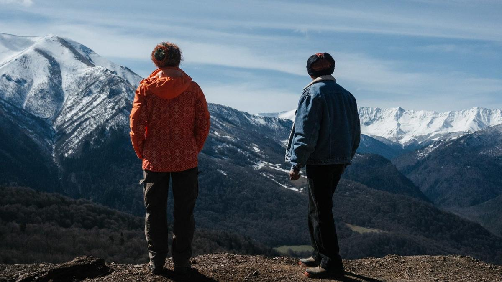

# На санках по Млечному Пути. На грядущем ММКФ в программе «Русские премьеры» — камерная драма Виктора Шамирова «Температура Вселенной»

- **URL:** https://novayagazeta.ru/articles/2026/04/13/na-sankakh-po-mlechnomu-puti
- **Дата:** 2026-04-13
- **Автор:** Лариса Малюкова

## На санках по Млечному Пути

## На грядущем ММКФ в программе «Русские премьеры» — камерная драма Виктора Шамирова «Температура Вселенной»

Кадр из фильма «Температура Вселенной»

Кино про «дела обычные», узнаваемые человеческие переживания в одном из самых необычных мест земли. Маленький поселок Нижний Архыз (Карачаево-Черкесия) спрятан в ущелье, окруженном живописными заснеженными горами. Примерно с десяток зданий. Здесь живут в основном астрономы и астрофизики, работающие в затерянной среди гор лаборатории внегалактической астрофизики и обсерватории. Само экзотическое место и вдохновило Виктора Шамирова на эту киноисторию. Григорий Сиятвинда играет впервые приехавшего сюда одинокого историка средних лет из Новосибирска. Прилетел он зимним утром на день рождения к другу юности — ученому-астроному Андрею (Антон Эльдаров) в качестве, так сказать, сюрприза. Так здорово придумала Наташа (Дарья Семенова), жена Андрея, чтобы устроить мужу неожиданный подарок, когда он вернется с конференции. Но жена предполагает, а муж располагает. В общем, звонит Андрей из аэропорта — мол, не жди, не вернусь я домой: запутался в чувствах старых и новых. И вот стоит Наташа, которая только что проводила экскурсию в обсерватории, отвечала на вопросы про дальние галактики и инопланетян… Стоит буквально под голубыми небесами рядом с волшебной красоты горами и гигантским телескопом, а тут вдруг такое земное. И начинает орать на мужа. Что еще может женщина в такой мерзкой ситуации? Покричать и порыдать — исключительно в машине, ведь дома — дети.

Космос где-то далеко, за облаками, а здесь между людьми — «большая секунда», сдвиг в гармонии. И праздник — день рождения. И дети ждут. В подарок песню папе приготовили…

Кадр из фильма «Температура Вселенной»

Здесь мужчины у костра до хрипоты спорят об исчезновении жизни всего через пару миллиардов лет. А женщин больше волнует то, что происходит в эту самую большую секунду на этом крошечном отрезке жизни.

Виктор Шамиров продолжает изучать вселенную людей на молекулярном уровне с точки зрения взрослых и детей. Кстати, по мнению детей, смуглый пришелец Сергей — точно инопланетянин. Вся эта скромная земная история про путанные человеческие отношения, рвущиеся и образующиеся связи под звездами, снята практически без бюджета. В финансировании фильма Минкульт отказал. Эта бедность, конечно, видна в кадре. Но, как всегда у Шамирова, многое искупают диалоги. В итоге получилось узнаваемое, немного театральное шамировское разговорное кино про старых и новых друзей, которые пьют на пикнике вино у костра, пока рушатся их судьбы.

Кадр из фильма «Температура Вселенной»

Поддержите нашу работу!

1000 500 300 Нажимая кнопку «Стать соучастником», я принимаю условия и подтверждаю свое гражданство РФ

Если у вас есть вопросы, пишите [email protected] или звоните:+7 (929) 612-03-68

Сценарий Шамиров писал вместе с Ольгой Мотиной-Супоневой («Большая секунда»). Вроде бы и космос в картине присутствует. Но в отличие, допустим, от «Девяти дней одного года» и уж тем более нынешних «Времени первых» и «Салютов» здесь даже намека нет на героику. Просто обычная жизнь обычных людей, которые — да, думают о космосе. Прежде всего потому, что это их работа. Но живут своими каждодневными проблемами. В общем, с точки зрения Шамирова, все земляне — немного инопланетяне. Ведь и знатоки древних времен, как историк Сергей, всё понимающий про эпоху союза Алании и Византии, и заглядывающие в самое дальнее будущее местные астрономы не всегда могут ответить на вопрос, что значит быть человеком. Каждый ищет ответ сам. Может, поэтому так трогают слова почти детской песни Рыбникова, которую поет сын Наташи для неприлетевшего папы и прилетевшего инопланетянина Сергея: «Мы катимся на санках / по Млечному Пути».

Читайте также

Помоги мне

Триллер «Гуру» Яна Гозлана о токсичном лайф-коуче и непобедимой индустрии

Лариса Малюкова ведет телеграм-канал о кино и не только. Подписывайтесь тут.

### Этот материал входит в подписки

Смотровая площадкаКино с Ларисой Малюковой

Культурные гидыЧто читать, что смотреть в кино и на сцене, что слушать

### Добавляйте в Конструктор свои источники: сайты, телеграм- и youtube-каналы

Войдите в профиль, чтобы не терять свои подписки на разных устройствах

Поддержите нашу работу!

1000 500 300 Нажимая кнопку «Стать соучастником», я принимаю условия и подтверждаю свое гражданство РФ

Если у вас есть вопросы, пишите [email protected] или звоните:+7 (929) 612-03-68
