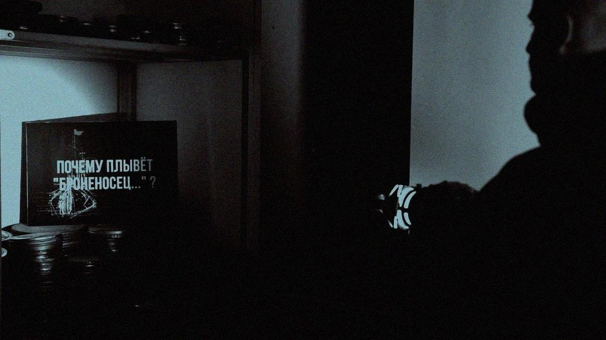

# Прибытие корабля. На ММКФ — премьера докудрамы Марианны Киреевой «Почему Броненосец плывет»

- **URL:** https://novayagazeta.ru/articles/2026/04/22/pribytie-korablia
- **Дата:** 2026-04-22
- **Автор:** Лариса Малюкова

## Прибытие корабля

## На ММКФ — премьера докудрамы Марианны Киреевой «Почему Броненосец плывет»

Кадр из фильма «Почему Броненосец плывет»

Это уже второй фильм команды киноведов Марианны Киреевой и Евгения Марголита (до недавнего времени — главного искусствоведа Госфильмофонда, гениального знатока истории отечественного кино), которые превращают историю кино в захватывающую историю взаимоотношений художника и времени, художника и власти, художника с самим собой. В фильме «Улыбнись» это был Эрмлер; новая работа посвящена главному шедевру эпохи главнокомандующего советского кинематографа Сергея Эйзенштейна.

В картине, притворяющейся забавной игрой, исследуется, почему «Броненосец «Потемкин» остается и по сей день актуальным шедевром мирового искусства, выходящим за рамки идеологии, гимна классовой борьбе.

Рассказывается вся эта история от лица достопочтенного господина в годах. В любимом белом свитере, плаще, берете, с палкой он неспешно бредет по скверу с первым снегом на лекцию к своим студентам. В этой роли самого себя — Евгений Марголит. Он размышляет о судьбе старых фильмов, замерших в коробках с пленками в фильмохранилище. Бесконечные стеллажи с коробками. Картины, практически пропавшие в забвении и залюбленные до дыр. И вот в этих лучах славы порой стирается существо картины. Снова, как и в «Улыбнись», студенты подыгрывают «профессору», немного самодеятельно разыгрывают сценки рядом с одушевленным киношедевром экраном. Профессиональный актер Михаил Бернацкий превращается в The Мишу — блогера, для которого «Броненосец» с его столетним рубежом лишь инфоповод, а фильмохранилище — место для селфи.

Но авторы сразу обозначают правила игры: «А что вы хотите от малобюджетной докудрамы?» Хотим разговора по существу. И получаем.

Для того чтобы эта история стала понятной новым поколениям блогеров, Марголит превращает ее в сказку с разными зачинами. Он рассказывает о рижском детстве режиссера, папином воспитании, встречей с «Турандот» Комиссаржевского, спектакле, ломающем сценические стереотипы, стену со зрительным залом. Спектакль-удар. А так можно было — разрушать правила и монументы? Он, знаток мировой культуры, будет заниматься этим на протяжении всей жизни, ломать общепринятое, переосмысливая законы киноискусства. Да что там переосмысливая, создавая по ходу съемок новый язык театра и кино.

Евгений Марголит. Фото: соцсети

И в своем спектакле «На всякого мудреца…» выпустит канатоходца актера Александрова в роли Глумова из окна Морозовского особняка. Зачем нужны ему эти трюки? По Марголиту, трюк, ощущение экстаза, — причащение к чуду. Как красный флаг в финале черно-белого «Броненосца», раскрашенный от руки. Не чудо ли?

За кадром остался монтаж аттракционов и сами виды монтажа. Технические инновации — от зеркальных отражателей до трэвеллинга. Но история с флагом рассказана весьма эмоционально. Ручная покраска красного флага кадр за кадром (80+ кадров) — так Эйзенштейн создавал агитационное произведение по заказу государства, и часть сцен (например, расстрел на лестнице) — художественная реконструкция, а не документальная хроника.

Эйзенштейн использует приемы гротеска, шаржа, маски, унаследованные от театра Мейерхольда и цирковой эстетики, но переосмысливает их, превращая в инструменты кинематографического высказывания о человеке и крае бесчеловечности. Снимая кино про то, как становятся людьми.

Мы узнаем, как он создает образ с помощью крупного плана, меняя ракурсы, превращает толпу (с точки зрения демонов власти) в живых людей.

Ему никогда не удавалось снять кино по собственной идее. Все были ниспосланы с высоких трибун. И «Броненосец» — всего лишь юбилейный заказ (в честь революции 1905 года). Но он создал собственное кино поперек заказа. И

когда смотришь «Броненосец», потрясает сплав документальности и христологической киноживописи в эпоху тотального атеизма. Воистину смерть матроса Григория Вакуленчука превращается в символ мученичества, «искупительную жертву».

Поддержите нашу работу!

1000 500 300 Нажимая кнопку «Стать соучастником», я принимаю условия и подтверждаю свое гражданство РФ

Если у вас есть вопросы, пишите [email protected] или звоните:+7 (929) 612-03-68

И фильм Киреевой — попытка увидеть за пленками затертых клише истинный сюжет «Броненосца». Евангельские мотивы спасения от тьмы и восторга убийства, спасения от бойни благодаря этой искупительной жертве. Именно Вакулинчук отправляет лохматого беса, «представляющегося» священником, обратно в «нижний мир». Образ священника в «Потемкине» можно прочитать как воплощение личины — пустой маски, выдающей себя за носителя божественного, но лишенной внутренней сущности:

Марианна Киреева. Фото: соцсети

По версии Марголита, весь кинематограф Эйзенштейна — столкновение истинного христианства и бесовской подделки. И в Александре Невском, и в центральной сцене «Броненосца» — Потемкинской лестнице с расстрелом живых людей. И, конечно же, в «Иване Грозном» — царь, превращающийся на наших глазах в мертвого идола. Его притягивали и не отпускали мотивы искупления, а не сомнения. Русская традиция совести. Покаяния.

И фильм для Эйзенштейна всегда больше, чем фильм, — это проповедь, апеллирующая к совести.

Есть конфликт художника с властью, которая требует от него четкого выполнения заданий. Но есть и внутренняя драма создателя, конфликт с собой, собственными бесами, которые сталкивают тебя с избранного пути.

Эта история и про сейчас, про сегодня. Художник и соблазн: «сделай как они любят!». Снимаем что под руку попалось. Зачем мучиться? Но именно эти внутренние поиски и позволяют превратить идеологию в универсальный визуальный опыт и делают фильм вечным: он работает не как пропаганда, а как чистая кинематографическая энергия. И даже критики «Броненосца» признавали его как мощнейшее художественное явление, как протест против насилия, про «не убий», с прямыми отсылками к текстам Священного Писания, про призыв ко всечеловеческому братству.

Читайте также

Песни джиннов и ангелов

На ММКФ сразу две картины Романа Михайлова, главного инди-режиссера страны — «Песни джиннов» и «Пока небо смотрит»

Лариса Малюкова ведет телеграм-канал о кино и не только. Подписывайтесь тут.

### Этот материал входит в подписки

Смотровая площадкаКино с Ларисой Малюковой

Культурные гидыЧто читать, что смотреть в кино и на сцене, что слушать

### Добавляйте в Конструктор свои источники: сайты, телеграм- и youtube-каналы

Войдите в профиль, чтобы не терять свои подписки на разных устройствах

Поддержите нашу работу!

1000 500 300 Нажимая кнопку «Стать соучастником», я принимаю условия и подтверждаю свое гражданство РФ

Если у вас есть вопросы, пишите [email protected] или звоните:+7 (929) 612-03-68
