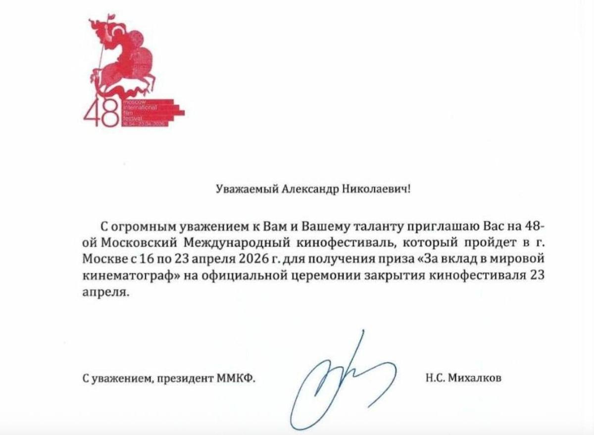

# «Ну, передумали, ну, по-хамски, бог с ним». Сокуров получил личное приглашение Михалкова на церемонию ММКФ для вручения приза «За вклад в кинематограф», но никакого вручения не было

- **URL:** https://novayagazeta.ru/articles/2026/04/24/nu-peredumali-nu-po-khamski-bog-s-nim-sokurov-poluchil-lichnoe-priglashenie-na-tseremoniiu-mmkf-dlia-vrucheniia-priza-za-vklad-v-kinematograf-no-nikakogo-vrucheniia-ne-bylo-news
- **Дата:** 2026-04-24
- **Автор:** Лариса Малюкова

## «Ну, передумали, ну, по-хамски, бог с ним». Сокуров получил личное приглашение Михалкова на церемонию ММКФ для вручения приза «За вклад в кинематограф», но никакого вручения не было

Идея вручения приза «За вклад в мировой кинематограф» Александру Сокурову была личной инициативой Никиты Михалкова. Известно, что 30 марта режиссер получил официальное приглашение с подписью Михалкова и признанием заслуг.

Приглашение с подписью Никиты Михалкова, переданное Александру Сокурову 30 марта

«Конечно, письмо изумило меня — это на фоне запрещенных к показу на родине моих фильмов? Я почему-то был уверен, что решение о призе будет отменено. У меня не было намерения отказываться от награды. Все же рядом и за моей спиной стоят мои уважаемые коллеги, участвовавшие в создании фильмов», — рассказывает сам Сокуров.

Он добавил, что во время представления фильма «Записная книжка режиссера» (спецпоказ ММКФ) он передал программному директору Кудрявцеву «письмо, адресованное Н.С. Михалкову, с предложением обратить внимание на ситуацию, сложившуюся в российском кино».

«Накануне премьеры фильма я получил подтверждение своим предположениям — вручение премии отменяется. Ну что же: отменяется — так отменяется», — резюмировал Сокуров.

Для ММКФ участие в церемонии Сокурова — режиссера с безупречной репутацией — было бы тоже спасительным решением: сегодня зазвать мировых звезд на фестиваль практически невозможно.

И появилась надежда, что этот «широкий жест» даст зеленый свет хотя бы отдельным показам «Записной книжки режиссера» — пусть даже в рамках творческих вечеров и «спецсобытий» — в кинотеатрах, киноклубах и галереях.

На церемонии Закрытия о награде даже не вспомнили. Не было на ней не только Сокурова, но и Михалкова.

Из комментария Сокурову изданию «Подъём» становится ясно, что о причинах отмены ему никто не сообщил.

«Ну, что я могу сказать? Ну, сначала решили, потом передумали. Это же так для нас привычно, на самом деле. <…> Мы не за награды работаем, мы снимаем кино, потому что должны снимать кино, а то, что так происходит, — ну, невежливо, ну, грубо, по-хамски, но бог с ним».

Режиссер отметил, что Михалков с ним после приглашения не связывался.

«Я получил от него приглашение и решение о вручении премии. Был в Москве полтора дня — для показа своего фильма «Записная книжка режиссёра». Фильм показали — всё, я уехал».

Александр Сокуров в рамках спецпоказа ММКФ демонстрирует свою 5-часовую картину «Записная книжка режиссера»

Поддержите нашу работу!

1000 500 300 Нажимая кнопку «Стать соучастником», я принимаю условия и подтверждаю свое гражданство РФ

Если у вас есть вопросы, пишите [email protected] или звоните:+7 (929) 612-03-68

19 апреля во втором зале московского кинотеатра «Октябрь» в рамках спецпоказа ММКФ действительно с аншлагом состоялся спецпоказ пятичасового кино Сокурова «Записная книжка режиссера», а перед показом с публикой поговорил сам режиссер. Тогда же, как нам известно, Сокуров передал благодарственное письмо Михалкову (за приглашение) — того в зале не было.

Возможность устроить такой показ на ММКФ — примечателен уже тем, что у «Записной книжки режиссера» не было прокатного удостоверения. Наученные горьким опытом (и в частности, судьбой сокуровской «Сказки») создатели фильма за «прокаткой» в Минкульт на этот раз даже не обращались.

«За последние четыре года, — пишет кинокритик Любовь Аркус, — у Сокурова не выпустили ни один фильм, не дали прокатных удостоверений».

«Сеанс» обращался в разные кинотеатры Петербурга с предложением сделать юбилейную ретроспективу современного классика, но везде получили отказ.

А в январе 2026 года Сокурова исключили из Совета по развитию кинематографии.

Вспоминается недавний рассказ Михалкова о том, как ему удалось не только ускорить освобождение Михаила Ефремова, но и сразу обеспечить его главной ролью в спектакле «Без свидетелей» в своем театре. Случилось это благодаря личным контактам Никиты Сергеевича с Владимиром Путиным. Причем Михалков уточнял, что решение это далось непросто: у президента якобы были сомнения. Значит, он убедил президента.

Ксения Собчак называет Михалкова «Горьким нового времени» — человеком «с ресурсом». Видимо, и «горькие» сегодня не всесильны.
