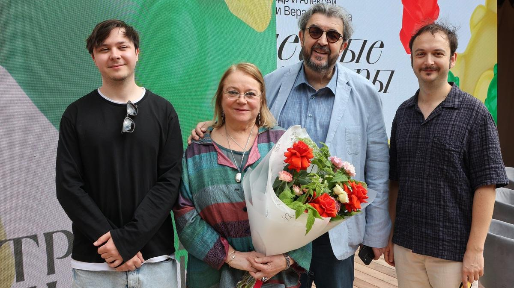

# Жизнь как театр на ковре. Знакомьтесь: Александр Золотовицкий, актер и режиссер, Вера Харыбина, режиссер и актриса, Алексей Золотовицкий, режиссер и актер

- **URL:** https://novayagazeta.ru/articles/2026/04/24/zhizn-kak-teatr-na-kovre
- **Дата:** 2026-04-24
- **Автор:** Лариса Малюкова

## Жизнь как театр на ковре

## Знакомьтесь: Александр Золотовицкий, актер и режиссер, Вера Харыбина, режиссер и актриса, Алексей Золотовицкий, режиссер и актер

Этот материал вышел в специальной вкладке номера 17 «Новая газета. Журнал».

Мы у них дома на Самотёке, на столе — торжественно возлежит белая кошка-подобрыш Мурка, тут же разбросаны фотографии из семейного архива, рядом со мной на диване дружелюбная Чапа. Вспоминаем, пытаемся хотя бы для себя сформулировать словами очевидное-невероятное, ощущение солнечного реактора, каким был Игорь Золотовицкий для бесчисленного количества людей и для самых близких. Каким образом и почему он превратил свою жизнь в театр? Каждый прожитый день.

— Известный театральный деятель, ректор Школы-студии, директор Дома актера, а дома он тоже был центром семьи?

Алексей. У нас смещенный центр: для нас с Сашей это, конечно, и мама, и папа. Они здорово дополняли друг друга, передавая друг другу заботу о нас. Такой «передающий центр»…

Александр. Мне кажется, в последние годы у нас в семейных взаимоотношениях сложилось подобие демократии: нас четверо, и у нас по 25% ответственности за все происходящее дома. Хотя в детстве, конечно, папа был подарком: он работал, репетировал, снимался. А все заботы: выучил ли я немецкий, сделал ли математику, не пропустил ли музыкалку — легли на мамины плечи. Она была требовательной, а папа: «Ну как дела?.. Молодец!»

— Я видела в Сети видео. Игорь младенца взвешивает, потом передает Вере с блаженным счастливым лицом: «Ну какая же у нас игрушка! А?»

Алексей. Саше больше папы досталось, потому что родители в Москву вернулись. Когда я родился, папа был в Японии. Потом они долго с Сергеем Ивановичем Земцовым преподавали во Франции. Для меня огромным событием была поездка с ним в Ташкент. Мне было лет восемь…

— О да, Ташкент — родина, точка сила. И дыни, которые, по слухам, он оттуда привозил едва ли не всем друзьям.

Вера. Для него, конечно, это ностальгическое место, он там жил до 17 лет, а для нас абсолютно неведомый край.

Алексей. Тогда там оставались многочисленные родственники, там жил дедушка, папина сестра, наши двоюродные братья. Правда, после этого вояжа я арбузы не могу есть, потому что каждый день четыре блюда: плов, дыни, арбузы, шашлык. Завтрак, обед, ужин — не важно.

Но с утра до ночи мы были в каком-то обволакивающем теплом окружении — родственном, дружеском. Это был папин круг. И он сам, конечно, отличался своим каким-то южным колоритом, особой добросердечностью.

Александр. Соглашусь, мне кажется, у папы темперамент не московский. Восточный, разогретый. К сожалению, я никогда не был с папой в Ташкенте, но когда мы ездили в Турцию или в Израиль, он сразу попадал в локальную интонацию, растворялся в этом воздухе, его принимали как своего. А как волшебно он торговался, он обожал рынки. Всегда говорил: «Рынок — это мое».

— Его узнавали?

— Дело даже не в этом. В нем сразу распознавали, человека, который на рынке торгуется. Продавец же ждет, что с ним будут торговаться. И начинался поединок… Первое, что он говорил: «Ну… Праздничная скидка?» Причем сразу на «ты». Не важно, будни или выходные. Помню, как они торговались с каким-то турком за лампу. Где у нас эта лампа? Вот она, правда, у нее разбились плафоны… но все равно красивая. Это же был как срепетированный спектакль. Они торговались долго и артистично. А потом папа начинал уходить… до другой части рынка. Продавец догнал нас: окей, я согласен. Папе не нужны были иностранные языки для общения. Он в совершенстве владел языком эмоций и жестов. Нашел маме какое-то кольцо за $500. Продавец не уступал, но и не отпускал: едва ли не целый день ходил за папой по рынку, и они общались. В конце концов: «Забирай просто так». Вообще, когда рассказываешь его истории или про него истории — непонятно, в чем юмор, а когда их папа рассказывает, все лежат от смеха.

— Как это сформулировать? Особое чувство смешного? Интонация? Мимика?

Вера. Прежде всего, колоссальное удовольствие от истории, которую ты сейчас рассказываешь, предвкушение, что сейчас будет смешно. Он сам это так остро чувствовал, что умел заражать этим других. Это была его стихия.

— Но может, это природный артистизм, который распространяется не только на сцену, но в пространство самой жизни?

Александр. Вероятно. Ему не важно, есть ли публика, какая публика. Сохранились умопомрачительные видео, где папа приглашает людей на Лешин спектакль. Это феерично. Или пикники на даче среди своих. Это не «мероприятие», где «надо веселить», смех — его естественная среда, природа.

Алексей. А публика — любой собеседник, попутчик. Он страшно заинтересован, сразу располагает к себе. Когда звонили мошенники, начиналось шоу: «Здравствуйте, вас как зовут? А где вы учились? И почему решили этим заниматься? Да что вы говорите!» Он не издевался. Ему интересно было, что там, кто — по другую сторону провода. Обычно мы либо трубки бросаем, либо издеваемся, ругаемся. Человек «в трубке» тоже злится, «посылает» нас. А тут они смеялись и вешали трубку… в хорошем настроении. Для меня это жизненный ориентир, что можно так общаться практически с любым человеком: не множить агрессию.

Фото: семейный архив

— Вера, а дома, в быту Игорь был таким же легким в общении, неприхотливый, или, наоборот, капризный?

Вера. Да нет, конечно, не капризный. Но центр, все вокруг него. Причем не специально, просто увлекал своей энергией, своими предпочтениями, привычками… За исключением Сашиной аллергии на рыбу. Поэтому у нас никогда не бывает рыбы.

— Столько легенд про его страсть к застольям, особенно после Нового года. Дома все это тоже устраивалось?

Вера. У Игоря гигантомания.

Если я его посылала в магазин, он обязательно приходил с двумя бараньими ногами, пятью килограммами, помидоров, ящиками огурцов… приходилось немедленно звать гостей. А что делать?

— Золотовицкий — актер…. Нет ли ощущения, что он в жизни доигрывал то, что он не доиграл на сцене?

Алексей. Конечно, есть. Мы тут со студентами говорили о том, что хороший человек — это профессия. У него, конечно, такая была мощная личность, что она проектировалась на его роли. И я считаю, что было еще куда развернуться, было еще что сыграть. Он это чувствовал, ему хотелось двигаться дальше. Но дефицит ролей он отчасти восполнял: в друзьях, общении, в интервью. В разных социальных ролях. В роли директора Дома актера, ректора Школы-студии. Признаюсь, я мечтал, но так и не решился ему предложить… Он же идеальный Фальстаф. Сегодня никто не может убедительно сыграть Фальстафа. Где и харизма, и комизм, и трагизм, и обыкновенность, и необычность. И эта широта, бесконечное застолье, какие бы темные времена ни были на дворе, но всегда есть точка света, жизнелюбия, веселья, надежды и оптимизма. Это абсолютно наш папа. Персонаж сам по себе.

Александр. Мне кажется, он действительно не доиграл. И не из-за раннего ухода… Не было по-настоящему крупных ролей, в которых была бы востребована его карнавальная природа, когда открываются новые грани, не только смеха, но трагикомедии. Но он делал это в каждом спектакле, пытаясь выходить на какую-то новую глубину.

— Все говорят, что ему не хватало ролей. Но прекрасный, например, был Лебедев в «Иванове» Бутусова, разрывающийся между бытовым пьянством и осознанием гибели собственной души. Спектакли Гришковца в МХТ.

Вера. Да нет, конечно, не доиграл. Он, например, всего один раз сыграл мучающегося нерешительностью Подколесина в «Женитьбе» Романа Козака во МХАТе. Не смог Виктор Гвоздицкий, и Рома попросил Игоря. И это стало событием. Игорь расстроился, что сыграл эту вымечтанную роль всего один раз. Он думал, вдруг случится, что будет возможность продолжить жизнь в этом фантастическом спектакле с Калягиным, Теняковой, Юрским, Невинным. Но никогда не зацикливался на обиде.

Александр. Нет справедливости в профессии. Но вот была прекрасная роль в «Самоубийце» по Эрдману. Были роли на сцене Et Сetera. Он играл в МХТ сложный драматический характер в спектакле «Дом» Евгения Гришковца, у его героя мечта-фикс — обрести большой дом, способный стать семейным гнездом и личной крепостью. Они с мамой играли. Другое дело, что в нем был колоссальный потенциал.

Алексей. Профессия — лотерея, и мы — заложники своей фактуры. Но сцена дарит возможность расширять актерский диапазон. Он играл Де Гиша в «Сирано…». Обычно это такой обыкновенный злодей. А его граф — очень обаятельный, но при этом расчетливый аристократ, да еще страдающий от ревности. Появилась биография у персонажа и какая-то спрятанная боль.

— Он никогда не пользовался дружбой, связями для реализации актерских амбиций?

Александр. Внутреннее благородство не позволяло — не буду же я унижаться: дай-ка мне роль. А им в голову не приходило. В последнее время мне стали предлагать… У него же должен был случиться юбилей. Активно начали обсуждать, что можно на него поставить. Я испугался. Он же папа в первую очередь, а тут надо давать ему задачи, выстраивать интонацию. Вот сейчас нам с мамой как актрисой предстоит работать в «Пространстве Внутри» — пьеса «Просрочка». И я волнуюсь — не просто перестроиться.

Вера. Я всегда понимала, насколько сложно сломать стереотипы в нашей профессии. Мне кажется, что Игорь выходил за рамки какого-то типажа: слишком яркая индивидуальность, в том числе внешне. И поэтому, возможно, не сыграл огромное количество больших серьезных психологических ролей. Но в своих слабых попытках заниматься режиссурой я пыталась это наверстать. Мы ставили «Сказку о мертвом теле, неизвестно кому принадлежащем» по мотивам произведений Одоевского, где был совершенно невероятный дуэт: Игорь и Андрей Смоляков. Я ставила на Игоря притчу с элементами абсурда Макса Фриша «Бидерман и поджигатели», он репетировал роль Бидермана — конформиста, пытающегося умиротворить зло. Этот независимый проект в итоге не вышел: не хватило денег. Но бесценен сам процесс. Смешная была история, когда я снимала свой дипломный фильм во ВГИКе. Должны были играть Миша Ефремов с Женей Добровольской, тогда муж и жена. Но какая-то у них случилась ссора, и в последний момент они не приехали на съемочную площадку. Я в панике бросилась за помощью к Игорю. А потом думала, какое это было счастье… История была про пару, одержимую страстью, они ехали на свидание в какую-то коммуналку, где и происходил трагифарсовый случай в духе Хармса. Именно Игорь дал этой незамысловатой истории вертикаль и объем. Было смешно, при этом была большая любовь.

— Вера, неужели он вам не жаловался на эту вопиющую несправедливость — почему ему не предлагают интересные роли?

Вера. Нет, никогда не жаловался. Мне кажется, это тоже была его философия. Мудрая философия радости жизни. Редкая для актера.

Поддержите нашу работу!

1000 500 300 Нажимая кнопку «Стать соучастником», я принимаю условия и подтверждаю свое гражданство РФ

Если у вас есть вопросы, пишите [email protected] или звоните:+7 (929) 612-03-68

— Тогда задам журналистский вопрос. Какая из его ролей вам кажется наиболее значимой?

Алексей. Первое, что приходит на память — «Чинзано». Не сосчитать, сколько раз я был на спектакле, уже на восстановленном спустя годы после премьеры. Играли Рома Козак, Сережа Земцов и папа. Это был неописуемый восторг. У нас же всегда висели афиши, об этом спектакле мне с детства рассказывали легенды. И когда я увидел своими глазами, все завышенные ожидания оправдались.

— А действительно этот спектакль был хэппенингом и каждый раз — другим?

Александр. Я миллион баек знаю о том, насколько по-разному он проходил, причем по разным обстоятельствам.

Алексей. Там же депрессивные мужики бухают, да? А разница в том, что в жизни эти актеры совсем не депрессивные. И они просто купались в этой стихии импровизации.

Александр. Мне кажется, это сейчас невозможно поставить. Есть же слово «поколенческий», сшитый со своим временем. Интонация, то, как они говорят, выпивают, на чем выпивают, чем закусывают, как себя ощущают. Сейчас это невоспроизводимо. Я грущу, что не видел спектакль вживую. Запись ни о чем не говорит, потому что это «театр на ковре»: три человека + живая энергия + момент узнавания для зрителя. В детстве на меня большое впечатление произвел спектакль «Быстрее, чем кролики» с «Квартетом И». Это была главная роль и к финалу подлинный трагизм. В каком-то смысле его герой олицетворял страх смерти. Таким папу я больше никогда нет видел. А еще мне нравился их тандем с Брусникиным. Они играли два спектакля Вырыпаева. Особенно хороши были «Иллюзии» — философская драма о хрупкости человеческих отношений. Два крупных артиста, два мощнейших монолога, очень разных, они наполняли их собой. Два клоуна: белый и рыжий. Для меня это было открытие.

Вера. А я не знаю. Но, наверное, тот самый Подколесин, который случился лишь однажды. Правда, я слишком близко… Как можно оценивать? Когда смотрю, как Алеша играет, или Саша, или Игорь…. Что-то во мне замыкает. Волнуюсь.

Фото: семейный архив

— Но вы же вместе играли на сцене. Какой он партнер?

Алексей. Я с папой дважды снимался. Слава богу, первый ролик никто не увидит — пилот сериала про антипохмельный энергетик, что-то такое. Второй раз снимались втроем c родителями — в сериале Юрия Мороза «Я не могу без тебя». Но ведь мы и на площадке, и дома ведем себя примерно одинаково.

Когда я с мамой делал спектакль в ЦДР Панкова, я честно пытался называть ее Вера. Но сразу кринжово себя чувствуешь. Вранье какое-то: «Вера Анатольевна!» Поэтому — мама и папа. Папа никогда не говорил: «Я служу в театре», притом что он корневой мхатовец, «старик». Они с Калягиным и Евстигнеевым приходили в театр — «на работу», а в перерывах футбол обсуждали. Без оголтелого традиционализма и «сакральности»: мы — мхатовцы. У них, напротив, складывались какие-то семейные отношения. И отношение к истории МХАТа как к истории своих друзей, учителей — большой семьи.

Я абсолютно понимаю маму: нам действительно трудно говорить о его ролях. Тут нужна доля отстранения, дистанция… А нам всем он был суперважен как папа.

Его было много для других: как актера, партнера, руководителя, ректора, товарища и так далее… А для меня было важно сохранить в себе отношение как к папе и познакомить своих друзей с ним.Им поначалу было сложно ездить к нам в гости. Потому что сразу два педагога Школы-студии… Но в следующий раз они сами спрашивали: «А Игорь Яковлевич и Вера Анатольевны будут?» Им с ними общаться.

— Педагог Золотовицкий… вообще-то, по формальным признакам не слишком солиден и похож на «педагога школы студии МХАТ».

Александр. Он приглашал все свои курсы на дачу, пикники устраивал. И с каждым курсом эта пресловутая субординация им же и нарушалась. Многие из учеников стали нашими друзьями. Все называли его «большим папой». Это не формальность. Лет десять подряд папа с мамой преподавали в Гарварде. Мы ездили туда в летнюю школу. Так он «усыновил» и этих американцев. Делал с ними отрывки по Чехову. Рассказывал про Россию. А в конце американского блока устраивалась водка-пати, где он учил студентов правильно пить водку.

Алексей. Потом эти студенты приезжали. Помню, у нас на даче в каждой комнате по пять человек спали. Они же просто мечтали об этом времяпрепровождении. Он и их заразил своим жизнелюбием.

— Вы говорите о нарушении субординации… Когда его назначили на должность ректора, первой реакцией многих было недоумение. Но через какое-то время, казалось, лучший выбор трудно сделать.

Алексей. У нас самих была реакция изумления. Помню, папа пришел домой растерянным. Он не «стремился», не шел по головам, чтобы «добиться», должность получить. И до, и после назначения искренне дружил с людьми и помогал им, независимо от того, кем они работают и какой у них социальный статус. Это назначение было исключительно решением Олега Палыча Табакова и Анатолия Мироновича Смелянского.

Александр. Большая доля театрального образования построена на насилии, необходимости страдать, тебя должны унизить, указать, какое ты «ничто». Чтобы не мог заснуть, рыдал, кусал ногти, испереживался. А потом из этого «ваял» образ. Папа доказывал, что все это не нужно.

Что педагог может общаться и строить отношения со студентами на принципах доверия, а не унижения.

— Есть такая традиция, когда ректор Школы-студии передает бразды правления в правильные руки. Он говорил что-то на эту тему?

Алексей. Мы с ним об этом не говорили. Для нас сейчас вся эта возня, битвы за ректорское кресло, пасьянс кандидатур — ужасны. Ведь папа действительно всех объединял. И как сказал Евгений Миронов, на прощание с ним собрались люди, которые друг с другом не здороваются. Он умел найти общий язык и с чиновниками, и с охранниками, и в банке, и в поликлинике. И то, что сейчас столько конфликтов вокруг этого… Мы стараемся от этого быть в стороне.

Александр. Для нас эта возня болезненна… Потому что она про разъединение, болезненные амбиции, не про объединение.

— Игорь Золотовицкий — карнавальный человек, как это было дома? Устраивались ли розыгрыши, подколы?

Алексей. Я оцифровал детские записи. Там первые мои четыре дня жизни. Папа любил снимать… «Мы ведем прямой репортаж из пеленальной комнаты!» Такие же репортажи из наших поездок. Из жаркой машины в Долине смерти… Но ничего специального, просто такое существование, неописуемое словами.

Александр. Начало темных ковидных времен. А для нас карантин — самые счастливые моменты. Мы самоизолировались на даче вместе с нашими животными. Это была наша обломовщина, счастливейшее время. Папина гигантомания проявилась в полной мере, ежедневное обжиралово всеми видами яств. Тандыр работал как доменная печь. Но еще был участок. Из-за того, что он долго пустовал, жители нашего поселка скидывали туда мусор, поджигали — выросли заросли сорняка. В какой-то момент мама говорит: «Все, мы идем чистить — пахать. Взяли у соседа бороздовик. Выкорчевывали, вывозили мусор, бороздили землю. Папа в основном снимал, комментируя: «Смотрите! Что творится, только вы это видите! Алексей Золотовицкий и его борона!» Но благодаря маме и настроению, которое создавал папа, мы посадили там вишнево-яблоневый сад.

— Вера, у вас же отношения с Игорем и начались с розыгрыша? Это уже описано 1000 раз. Причем инициатором розыгрыша были вы, назвавшись художницей.

— Просто всю эту историю розыгрыша Игорь трансформировал в своих байках — в розыгрыш самого себя. Мы оказались в одном купе втроем. Третьим был актер Гриша Мануков. Я возвращалась в Москву на пару дней с гастролей в Ленинграде Театра сатиры. Они — с каких-то проб.

— Не просто каких-то — кинопроб у Алексея Германа… В это время он был в подготовительном периоде фильма «Мой друг Иван Лапшин».

Вера. В общем, они ввалились в купе, мгновенно начали шутить и знакомиться: «А вы художница? Да?» И я ответила: «Вот видите, мне даже ничего и не надо вам рассказывать». Дальше, конечно, Игорь развил это в легенду, будто я их разыграла…

Александр. А я вспомнил, как в Америке он заставил нас гнаться за Джоном Малковичем. Мы сидели в кафе в пригороде Кембриджа, где он преподавал, пьем кофе после занятий, идет Джон Малкович. Смотрим: он уходит за поворот. И папа сразу: «Так… Бегите за ним! Приглашайте его на тренинг!» И мы бежали за Джоном Малковичем…

Вера. Розыгрыши — не про него, у него другая природа.

Он просто жил театром, это даже нельзя назвать «служением», это его жизнь. Что бы он ни смотрел, ни читал, какие бы новости… думал, как это можно сыграть? Именно поэтому у него всегда работали два телевизора и радио, и компьютер. Все в «копилку».

— То есть вместо того, чтобы переживать плохие новости, он думал, как это можно превратить в…

Вера. Да, все трансформировал в театр. И не было специального юмора: сейчас будем шутить.

— И не было разделительной линии между личной жизнью и театральной?

Александр. Представьте себе, мы вместе с ректором Школы студии возвращаемся новогодней ночью после салюта на дачу. О чем-то говорим. И ректор вдруг берет огромную охапку снега, бросает мне в лицо, сам валится от хохота в сугроб. Где апломб, самолюбие, самолюбование? Ничего подобного. Подростковое поведение.

Вера. Когда Саша был маленький, был обмен школьниками из других стран. И мальчик из Италии приехал к нам. Сначала жутко переживал, что придется спать в нашей небольшой квартире вместе с Сашей в одной кровати. Мы показали ему отдельную комнату. Вечером зову ужинать, он не идет и спрашивает: «А где же сеньор?» Я говорю: «Сеньора нет, он работает». На следующий день то же самое. И он каждый день маме с изумлением докладывает: «Странная семья, у них нет сеньора». Наконец Игорь вернулся с гастролей. Утром я завожу мальчику в комнату, а в ней храпит огромный великан. Мальчик был совершенно счастлив, бежит звонить маме: «Мама, есть сеньор! Он просто всегда на работе… когда не спит!»

### Этот материал входит в подписку

Культурные гидыЧто читать, что смотреть в кино и на сцене, что слушать

### Добавляйте в Конструктор свои источники: сайты, телеграм- и youtube-каналы

Войдите в профиль, чтобы не терять свои подписки на разных устройствах

Поддержите нашу работу!

1000 500 300 Нажимая кнопку «Стать соучастником», я принимаю условия и подтверждаю свое гражданство РФ

Если у вас есть вопросы, пишите [email protected] или звоните:+7 (929) 612-03-68
