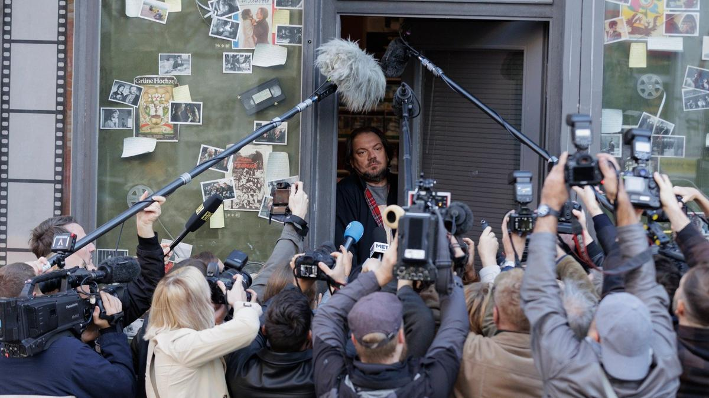

# Между фактом, вымыслом, героикой и аферой. Спустя год после смерти режиссера Беккера, снявшего «Гуд бай, Ленин!», в кинотеатрах выходит его последняя картина «Берлинский герой»

- **URL:** https://novayagazeta.ru/articles/2026/05/06/mezhdu-faktom-vymyslom-geroikoi-i-aferoi
- **Дата:** 2026-05-06
- **Автор:** Лариса Малюкова

## Между фактом, вымыслом, героикой и аферой

## Спустя год после смерти режиссера Беккера, снявшего «Гуд бай, Ленин!», в кинотеатрах выходит его последняя картина «Берлинский герой»

Кадр из фильма «Берлинский герой»

Однажды к хозяину убыточного видеопроката с фицджеральдовской вывеской «Последний магнат» Михаэлю Хартунгу (Чарли Хюбнер) является журналист Ландманн. Он-де собственноручно провел расследование и с трудом отыскал забытого героя: в 1989-м, работая на железной дороге, Рейхсбане, Михаэль якобы перевел стрелки на станции Фридрихштрассе, отправив электричку с Восточного Берлина в Западный, тем самым организовав крупнейший массовый побег из ГДР. Михаэль, мягко говоря, в своем подвиге не уверен. Но гонорар настолько щедрый… В общем, подтверждает этот удивительный, хотя и несколько сомнительный сюжет: надеясь, что на гонораре дело и остановится. Но нет, стрелочника превращают в национального героя, слава его растет как на дрожжах: интервью, ток-шоу, выступление в Бундестаге. И как признаться в разоблачительной правде, если вчера еще ты ноль без палочки, а сегодня на тебя смотрят с восхищением близкие, друзья и даже собственная дочь. Если вся эта история помогает сблизиться с недосягаемой прокуроршей Паулой (Кристиана Пауль), пассажиркой того поезда. И если ты из ноунейма превратился в спасителя — медийную сенсацию.

Политическая трагикомедия «Берлинский герой» — работа Вольфганга Беккера, режиссера той самой, ставшей в России хитом картины «Гуд бай, Ленин!» (2003). В ней герой Даниэля Брюля Александр тоже вынужденно раскатал целый сугроб лжи. Когда его мать-социалистка вышла из восьмимесячной комы, он не осмелился сказать ей, что Берлинская стена рухнула и нет больше двух Германий. Она бы не пережила… И тогда он создал для нее в одной малогабаритной квартире — ГДР: покупал горошек «Глобус» и «шпревальдские» огурчики. С приятелем снимали «выпуски вечерних новостей», сообщая лично маме про успехи партии и правительства в деле строительства социализма. Кстати, подругу Александра, советскую медсестру Лару, играла Чулпан Хаматова.

Кадр из фильма «Берлинский герой»

«Берлинский герой» снят по мотивам бестселлера Максима Лео. Михаэль, или Миха, как его зовут друзья, — типичный хронический лузер, смирившийся со своей утлой долей, и не сейчас — давно, променявший реальность на киноиллюзию, параллельные миры любимых картин, которые его окружают: «Разговор», «Поговори с ней», кубриковское «Убийство». В хорошем вкусе ему не откажешь. Но думал ли он, что сам окажется протагонистом придуманной истории, которая увлечет всю страну. Поначалу он даже сопротивляется, идет к Ландманну в газету «Факт» (!) выяснять отношения… Но поздно, его правда уже никому не нужна. Статья вот-вот превратится в книгу, книга — в кино, его будут рвать на части СМИ, он уже снимается в рекламе колбасок. Он всем нужен. Нет, точнее — всем нужен живой символ освобождения.

В эпоху постправды, когда факты отменены, главное вызвать сильные чувства аудитории. Здесь правда — у всех своя, даже у бывшего штази, который теперь мирно трудится в госархиве.

Новость все равно живет день. Юбилей «Падения Стены» сегодня? Значит, ты калиф на час. Завтра вряд ли будешь кому-то интересен. Как и реальные факты биографии «стрелочкника».

И значит, надо «жить по лжи». Самозванец — привлекательнее обычного человека. Как и миф о поезде-беглеце — его реальной подоплеки. Сюжет ведет Миху по тонкому льду между фактом, вымыслом, героикой и аферой. Фраза «История — ложь, о которой договорились», звучит дважды.

Поддержите нашу работу!

1000 500 300 Нажимая кнопку «Стать соучастником», я принимаю условия и подтверждаю свое гражданство РФ

Если у вас есть вопросы, пишите [email protected] или звоните:+7 (929) 612-03-68

Кадр из фильма «Берлинский герой»

У фильма Беккера — большой бэкграунд. И «Потерянная честь Катарины Блюм» — классическая экранизация романа Генриха Бёлля, в которой бульварная пресса искажает факты, выставляя Катарину пособницей террористов, разрушая ее репутацию и частную жизнь; и «Плутовство» Барри Левинсона, в котором победоносная война в Албании, затеянная в телевизоре, должна отвлечь от интрижки президента. Но картину Беккера с социально-абсурдистской подоплекой (при всем сарказме) пронизывает на редкость теплый юмор, меланхолия, прекрасное понимание «немецкой культуры памяти».

Сам Даниэль Брюль из «Гуд бай, Ленин» появится в роли камео — кинозвезды, приглашенной на роль Хартунга в сериале. Легенду фигурного катания Катарину Витт, символ краснофлагового ГДР, увидим на ток-шоу, посвященном сочиненной звезде Хартунгу. Да и Беккера — вместе с Либом — можем заметить рядом с героями как «наблюдателя». Оператор Бернд Фишер запечатлевает Берлин между ностальгией и настоящим в теплых закатных тонах, создавая общее ностальгическое настроение картины.

Премьера фильма состоялась на Берлинском кинофестивале 2025-го, уже после смерти режиссера.

Читайте также

Золушки на тонком льду

На экраны выходят сразу два громких российских проекта о спорте и его закулисье — «На льду» и «Первая ракетка»

Лариса Малюкова ведет телеграм-канал о кино и не только. Подписывайтесь тут.

### Этот материал входит в подписку

Смотровая площадкаКино с Ларисой Малюковой

### Добавляйте в Конструктор свои источники: сайты, телеграм- и youtube-каналы

Войдите в профиль, чтобы не терять свои подписки на разных устройствах

Поддержите нашу работу!

1000 500 300 Нажимая кнопку «Стать соучастником», я принимаю условия и подтверждаю свое гражданство РФ

Если у вас есть вопросы, пишите [email protected] или звоните:+7 (929) 612-03-68
