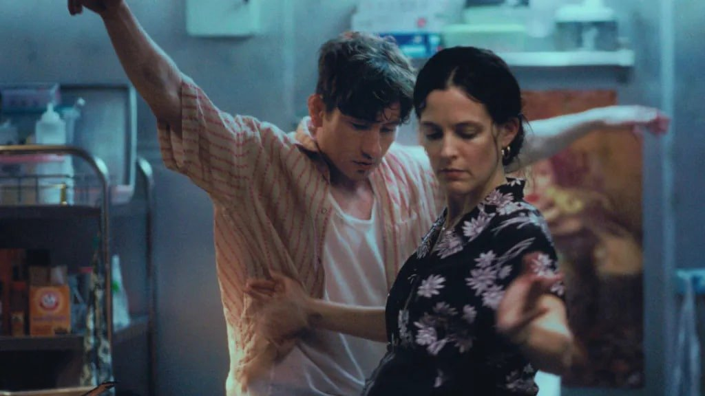

# Гетто, где я? О каннских премьерах — фильме «Варенье из бабочек» Балагова и картине «Жизнь женщины» Буржуа-Таке

- **URL:** https://novayagazeta.ru/articles/2026/05/14/getto-gde-ia
- **Дата:** 2026-05-14
- **Автор:** Лариса Малюкова

## Гетто, где я?

## О каннских премьерах — фильме «Варенье из бабочек» Балагова и картине «Жизнь женщины» Буржуа-Таке

Кадр из фильма «Варенье из бабочек»

— Форрест, ты уже выбрал, кем станешь?

— Кем буду я?

— Да.

— А разве я не буду самим собой?

«Варенье из бабочек» Кантемира Балагова — фильм Открытия престижной программы «Двухнедельник режиссеров».

Это уже третьи Канны 34-летнего режиссера. Предыдущие фильмы участвовали в номинации «Особый взгляд». Дебютная «Теснота» получила приз ФИПРЕССИ, «Дылда» — приз за режиссуру.

Новая картина была задумана давно, но мир стал рушиться, Балагов уехал, и пришлось им с Мариной Степновой переписывать сценарий, перенося действие из Нальчика в Нью-Джерси, где есть кабардинская диаспора. На пути к фильму было много испытаний, нервных срывов, в частности из-за конфликта с продюсерами сериала «The Last of Us», который Балагов покинул, сняв из титров пилотной серии свое имя.

Травма «переселения» проступает сквозь плоть фильма шрамами и разрывами: она то расходится по швам, то срастается заново.

В черкесской диаспоре Ньюарка — мир, зажатый между «там» и «здесь», как герои «Тёзки» Миры Наир, разрывающиеся между калькуттскими корнями и нью-йоркским асфальтом.

Азик (Барри Кеоган), вдовец-инфантил, и его беременная сестра Заля (Райли Кио) держат закусочную, где пахнет дэленами — искусными пирогами, в которых зашифрована память о горах. Это их «маленькая Италия», только вместо пасты — кабардинская кухня, а вместо сицилийской тоски — кавказская. Как в «Крестном отце», где итальянская семья своеобразным способом пыталась сохранить честь в американском аду, Азик и Заля из последних сил цепляются за обломки идентичности.

Кадр из фильма «Варенье из бабочек»

Балагов предъявляет маскулинное царство: карты, пиво, драки, переходящие в объятия. Братство, существующее на грани нервного срыва. Взрывной Марат Гарри Меллинга похож на героев «Ненависти» («La Haine») Кассовица — взвинченных, опасных, обреченных молодых парней. Да и сам Азик ведет себя как бунтарь без причины. И когда ему предлагают лучшую участь, «американский шанс», он откажется. Останется в своей закусочной. Возможно, решив, что это способ сохранить себя.

Балагов погружает нас в хаос токсично понимаемой мужественности, опасной, как бритва, но и хрупкой, как стекло. Когда нет ничего страшнее, чем признание в собственной слабости.

Картина, не лишенная сценарных проблем, забирает зрителя открытой чувственностью, энергией, атмосферой закрытого мира этнического гетто. Точно выписанной световой драматургией от теплой закатной через трагическую черноту — к утреннему свету. Саундтреком, в котором рваное дыхание — контрапункт ноющей, зовущей в никуда смычковой на низах музыке, сочиненной композиторами братьями Гальпериными и воспроизводящей звук национального шичепшина.

Кадр из фильма «Варенье из бабочек»

Но впервые после социальных сумрачных социальных психодрам Балагов обращается к магическому реализму. Как попытка вырваться из «тесноты» места к новым кинематографическим пространствам. Поэтому центральной метафорой становится «варенье из бабочек», которое будто бы умеет готовить Азик. Никто не знает ингредиентов. Но мы видели это солнечное варенье. И, разумеется, верим Азику на слово, как и в то, что Моника Беллуччи, которая украшает его комнату на плакате, — родом из Нальчика. Там каждый ребенок это знает.

Поддержите нашу работу!

1000 500 300 Нажимая кнопку «Стать соучастником», я принимаю условия и подтверждаю свое гражданство РФ

Если у вас есть вопросы, пишите [email protected] или звоните:+7 (929) 612-03-68

Звездный кастинг (Кеоган, Кио — внучка Элвиса Пресли и Меллинг) вызвал острые споры критиков, но в этом решении есть своя поэтика:

Балагов снимает не этнографический очерк, а историю людей-призраков, оторванных от корней.

Не черкесы, не американцы, они — граждане лимба, как те же герои уже упомянутой «Ненависти» Кассовица, разрывающиеся между экзистенциальными полюсами, добром и злом, свободой и беспределом. Мучительно пытающиеся понять, прочувствовать, «кто они» и «откуда».

Читайте также

Звягинцев и Балагов, Альмодовар и Фархади

12 мая открывается 79-й Каннский кинофестиваль. Вопреки прогнозам скептиков, программа обещает быть сильной

…Конкурсный фильм «Жизнь женщины» Шарлин Буржуа-Таке — драмеди о кризисе среднего возраста и самоидентичности. Леа Дрюкер играет известного хирурга Габриэль. Она оперирует, читает лекции, борется с сокращениями персонала и бюджета, мурыжит своих интернов, выясняет отношения с партнером. Своих детей нет, но воспитывает детей мужа Анри (Шарль Берлинг). Ее мать Арлетт (блестящая роль Мари-Кристин Барро) все больше впадает в прострацию из-за альцгеймера и улыбается так беззащитно, что руки опускаются.

Кадр из фильма «Жизнь женщины»

Жизнь Габриэль перенасыщена делами, событиями, встречами. Но она научилась управлять этим хаосом. Пока в какой-то момент не задается простым вопросом: а где она сама в этой «груде дел, суматохе явлений». Где ее собственные желания, чувственность, слабости?

В одном из эпизодов Габриэль и писательница Фрида приезжают в альпийские горы в дом выдающегося писателя (в этой роли итальянский романист Эрри Де Лука). Он живет совершенно один в доме с окнами на снежные вершины. И кажется, само время здесь перестает бежать и суетиться, остановилось, чтобы остаться один на один человеком, готовым к долгому молчаливому диалогу.

Лариса Малюкова ведет телеграм-канал о кино и не только. Подписывайтесь тут.

### Этот материал входит в подписки

Смотровая площадкаКино с Ларисой Малюковой

Культурные гидыЧто читать, что смотреть в кино и на сцене, что слушать

### Добавляйте в Конструктор свои источники: сайты, телеграм- и youtube-каналы

Войдите в профиль, чтобы не терять свои подписки на разных устройствах

Поддержите нашу работу!

1000 500 300 Нажимая кнопку «Стать соучастником», я принимаю условия и подтверждаю свое гражданство РФ

Если у вас есть вопросы, пишите [email protected] или звоните:+7 (929) 612-03-68
