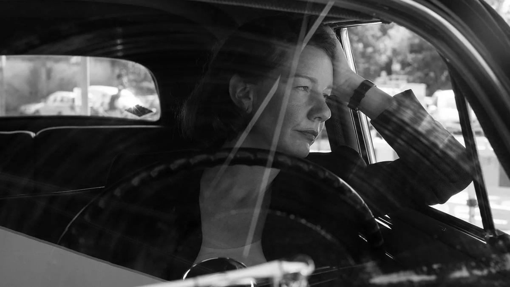

# И дым отечества. В Каннах состоялась премьера фильма «Отечество» — напряженной драмы о цене морального выбора в послевоенной Германии

- **URL:** https://novayagazeta.ru/articles/2026/05/15/i-dym-otechestva
- **Дата:** 2026-05-15
- **Автор:** Лариса Малюкова

## И дым отечества

## В Каннах состоялась премьера фильма «Отечество» — напряженной драмы о цене морального выбора в послевоенной Германии

Я очень ждала премьеру «Отечества» в Каннах — по многим причинам. Режиссер Павел Павликовский брал «Оскара» за свою «Иду» в 2015-м , а три года спустя уже в Каннах его «Холодная война» тоже оправдала ожидания (приз за режиссуру). Думаю, и «Отечество» — один из претендентов на главные награды в этом году.

Из последних ярких литературных впечатлений — роман «Волшебник» трехкратного финалиста Букера ирландца Колма Тойбина, который больше чем биография: попытка живописать тайный многосложный пейзаж внутренней жизни гения, включая его утаенные желания и запреты. Но вместе с тем Тойбин раскрывает трагедию выдающегося писателя, вынужденно оторванного от корней «отчизны».

Продюсер и режиссер Эдвард Бергер («На Западном фронте без перемен») предложил этот проект Павликовскому, режиссеру из Восточной Европы. Этот выбор оказался стратегически точным: сохраняя взгляд «со стороны», Павликовский избегает ловушек демонстрации коллективной вины или национальной ностальгии. Они с соавтором Хендриком Хандлёгтеном оставляют за кадром десятилетия, выхватывая лишь один, быть может, самый уязвимый излом: путешествие Томаса Манна из благополучной Америки в послевоенную, разодранную идеологией, разбомбленную и обиженную Германию.

Через минималистскую черно-белую эстетику авторы превращают задокументированный исторический эпизод в напряженную драму о цене морального выбора, травме разрыва с родиной и невозможности окончательно от нее оторваться.

Канны, 1949 год. Клаус Манн (Аугуст Диль), писатель, драматург, активист, сын классика, в номере гостиницы, совершенно опустошенный, пытается выяснить у сестры Эрики (Сандра Хюллер), зачем они с отцом едут в эту «ужасную страну с ужасными людьми»? И доводы сестры принять не может, как и всего послевоенного мира, где «правят одновременно Сталин и Микки-Маус». Их разговор обрывается на полуслове…

«Отечество» начинается не с парадного возвращения великого писателя на родину, а буквально со смертельной тишины.

Шестнадцать лет изгнания. Для Манна это возможность вновь заговорить на родном языке, увидеть своего читателя. Ответить наконец на вопрос: имеет ли он право, находясь всю войну в безопасности, поучать тех, кто выживал среди руин? Говорить от имени страны, с которой формально порвал связи?

Режиссер сознательно сужает фокус: жена Манна, фрау Катя, без которой он буквально не мог дышать, остается дома. В Германию с классиком едет только его дочь Эрика (Сандра Хюллер) — писательница, левая активистка, незаменимая ассистентка. Поначалу неочевидная, немногословная, а временами молчаливая дискуссия Эрики с отцом постепенно становится нервным узлом всей картины. Мы словно видим, как укрупняется этот вроде бы второстепенный образ. А ее реакции на тексты, которые ей читает Манн, на его речи и поступки превращается для него в нравственный камертон.

Кадр из фильма «Отечество»

Маршрут проложен через раскол, шрам Европы. Сначала Западный Франкфурт: Манну (Ханс Цишлер) устраивают пышный прием, его встречает толпа поклонников. Но, к разочарованию западных немцев, классик заявляет о намерении принять награду и в восточном Веймаре, где жил Гёте. Несмотря на сопротивление близких и предупреждения агентов госдепа, он пересекает границу, направляется в советский сектор. Даже узнав о смерти сына, к изумлению Эрики, не разворачивается. Ему необходимо побывать в квартире Гёте, заглянуть в глаза незнакомой родине, заключившей сделку с дьяволом.

Его встречают горячо, если не восторженно, по обе стороны демаркационной линии.

Но восторг быстро обнаруживает инструментализацию: на Западе нобелевского лауреата превращают в буржуазный трофей, на Востоке — в марксистский символ.

Поддержите нашу работу!

1000 500 300 Нажимая кнопку «Стать соучастником», я принимаю условия и подтверждаю свое гражданство РФ

Если у вас есть вопросы, пишите [email protected] или звоните:+7 (929) 612-03-68

Манн при этом понимает, что связь с Германией одновременно разорвана и нерасторжима. Его сопровождают невидимые спутники: любимый Гёте и только что ушедший из жизни Клаус, которого они с Эрикой все время замечают среди слушателей. К нему обращаются внуки Вагнера, желающие восстановить «из пепла» Байрёйтский фестиваль, основанный самим композитором, и просящие о содействии. Он заявляет, что фестивальный театр следует сжечь дотла.

А с Эрикой беседует невесть откуда взявшийся экс-муж, отказавшийся покидать Германию, любимый актер Геринга. Это Густаф Грюндгенс (Йоахим Майерхоф). Прототип героя знаменитого романа Клауса Манна «Мефистофель (а позже и знаменитого фильма «Мефисто»)

Съемки проходили в Польше, которая стала идеальным двойником послевоенной Германии. Разорванная на части страна показана неприкрашенной. Яркий дневной свет лишь усиливает картину разрушений. Известно, что Манн призывал Америку вступить в войну с Германией, но не мог одобрить разрушительные и бесцельные бомбардировки его родного Любека и других городов Германии.

Кадр из фильма «Отечество»

Манн в исполнении Ханса Цишлера — весьма сдержанный, дипломатичный господин в накрахмаленных рубашках. Удивительная актерская точность. Минимальными средствами он создает объемный характер, в котором и тщеславие, и мудрость, властность и воля, и покорность судьбе.

Авторы сосредотачивают действие своего фильма на ключевых вопросах, волнующих Манна всю жизнь:

почему великая культура не стала иммунитетом против варварства? Почему Гёте и Бах, Гейне и Бетховен не остановили катастрофу? Почему «злая Германия — это добрая Германия на ложном пути, добрая в беде, в преступлениях и в гибели»?

Павликовский и его верный оператор Лукаш Жаль создают черно-белый мир, снимая кино в документальной стилистике. Визуальная аскеза умножает пацифистский импульс картины: раскол показан не через лозунги, а через геометрию пространства: строгая геометрия залов (еще несколько лет назад они здесь слышали совсем другие речи), приветственных хоров, поющих о родине, — и через тишину заросшего старого немецкого парка, природу, которая живет без правил, не ведая идеологических и политических границ. В этом редком сопряжении формы, этики и эмоциональной сдержанности «Отечество» утверждается как одна из сильнейших картин последнего времени

Читайте также

Гетто, где я?

О каннских премьерах — фильме «Варенье из бабочек» Балагова и картине «Жизнь женщины» Буржуа-Таке

Авторы не предлагают публицистических развязок. Вместо этого неспешно подводят зрителя к тихому, почти будничному прозрению. В сильнейшей сцене в разрушенном храме начинается тот самый «спасительный разговор Томаса Манна и Эрики Манн с небесными сферами». И неотменимая музыка Баха задает единственно возможный тон жизни в эпоху, где однозначные ответы давно утратили силу.

Лариса Малюкова ведет телеграм-канал о кино и не только. Подписывайтесь тут.

### Этот материал входит в подписки

Смотровая площадкаКино с Ларисой Малюковой

Культурные гидыЧто читать, что смотреть в кино и на сцене, что слушать

### Добавляйте в Конструктор свои источники: сайты, телеграм- и youtube-каналы

Войдите в профиль, чтобы не терять свои подписки на разных устройствах

Поддержите нашу работу!

1000 500 300 Нажимая кнопку «Стать соучастником», я принимаю условия и подтверждаю свое гражданство РФ

Если у вас есть вопросы, пишите [email protected] или звоните:+7 (929) 612-03-68
